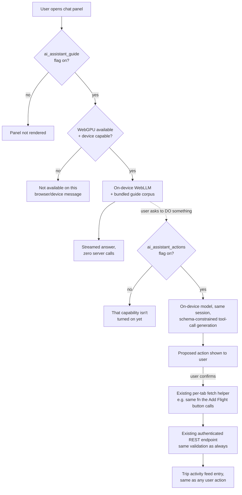

# Implementation Plan: AI Trip Assistant

## Status

Proposal, Phase 0 spike underway (see findings below). This plan reflects
scoping decisions the product owner made up front (see "Scoping decisions"
below), most recently revised to make the **entire** feature — guide *and*
actions — run on-device with $0 marginal cost.

## Phase 0 findings so far

Concrete results from installing `@mlc-ai/web-llm` into `app/` and running
it through this repo's actual tooling (not simulated):

- ✅ **Installs as a single clean dependency.** `@mlc-ai/web-llm@0.2.84`
  (Apache-2.0, confirmed via its own npm registry metadata) pulls in
  exactly one transitive dependency, `loglevel` (MIT). No dependency
  conflicts.
- ✅ **Typechecks cleanly with zero extra devDependencies**, despite the
  library's own `.d.ts` files referencing a few peer packages
  (`@mlc-ai/web-tokenizers`, `@mlc-ai/web-runtime`, `@mlc-ai/web-xgrammar`)
  that aren't installed by default, plus an unused Chrome-extension code
  path. This repo's existing `skipLibCheck: true` (in both the root and
  `expo/tsconfig.base` configs) already makes all of that a non-issue —
  `npm run typecheck` passes with no changes needed beyond adding the one
  real dependency.
- ✅ **Bundles cleanly under the real Metro web export** — `expo export
  --platform web` (via `npm run export:web`, the same command the
  production deploy pipeline uses) successfully bundled the app with
  `@mlc-ai/web-llm` wired into the module graph: 2028 modules, zero
  errors.
- ✅ **Lazy-loading works — resolved, correcting an earlier finding in
  this same spike.** The first pass wired `assistantLocalModel.ts` in via
  a plain top-level `import` chain from `App.tsx` (through a throwaway
  probe file), and its nested `await import('@mlc-ai/web-llm')` landed in
  the main eagerly-loaded bundle — because the *calling code* was reached
  eagerly, not because Metro can't split. Re-tested by instead wrapping a
  probe component behind `lazy(() => import(...))`, the exact pattern this
  codebase already uses for `AdminTab`/`IngestionTab`
  (`app/App.tsx:44-45`), and confirmed with a byte-level before/after
  comparison:
  - `index.html`'s initial `<script>` tags stayed at exactly 3 files in
    both cases — `@mlc-ai/web-llm` never appears there.
  - The secondary, async-fetched-on-demand bundle that a lazy import
    resolves into went from **25.7 KB with nothing lazy-loaded requiring
    it** to **5.75 MB with web-llm reachable only through the lazy
    boundary** — an isolated, precise delta confirming the library's code
    sits entirely inside the deferred chunk, not the initial payload.
  - **Conclusion for implementation:** `AssistantChat.tsx` (§5.2) must
    itself be the `lazy(() => import('./components/AssistantChat'))`
    boundary in `App.tsx`, exactly like `AdminTab`. `assistantLocalModel.ts`
    must only ever be reached *through* that component, never via a
    static/eager import elsewhere — that's the one rule that makes this
    actually free for non-users. This is a one-line architectural
    requirement to get right, not a Metro limitation to work around.
  - **One number worth carrying forward honestly:** that 5.75 MB is
    minified JS (confirmed — the export output has single-letter
    variables, no whitespace), not gzipped-over-the-wire size, and it's
    on top of the model-weight download (§4), not instead of it. A user
    who *does* open the assistant for the first time pays both costs —
    that's the real, honest first-open cost, still $0 in dollars but not
    literally free in bytes. See the revised §6.
- ✅ **Model registry confirms every candidate model from §4 is real and
  hosted**, with concrete numbers: Qwen2.5-1.5B (1.63GB VRAM),
  Qwen2.5-3B (2.5GB VRAM), Qwen2.5-0.5B (0.94GB VRAM), SmolLM2-1.7B
  (1.77GB VRAM) are all `low_resource_required: true` in WebLLM's own
  config. All four share a **4096-token context window** — a real,
  previously-unstated constraint that means guide-corpus retrieval must
  inject only a few relevant snippets (not the whole corpus) and
  conversation history needs active pruning, not just a message-count cap.
- ⚠️ **Tool-calling risk is now concretely confirmed, not just
  theoretical.** WebLLM's OpenAI-compatible API genuinely supports
  `tools`/`tool_choice` and real grammar/JSON-schema-constrained decoding
  (`response_format: { type: "grammar", grammar }`) for any model — but
  MLC's own explicitly-vetted `functionCallingModelIds` list contains only
  larger 7–8B Hermes-family fine-tunes, and **does not include Qwen2.5 at
  all**. Constrained decoding still forces syntactically valid JSON
  regardless of model, but *tool-call accuracy* (right tool, right
  arguments) is unverified for our chosen default and is now the single
  most important thing to test before Phase 3 is greenlit — see the
  updated §13. This also surfaces a real fallback option worth recording:
  **Hermes-2-Pro-Mistral-7B-q4f16_1-MLC** is Apache-2.0 (Mistral-based, not
  Llama-based) and is on MLC's vetted function-calling list — a candidate
  "bigger model just for action mode" if Qwen2.5's tool accuracy proves
  insufficient (~7B, ~4–5GB download, opt-in only).
- **Incidental, unrelated finding — flagged, not fixed here:**
  `app/tests/metroConfigParity.test.ts`'s "keeps image-size-safe as a
  workspace instead of a broken file override" assertion is already
  failing on `main`, independent of anything in this spike (verified via
  a clean `git stash` + test run). Worth a separate look, but out of scope
  for this plan.

## 1. Summary

A chat-based assistant embedded in the app that helps users understand and
use app features ("guide" mode), and can take real actions on their behalf
("action" mode: add a flight, edit lodging dates, etc.) via natural
language.

**Both modes run entirely on-device**, in the browser, via
[WebLLM](https://github.com/mlc-ai/web-llm) + WebGPU. There is no
server-side LLM call anywhere in this feature, in either mode. This
resolves the original tension cleanly: "runs locally so it doesn't cost us
anything" now applies to the whole feature, not half of it — and the
"standard API-limiting/budget architecture" simply doesn't come into play,
because there's no new billed resource for it to govern. Action mode's
safety comes from a tool allow-list, confirmation-before-write, and
dispatching through the app's existing, already-authorized REST
endpoints — not from a cost cap.

Guide mode and action mode still ship as separate, independently-flagged
phases (§5.5), because the *reliability and blast-radius* risk of letting a
small on-device model call mutating tools is real even though the *cost*
risk isn't. Phasing exists for safety/rollout reasons now, not cost
reasons.

## 2. Scoping decisions

| Question | Decision |
|---|---|
| What does "local" mean? | **All on-device**, both guide and actions — no server LLM calls at all (revised; originally actions were server-mediated) |
| Can it take real actions? | Phased — guide/Q&A ships first; actions come later behind their own flag, once tool-calling reliability is validated |
| Platform priority | Web first; native is a later, separate investigation (now blocks *both* modes — see §11) |
| Who gets access? | **All tiers, both modes.** Tier-gating for actions is dropped: it was motivated by cost containment, which no longer applies (revised — see §5.6) |

## 3. Goals / Non-goals

**Goals**

- In-context help: answer "how do I do X in this app" questions accurately,
  grounded in this app's actual features (not a generic travel chatbot).
- Let users perform common actions via natural language, with explicit
  confirmation before anything is written.
- **Zero marginal cost, full stop** — no server-side LLM calls in either
  mode, no fallback path that could quietly reintroduce one (see §13).
- Action mode's safety comes from a small tool allow-list + mandatory
  confirmation + reuse of already-authorized endpoints, not from a spend
  cap.
- Every major component independently feature-flagged, so any piece can be
  killed without redeploying.

**Non-goals (v1)**

- Not an autonomous multi-step agent — no chained actions without
  per-action user confirmation.
- Not a replacement for the existing AI itinerary generator; that feature
  keeps its own separate flag and its own server-side budget, untouched by
  this plan.
- Not available on native in v1 for *either* mode (see §11) — on-device
  inference has no native story yet, and there is no server-mediated
  fallback anymore to give native an earlier partial launch.
- No voice interface.
- No chat history persistence in v1 (stateless per session) unless
  Phase 1 usage clearly asks for it.

## 4. Feasibility assessment — the "runs locally" reality check

**On-device, web (WebLLM + WebGPU):** feasible today for both guide and
action-oriented prompts. Small quantized instruct models run acceptably
via WebLLM in any browser with WebGPU (Chrome/Edge shipped; Safari's WebGPU
support is still maturing as of this writing — see risk in §13, resolved
as "stays free, no fallback"). Model weights (roughly 400MB–2GB depending
on choice) download once and are cached in the browser's Cache
Storage/OPFS; subsequent sessions load from disk almost instantly.
Low-end/older devices will be slow or effectively unusable — this must be
feature-detected and gracefully degraded, not silently attempted.

**Model selection.** To keep this genuinely free with no license strings,
model choice is filtered to true OSI-approved open-source licenses (Apache
2.0 / MIT) rather than "open weights" licenses that carry usage
restrictions (e.g. Llama's community license, which is free for this app's
scale but is not open source and was excluded on that basis) — evaluated
alongside WebLLM/MLC-format availability and quality-per-MB, for both the
"answer using only the provided app-feature context" task and the
"emit one JSON tool call matching this schema" task:

| Model | Params | License | ~4-bit download | Role |
|---|---|---|---|---|
| **Qwen2.5-1.5B-Instruct** | 1.5B | Apache 2.0 | ~1GB | **Default**, both guide and action mode. Best instruction-following-per-MB in this class, including structured-output/JSON tasks. |
| **Qwen2.5-3B-Instruct** | 3B | Apache 2.0 | ~2GB | **Opt-in "better answers"** for capable devices, same family/prompting as the default. |
| Qwen2.5-0.5B-Instruct | 0.5B | Apache 2.0 | ~400MB | Candidate low-end fallback if Phase 0 finds 1.5B too slow — guide mode only; too unreliable for tool-calling. |
| SmolLM2-1.7B-Instruct | 1.7B | Apache 2.0 | ~1GB | Hugging Face's on-device-purpose-built model — worth a head-to-head against Qwen2.5-1.5B in the spike, especially on structured-output accuracy. |

One model family covers both modes: **Qwen2.5-1.5B-Instruct ships as the
default**, with **Qwen2.5-3B-Instruct** as an opt-in toggle for capable
devices. Phase 0 confirms real tokens/sec, download size, and — critically,
now that this model also drives action mode — **structured tool-call
accuracy** (§4, "Tool-calling reliability" below) before this is locked
for release.

**On-device, native (React Native/Expo):** not feasible for v1 without a
substantial separate effort. There's no WebGPU on native; the equivalent
would be a llama.cpp binding (e.g. `llama.rn`) or MLC-LLM's native runtime,
which means native modules incompatible with Expo Go (a custom dev client /
EAS build would be required) and tens-to-hundreds of MB added to the app
binary per platform. This is explicitly out of scope for v1 and tracked as
a future spike, not committed work. **Because action mode is no longer
server-mediated, native gets neither mode until this is solved** — unlike
the previous version of this plan, there's no "actions ship on native
first via the server" path anymore (see §11).

**Tool-calling reliability — the real risk now.** Small on-device models
(1–3B params) are meaningfully less reliable at structured function-calling
than frontier cloud models. Since this plan drops the server-mediated
option, that risk is *accepted*, not avoided — and mitigated three ways
instead of sidestepped:

1. **Grammar/JSON-schema-constrained decoding.** WebLLM's underlying MLC
   engine supports constrained generation, so the model is forced to
   produce syntactically valid output matching the active tool's schema —
   it cannot emit malformed JSON or invent a field, though it can still
   pick the *wrong* tool or *wrong* argument values, which constrained
   decoding doesn't fix.
2. **Small, explicit tool allow-list**, starting with the lowest-risk
   actions only (§12).
3. **Mandatory confirmation before execution**, every time, no exceptions
   — the model proposes, the user approves, the app's normal (already
   validated, already authorized) code path executes.

Phase 0 must include a small accuracy check on this specific model against
a handful of realistic action prompts before Phase 3 (action mode) is
greenlit — see §12.

**Conclusion:** an all-on-device design is coherent once cost containment
is the only thing "must use the standard API-limiting architecture" was
protecting — with no server LLM calls, there's nothing left for that
architecture to meter.

## 5. Architecture

### 5.1 High-level flow

### 5.2 Frontend

- `app/components/AssistantChat.tsx` — a floating affordance + slide-over
  panel available from any tab, in the same family as other overlay
  components (`ConfirmDialog`, `LodgingDetailsDialog`).
- `app/hooks/useAssistantChat.ts` — owns message state, streaming, model
  load/error states, and — once action mode is enabled — parsing/
  validating a proposed tool call before showing the confirmation step.
  Everything in this hook talks to the on-device model; it never calls a
  new backend route.
- `app/utils/assistantLocalModel.ts` — thin wrapper around WebLLM: feature
  detection (WebGPU presence, a rough device-capability heuristic via
  `navigator.deviceMemory` where available), model download/cache
  lifecycle, streaming `generate()`, and (Phase 3) schema-constrained
  generation for tool calls. Kept behind a small interface so the
  underlying library could be swapped later without touching UI code.
- **Guide corpus:** a small, versioned, bundled set of feature-description
  snippets (one short doc per feature area — Transfers, Lodging,
  Activities, Itinerary, Expenses, etc.), retrieved via simple
  keyword/substring scoring (the corpus is a few dozen documents — no
  vector DB needed at this scale) and injected into the on-device model's
  context as grounding. This avoids the model inventing feature
  descriptions from generic training knowledge instead of this app's
  actual UI.
- **Action-mode tool dispatch (Phase 3):** `app/utils/assistantTools.ts`
  defines a small, explicit map from tool name (`addFlight`, `addLodging`,
  `addActivity`, `updateItineraryStatus`, …) straight to the **existing
  per-tab fetch helper function** that already implements that action —
  the same function the corresponding UI button already calls (per this
  codebase's existing convention that each tab file owns its own fetch
  logic). The model never talks to the network directly; it only ever
  produces `{tool, args}`, which this map turns into a call to code that
  already exists, is already tested, and already goes through the normal
  authenticated REST endpoint with all of that endpoint's normal
  validation (trip membership, active-trip limits, etc.) — nothing new to
  authorize, because nothing new is being called.
- Native ships with `ai_assistant_guide_native` and `ai_assistant_actions`
  both hard-blocked by the platform check until Phase 4 resolves on-device
  native inference — there is no "cheaper" native path to offer in the
  meantime now that neither mode touches a server.

### 5.3 Data model

**No new tables for either phase.** Guide mode is stateless and
client-only. Action mode dispatches to existing REST endpoints, which
already persist whatever they always persisted — there's no new "AI usage"
resource to track, because nothing new is being metered.

- Traceability for assistant-performed actions reuses the **existing trip
  activity feed** (`server/src/services/activityFeed.ts`, `TripActivity`,
  keyed by `actorUserId`) that already records user actions — an
  assistant-driven add-flight shows up there exactly like a manually-added
  one, attributed to the same user. If a specific action type's endpoint
  doesn't already emit an activity-feed event, that's a pre-existing gap
  in that endpoint, not something this feature needs to newly solve.
- **Phase 2 (optional chat history)**, only if pursued: one new table,
  e.g. `assistant_messages` (userId, tripId, role, content, createdAt).
  Itself behind the `ai_assistant_chat_history` flag, default OFF.

### 5.4 Feature flags

Following `server/config/feature-flags.yaml` conventions exactly:

| Flag | Default | Purpose |
|---|---|---|
| `ai_assistant_guide` | off → on after staged rollout | Master switch for the on-device guide chat UI (web) |
| `ai_assistant_guide_native` | off | Reserved for when native on-device guide exists (Phase 4) |
| `ai_assistant_actions` | off | Master switch for on-device tool-calling/action-taking, independently toggleable from the guide flag |
| `ai_assistant_chat_history` | off | Optional persistence of chat history across sessions (privacy-conscious opt-in) |

Each flag is a genuine kill switch, checked client-side before the
relevant UI affordance even renders — there's no server enforcement layer
to also disable, since there's no server call to gate.

### 5.5 Tier entitlement — dropped

Neither mode is tier-gated. The earlier version of this plan gated action
mode to Premium/Pro specifically because it cost money per use; now that
it doesn't, that gate has no remaining justification and is removed.
Rollout risk is instead managed by the flag-based staged rollout in §12
(internal/admin accounts first, then general availability) — a
time-boxed, cost-agnostic safety mechanism rather than a permanent
plan-tier paywall. If there's a *separate* business reason to make this a
paid-plan differentiator later (not a cost reason), that would be a new,
explicit decision — this plan doesn't make it by default.

## 6. Performance & caching

- **Model download:** WebLLM caches quantized weights in Cache
  Storage/OPFS after first load; later sessions load from disk almost
  instantly. Show a one-time "downloading assistant (~1–2GB)" progress UI
  with a skip/defer option — this is an optional feature, not a blocking
  one.
- **Lazy load — confirmed working by Phase 0, one hard requirement.**
  `AssistantChat.tsx` must be mounted as `lazy(() => import('./components/AssistantChat'))`
  in `App.tsx`, the same pattern already used for `AdminTab`/`IngestionTab`
  (`app/App.tsx:44-45`). Measured byte-for-byte: with `@mlc-ai/web-llm`
  reachable only behind that boundary, it does not appear in any of
  `index.html`'s initial `<script>` tags, and the async-fetched-on-open
  bundle it lands in is 5.75 MB (minified) versus a 25.7 KB baseline with
  nothing lazy-loaded needing it — i.e. a precisely isolated, confirmed-
  deferred cost. The one thing that would silently break this: importing
  `assistantLocalModel.ts` (or anything that imports it) from anywhere
  reached by a static/eager import chain, even indirectly. That's not a
  Metro limitation to configure around — it's a one-line architectural
  rule to keep from day one.
- **First-open cost, stated honestly:** a user opening the assistant for
  the first time downloads both the ~5.75 MB (minified; smaller gzipped
  over the wire) WebLLM JS payload *and* the model weights (§4) — still
  $0, but not literally free in bytes. Worth reflecting in the "downloading
  assistant" progress copy above rather than only mentioning model size.
- **Guide corpus:** bundled static JSON/TS, versioned with the app build,
  no network fetch needed for retrieval grounding.
- **Shared model session:** guide and action mode reuse the same loaded
  WebLLM engine instance within a chat session — no reloading the model
  when a conversation shifts from Q&A to "please add this flight."
- **Runaway-context guards:** cap max response tokens and max turns per
  conversation (e.g. 20 messages) client-side, so a long context can't
  make an underpowered device unresponsive. Also cap max tool-call
  attempts per user message (e.g. one proposal, one retry on invalid
  schema, then fall back to "I couldn't do that automatically — try the
  \<Tab\> screen directly") so a confused model can't loop.

## 7. Cost minimization

There is nothing left to estimate here — **both modes are $0 marginal
cost**, always, for every user, on every tier. The only cost this feature
carries at all is one-time model-weight bandwidth on first download, and
using a public model CDN (Hugging Face / MLC's hosted weights) rather than
self-hosting keeps even that at $0 to us. Action mode's "activity" is
indistinguishable, cost-wise, from a user clicking the equivalent button
themselves — it dispatches to the same endpoint, which was already free
(part of normal app operation) before this feature existed.

The existing `server/config/api-limits.yaml` / budget architecture is
untouched by this feature — no new provider, no new caller, no new
`budgeting` entry. That architecture remains exactly as it is today,
governing the features that already use it (itinerary generation,
ingestion, etc.).

## 8. Security

- **Tool allow-list only** — no arbitrary code execution, no direct DB/
  query access from the LLM, ever. The model can only ever produce a
  `{tool, args}` object matching one of a small set of known schemas.
- **Nothing new to trust:** every action dispatches through the exact same
  authenticated REST endpoint, with the exact same validation (trip
  membership, ownership, active-trip limits, etc.), that the equivalent UI
  button already goes through. The assistant is a natural-language front
  end over already-authorized code paths — it introduces no new privilege.
- **Explicit confirmation** before any mutating tool call executes, every
  time.
- **Prompt-injection hygiene:** retrieved app data placed into context
  (e.g. a lodging name a user typed, which could contain adversarial text)
  is treated as data, never as instructions — standard structural
  separation between system prompt, tool schemas, and user/data content.
  This matters even more now that the same context window can lead to a
  tool call, not just a text answer.
- **Traceability:** assistant-performed actions land in the existing trip
  activity feed under the acting user's own `actorUserId`, same as if they
  had clicked the button (§5.3).
- **Stronger privacy story than before:** on-device inference means no
  user question, no trip data, and (now) no proposed action ever leaves
  the device as an LLM input/output in *either* mode — this is a genuine,
  fully-true claim for the whole feature now, not just guide mode. Worth
  stating explicitly to users ("nothing you ask or ask it to do ever
  leaves your device") and reflecting in the privacy policy. This is
  strictly stronger than the previous version of this plan, where action
  mode still sent data to a cloud provider.
- **No new rate-limiting infrastructure needed** — abuse resistance is
  whatever the underlying REST endpoint already enforces (it was already
  callable by the user directly), not a new AI-specific limiter.

## 9. Maintainability

- `assistantLocalModel.ts` isolated behind a small interface so the
  underlying on-device library (WebLLM today) could be swapped later
  without touching chat UI code.
- **Hard rule, confirmed load-bearing by Phase 0 (§6): nothing outside
  `AssistantChat.tsx`'s own `lazy()`-loaded subtree may import
  `assistantLocalModel.ts` (or anything that imports it) statically.**
  A single stray eager import anywhere else in the app silently pulls the
  ~5.75 MB WebLLM bundle back into every web user's initial page load with
  no build error to catch it. Worth a dedicated lint rule or CI grep guard
  (import-cycle/dependency-boundary check) once this ships, not just a
  code-review convention to remember.
- Guide corpus kept as versioned, typed data. To stop it silently going
  stale as features change, add a soft CI nudge similar in spirit to the
  existing `userFacingCopyGuard.test.ts`: flag (not block) a PR that
  touches a tab file without touching its corresponding guide entry.
- **Action-mode tools are references to existing code, not new
  implementations.** `assistantTools.ts` is intentionally thin — a lookup
  table from tool name to an already-existing fetch helper. When a tab's
  fetch helper changes, the tool automatically reflects that; there's no
  parallel implementation to keep in sync. Add a similar soft CI nudge to
  catch a fetch-helper signature change that no longer matches its tool's
  declared schema.

## 10. Test coverage

**Frontend**

- `useAssistantChat`: message state, streaming, error/fallback states, and
  feature-flag hiding — mirroring the `aiItineraryGenerationAllowed` test
  pattern shipped this session (`createTripWizardAiFlag.test.tsx`,
  `overviewAiRetryButton.test.tsx`).
- `assistantLocalModel`: unit tests around feature detection (WebGPU
  absent → disabled state) and constrained-generation output validation
  (reject/retry on a malformed or unknown-tool response), with the WebLLM
  engine itself mocked out — never run real on-device inference in CI,
  it's too slow/heavy and not deterministic.
- `assistantTools`: for every tool, a test asserting it calls the correct
  existing fetch helper with the correct mapped arguments (mock the fetch
  helper, not the network) — this is the most important test in the whole
  feature, since it's the one place a mis-mapped tool could cause a wrong
  mutation.
- Component tests for panel open/close, message rendering, and the
  confirmation-dialog flow for a proposed action.

**E2E (Playwright, web)**

- One happy-path test: open chat, ask a guide question, get a rendered
  response (stubbed model response).
- One action happy-path test: ask for a supported action, confirm the
  proposal UI renders the correct summary, confirm, and assert the
  existing fetch helper's mocked endpoint was called.
- One flag-off test per flag: confirm the relevant UI doesn't render at
  all when its flag is off.

## 11. Usability (web & native)

- **Web:** persistent floating affordance across tabs; streamed responses
  so waits don't feel dead; explicit "nothing you ask or ask it to do ever
  leaves your device" messaging to build trust; visible download progress
  with a skip option; a clear, non-silent message when WebGPU/the device
  isn't capable ("assistant not available on this browser/device" rather
  than a quiet failure).
- **Native:** ships flag-off in v1, for **both** modes now — with action
  mode no longer server-mediated, there's no partial/paid native launch
  available as a stopgap the way there was in the previous version of
  this plan. Native gets this feature only once Phase 4's on-device
  native investigation lands (or a future, separately-scoped decision
  chooses to bring back a server-mediated path specifically for native).
- **Both:** the assistant is a supplementary, fully dismissible overlay —
  never blocks or replaces the primary trip UI.

## 12. Rollout plan

1. **Phase 0 — spike (starting now):** validate WebLLM works cleanly
   under Expo's Metro web bundler; measure real download size, load time,
   and tokens/sec on a representative machine; confirm constrained/
   schema-guided generation works for a simple tool-call shape; pick the
   final default model. This determines whether the rest of this plan is
   worth committing to as scoped, or needs revisiting — in particular,
   whether Qwen2.5-1.5B's tool-calling accuracy is good enough to greenlight
   Phase 3 at all, or whether action mode needs to stay guide-only for
   longer.
2. **Phase 1 — Guide/FAQ chat**, on-device, web only. `ai_assistant_guide`
   default off; staged rollout to internal/admin accounts first (same
   dogfood-then-flip pattern already used for `trip_day_map`), then
   general availability, to every tier.
3. **Phase 2 — optional chat history**, only if Phase 1 usage/feedback
   clearly asks for continuity across sessions. `ai_assistant_chat_history`.
4. **Phase 3 — action-taking**, on-device, all tiers, gated only by
   `ai_assistant_actions` and the Phase 0 accuracy checkpoint. Starts with
   the smallest, lowest-risk tool allow-list (e.g. "add an activity,"
   "check an itinerary item's status") — no deletions, nothing
   payment-adjacent — before ever expanding the allow-list, and follows
   the same internal-first staged rollout as Phase 1.
5. **Phase 4 (exploratory, not committed) — native on-device**, only
   pursued if Phase 1/3 clearly prove the UX is worth the native R&D cost.
   Unlocks both modes on native simultaneously, since neither has a
   server-side path anymore.

## 13. Open questions / risks

- **Safari WebGPU support** is still maturing as of this writing — a
  meaningful share of web users (Safari on macOS/iOS) may see "not
  available" for a while, for both modes now. **Decision: no server-side
  fallback**, for either mode. The whole feature stays unconditionally
  $0 — unsupported browsers/devices get the clear "not available on this
  browser/device" message rather than a paid API path. Revisit only if
  Safari's WebGPU rollout stalls long enough to materially block adoption,
  and treat any future fallback as a new, separately-scoped-and-budgeted
  decision, not a quiet addition to "free."
- **Tool-calling accuracy is the central open risk, now concretely
  confirmed rather than theoretical** (see "Phase 0 findings" at the top).
  WebLLM's own maintainers only formally vouch for function-calling
  accuracy on larger (7–8B) Hermes-family models — Qwen2.5 isn't on that
  list. Constrained decoding still guarantees syntactically valid JSON
  from Qwen2.5, but *correctness* (right tool, right arguments) is
  unverified. **Eval harness built:**
  `scripts/spikes/ai-assistant-tool-calling-eval.html` — a standalone,
  no-build-step page (imports WebLLM from a CDN) that runs a fixed set of
  10 realistic action prompts against a chosen model with the plan's
  candidate tool schemas (`addFlight`/`addLodging`/`addActivity`/
  `updateItineraryStatus`), auto-grades tool name + key arguments where
  possible, and leaves genuinely ambiguous cases (multi-intent, missing
  info that should trigger a clarifying question instead of a guess) for
  manual grading. Also reports real load time and `decode_tokens_per_s`/
  time-to-first-token per prompt — the tokens/sec measurement §13 flagged
  as still unmeasured. The grading logic itself is unit-tested against synthetic
  model outputs (correct call, wrong tool, wrong args, hallucinated call
  when it should have asked a question, etc.) so the harness's verdicts
  can be trusted before spending GPU time on it. **This needs a real
  WebGPU browser to actually run — serve `scripts/spikes/` locally
  (e.g. `npx serve scripts/spikes`) and open it in Chrome/Edge; opening
  the file directly (`file://`) won't work reliably.** Compare
  Qwen2.5-1.5B (and 3B) against **Hermes-2-Pro-Mistral-7B-q4f16_1-MLC**
  (Apache-2.0, MLC-vetted for function calling) as a reference point. If Qwen2.5's accuracy is too low
  even with constraints + confirmation, the fallback is *not* "add a
  server call" (that would undo the whole point of this revision) — it's
  either narrowing the tool allow-list further, or using the larger
  Hermes model specifically for action mode (bigger opt-in-only download,
  still $0, still on-device) while keeping Qwen2.5-1.5B for guide mode.
- ~~Lazy-load bundle-splitting~~ — **resolved.** Confirmed working via
  `React.lazy()`, matching this codebase's existing `AdminTab`/
  `IngestionTab` pattern (see "Phase 0 findings" and the revised §6). The
  remaining discipline is architectural, not infrastructural: everything
  under the assistant feature must be reached only through the
  `AssistantChat.tsx` lazy boundary.
- **Model choice** — provisionally confirmed by Phase 0: Qwen2.5-1.5B/3B/
  0.5B and SmolLM2-1.7B are all real, hosted, `low_resource_required`
  prebuilt options (see "Phase 0 findings"). Default
  **Qwen2.5-1.5B-Instruct**, opt-in **Qwen2.5-3B-Instruct**, pending the
  tool-calling accuracy check above actually validating the default is
  good enough for Phase 3. Real tokens/sec on representative hardware is
  still unmeasured — that requires a human running it in an actual
  WebGPU-capable browser, not something verifiable from this spike alone.
- **Legal/privacy copy** updates: the on-device privacy win now applies to
  the *entire* feature (§8), not just guide mode — worth a clear,
  specific callout in the privacy policy rather than folding it into
  existing itinerary-generation language, since this is a materially
  different (stronger) data-handling story.
