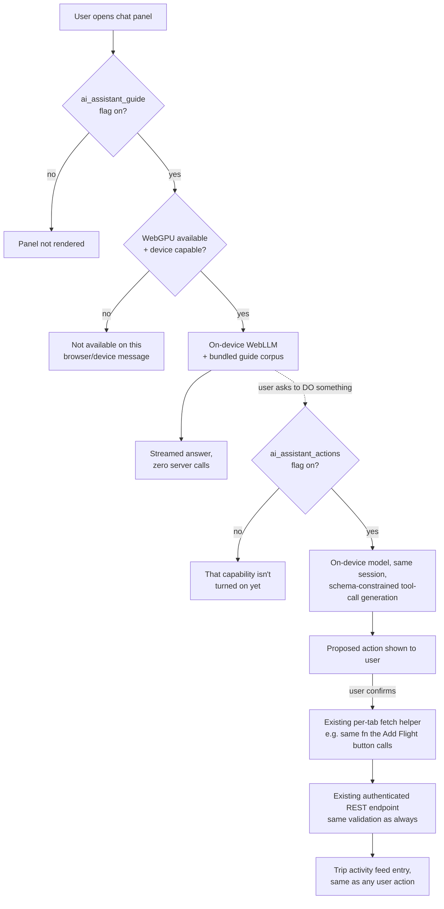

# Implementation Plan: AI Trip Assistant

## Status

Phase 1 (guide/FAQ chat) built, tested, and manually verified working
end-to-end behind the `ai_assistant_guide` flag (default off). Phase 2
(conversation persistence) is also built and tested — see "Phase 2
status" below for a real deviation from this plan's original design
(client-side only, not the server DB table originally specified). **Phase 3
(actions) is now built and tested too** — see "Phase 3 status" below for
the narrow tool set that shipped, how it differs from the original 4-tool
design, and what's still open before the `ai_assistant_actions` flag can
actually be flipped on for real users. Phase 0's findings below still
stand as background; Phase 1's own findings are below that. This plan
reflects scoping decisions the product owner made up front (see "Scoping
decisions" below), most recently revised to make the **entire** feature —
guide *and* actions — run on-device with $0 marginal cost.

**Phase 3 (actions) is paused, not started — product decision, not a
default.** The eval harness (§13) was run against both realistic
candidate models and found no currently-viable path: Qwen2.5-1.5B's
manual-JSON-in-prompt accuracy was weak (3/8, failing exactly the
safety-critical "ask instead of inventing details" cases), and
Hermes-2-Pro-Mistral-7B's native `tools` path is blocked by an upstream
WebLLM/XGrammar bug (crashes on the first call, every time — see the
"GrammarMatcher disposal bug" finding below) on top of GPU-load fragility
observed on the test machine. Given both realistic strategies are
currently broken or unreliable, the product owner chose to **keep the
assistant guide-only for now** rather than keep chasing either path.
Revisit if WebLLM's tool-calling matures upstream (watch
[mlc-ai/web-llm#807](https://github.com/mlc-ai/web-llm/issues/807)) or if
a narrower tool set is later judged worth re-testing against Qwen2.5.
**Update: that narrower retest happened — see "Narrow-tool-set retest
result" below.** The accuracy gate this pause was based on is closed for
the narrow tool set + manual strategy. **Product owner decision (2026-08-24):
un-pause Phase 3 and begin scoping the actual implementation**, on the
condition that the WebLLM `0.2.84` version risk (same entry below) is
resolved or explicitly accepted first, and on the narrow tool set only —
the full 4-tool set was never re-tested and should not be assumed safe.

**Retest in progress (product owner requested it):** since the manual
JSON-in-prompt strategy doesn't depend on the broken upstream Hermes path,
it's worth one more real attempt before treating the pause as final. The
harness now supports, without depending on any WebLLM fix: (1) Qwen2.5-3B
instead of 1.5B (better instruction-following, now the dropdown's default
selection), (2) two few-shot examples in the manual-strategy system prompt
targeting the exact observed failure modes ("ask instead of inventing
missing fields," "use the stated current year, don't guess"), and (3) a
"narrow tool set" checkbox (checked by default) that re-grades the same 10
prompts against Phase 3's actual planned first allow-list (`addActivity` +
`updateItineraryStatus` only) instead of all 4 hypothetical tools — the
scope that would actually ship, not a broader hypothetical one. Results
pending a real run.

🛑 **Retest hit a third blocker, also traced to a confirmed upstream bug —
and this one is a live risk for the already-shipped Phase 1 feature, not
just this eval.** Running Qwen2.5-3B via the manual strategy (no `tools`,
no `response_format` at all) failed identically to the Hermes crash —
"Object has already been disposed" on every call, starting with the
first, in a genuinely fresh browser session (confirmed with the product
owner: full browser restart beforehand, Qwen2.5-3B was the first model
tried, no prior Hermes attempt in that session — ruling out leftover
tab-state corruption as the cause). Found the real cause via GitHub
search: [mlc-ai/web-llm#844](https://github.com/mlc-ai/web-llm/issues/844),
opened days before this was hit, root-caused to `apache/tvm`'s web
runtime — a shared `shapeCache` LRU evicts and disposes tensor-shape
objects that are still in use elsewhere, and a fix requires an upstream
`apache/tvm` PR to land, a new `web-runtime` release, and then a WebLLM
dependency bump, **none of which has happened yet.** This is a different
bug from the Hermes GrammarMatcher one, but the same *class*: both are
"regression introduced in 0.2.83" per the issue title, and both this
harness and (more importantly) `app/package.json` are pinned to
`@mlc-ai/web-llm@^0.2.84` — **after** the regression, and with a caret
range that floats forward into any future 0.2.x. Apparently only larger
models (3B, 7B) churn the shape cache enough to trigger it reliably;
Qwen2.5-1.5B (the shipped guide-mode default) didn't trip it in this
session's earlier runs or in Phase 1's manual testing, but that's
circumstantial, not a guarantee — longer conversations or heavier prompts
could still hit it. **Fix applied in the harness only:** pinned the CDN
import to `@mlc-ai/web-llm@0.2.82` (before the regression) instead of
`0.2.84`, to unblock testing. **Not yet applied to `app/package.json` —
that's a real production question for the product owner**, since the
same regression, if it fires, would break the shipped guide chat, not
just this spike.

🎯 **Narrow-tool-set retest result — positive, and it closes the specific
accuracy gate Phase 3 was paused on.** With the 0.2.82 pin unblocking real
runs, the narrowed 10-prompt set (Qwen2.5-3B, manual JSON-in-prompt
strategy, `addActivity` + `updateItineraryStatus` only — Phase 3's actual
planned first allow-list, not the full 4-tool hypothetical set) went
through several rounds of real, verified fixes:

1. **Harness bug fixed — the system prompt didn't match the tool set.**
   `SYSTEM_PROMPT` was a static string claiming the model could add
   flights, lodging, *and* activities, regardless of which tool set was
   actually loaded — so under the narrow set the model was being told it
   had capabilities it didn't. Replaced with `buildSystemPrompt()`,
   generated from whatever's actually in `TOOLS`, which also explicitly
   forbids substituting a different tool for a request none of the active
   tools cover.
2. **Few-shot examples added** for (a) mapping the user's own phrasing
   onto the exact status enum value (fixed a wrong-value bug where "mark
   as booked" produced `status: "Needed"`), and (b) declining out-of-scope
   requests — covering both an under-specified case and, after a
   follow-up retest showed the lesson hadn't generalized, fully-specified
   flight and lodging requests too (each tool needed its own
   complete-detail example; the lesson didn't transfer between siblings on
   its own).
3. **Sampling temperature pinned to `0.2`** (`ACTION_TEMPERATURE` in the
   harness). Previously left at WebLLM's model-config default (~1.0 for
   Qwen2.5), which made back-to-back reruns of the *identical* prompts
   against *identical* harness code produce materially different
   pass/fail results — impossible to tell a real prompt improvement from
   sampling noise. Matches the precedent already set by
   `ASSISTANT_TEMPERATURE = 0.2` in the shipped guide mode
   (`assistantLocalModel.ts`), adopted for the same "confident-but-wrong
   drift" reason.
4. **A client-side heuristic guard added**, after the temperature fix
   revealed that coercing a *fully-specified* flight/lodging request into
   a bogus `addActivity` call is this model's actual preferred completion
   for that prompt shape — not sampling noise, and not something three
   rounds of prompt engineering could close. `detectOutOfScopeCoercion` /
   `applyClientSideGuard` (in the harness) inspect a proposed
   `addActivity` call's own arguments for flight/lodging-shaped content
   (the word "flight," an airport-code pattern, "hotel"/"resort"/
   "check-in"/"N nights," etc.) and intercept it before it would reach a
   confirmation dialog, rather than relying on the model to self-restrain.
   Blocked calls are still shown (flagged) in the harness's results, not
   hidden, so the model's real behavior stays visible alongside the
   guard's intervention.

**Final result: 8/8 auto-graded pass, 9/10 overall** — multi-intent (the
one `graded: "manual"` case that isn't a known harness limitation) also
passed, correctly adding only the in-scope cruise half and dropping the
hotel half. The sole remaining failure, ambiguous-reference ("cancel that
activity we just talked about"), isn't fixable by anything tested here —
this harness has no real conversation history to resolve "that activity"
against, so correct behavior (asking which one) can't be distinguished
from a lucky guess in this test shape; a real Phase 3 implementation would
have actual conversation context available and needs re-testing in that
context, not this harness.

**Caveat, stated plainly:** most of this gain is the guard, not the model
becoming more reliable — its underlying instinct to coerce an unsupported
request into `addActivity` did not change, which is exactly why the guard
exists. The guard itself is simple regex/keyword matching, which means
real false positives are possible in production (a legitimate activity
literally named "Dinner at the Hotel Ritz" or "wine tasting flight" would
be wrongly blocked) — a real `assistantTools.ts` implementation needs a
more careful version of this check, not a direct port of the harness's
regex.

**What this does and doesn't settle:** this closes the accuracy gate for
the *narrow* tool set specifically — the original full 4-tool set was
never re-tested under any of these fixes and should be assumed to still
fail the same way it originally did (no guard exists for `addFlight`/
`addLodging` calls when those tools are actually active and legitimate).
Un-pausing Phase 3 is still the product owner's call, not just an
engineering one — and two things independent of this accuracy result
still need resolving first: (a) the WebLLM `@mlc-ai/web-llm@^0.2.84`
shapeCache regression above is still unresolved in `app/package.json`
(only pinned to 0.2.82 in this harness, not the real app) — a live risk
to the already-shipped guide mode, unrelated to tool-calling accuracy; (b)
no `assistantTools.ts` dispatch layer, confirmation UI, or
`ai_assistant_actions` flag wiring exists yet — this retest validates the
accuracy checkpoint the plan's rollout gate (§12) names as the go/no-go
signal, it is not itself an implementation.

✅ **Update: that implementation now exists.** All three things this
paragraph named as missing — the `assistantTools.ts` dispatch layer, the
confirmation UI, and the `ai_assistant_actions` flag wiring — are built and
tested. See "Phase 3 status" below for what shipped and how it differs
from this section's assumptions (most notably: the flag ships fail-
**closed**, not fail-open like `ai_assistant_guide`, since it gates real
mutations).

## Phase 0 findings so far

Concrete results from installing `@mlc-ai/web-llm` into `app/` and running
it through this repo's actual tooling (not simulated):

- ✅ **Installs as a single clean dependency.** `@mlc-ai/web-llm@0.2.84`
  (Apache-2.0, confirmed via its own npm registry metadata) pulls in
  exactly one transitive dependency, `loglevel` (MIT). No dependency
  conflicts.
- ✅ **Typechecks cleanly with zero extra devDependencies**, despite the
  library's own `.d.ts` files referencing a few peer packages
  (`@mlc-ai/web-tokenizers`, `@mlc-ai/web-runtime`, `@mlc-ai/web-xgrammar`)
  that aren't installed by default, plus an unused Chrome-extension code
  path. This repo's existing `skipLibCheck: true` (in both the root and
  `expo/tsconfig.base` configs) already makes all of that a non-issue —
  `npm run typecheck` passes with no changes needed beyond adding the one
  real dependency.
- ✅ **Bundles cleanly under the real Metro web export** — `expo export
  --platform web` (via `npm run export:web`, the same command the
  production deploy pipeline uses) successfully bundled the app with
  `@mlc-ai/web-llm` wired into the module graph: 2028 modules, zero
  errors.
- ✅ **Lazy-loading works — resolved, correcting an earlier finding in
  this same spike.** The first pass wired `assistantLocalModel.ts` in via
  a plain top-level `import` chain from `App.tsx` (through a throwaway
  probe file), and its nested `await import('@mlc-ai/web-llm')` landed in
  the main eagerly-loaded bundle — because the *calling code* was reached
  eagerly, not because Metro can't split. Re-tested by instead wrapping a
  probe component behind `lazy(() => import(...))`, the exact pattern this
  codebase already uses for `AdminTab`/`IngestionTab`
  (`app/App.tsx:44-45`), and confirmed with a byte-level before/after
  comparison:
  - `index.html`'s initial `<script>` tags stayed at exactly 3 files in
    both cases — `@mlc-ai/web-llm` never appears there.
  - The secondary, async-fetched-on-demand bundle that a lazy import
    resolves into went from **25.7 KB with nothing lazy-loaded requiring
    it** to **5.75 MB with web-llm reachable only through the lazy
    boundary** — an isolated, precise delta confirming the library's code
    sits entirely inside the deferred chunk, not the initial payload.
  - **Conclusion for implementation:** `AssistantChat.tsx` (§5.2) must
    itself be the `lazy(() => import('./components/AssistantChat'))`
    boundary in `App.tsx`, exactly like `AdminTab`. `assistantLocalModel.ts`
    must only ever be reached *through* that component, never via a
    static/eager import elsewhere — that's the one rule that makes this
    actually free for non-users. This is a one-line architectural
    requirement to get right, not a Metro limitation to work around.
  - **One number worth carrying forward honestly:** that 5.75 MB is
    minified JS (confirmed — the export output has single-letter
    variables, no whitespace), not gzipped-over-the-wire size, and it's
    on top of the model-weight download (§4), not instead of it. A user
    who *does* open the assistant for the first time pays both costs —
    that's the real, honest first-open cost, still $0 in dollars but not
    literally free in bytes. See the revised §6.
- ✅ **Model registry confirms every candidate model from §4 is real and
  hosted**, with concrete numbers: Qwen2.5-1.5B (1.63GB VRAM),
  Qwen2.5-3B (2.5GB VRAM), Qwen2.5-0.5B (0.94GB VRAM), SmolLM2-1.7B
  (1.77GB VRAM) are all `low_resource_required: true` in WebLLM's own
  config. All four share a **4096-token context window** — a real,
  previously-unstated constraint that means guide-corpus retrieval must
  inject only a few relevant snippets (not the whole corpus) and
  conversation history needs active pruning, not just a message-count cap.
- ⚠️ **Tool-calling risk is now concretely confirmed, not just
  theoretical — and worse than first assumed.** WebLLM's OpenAI-compatible
  `tools`/`tool_choice` parameter is **hard-gated to an allowlist**
  (`functionCallingModelIds`), which contains only larger 7–8B
  Hermes-family fine-tunes and does **not** include Qwen2.5 at all. This
  was originally (incorrectly) recorded above as "constrained decoding
  still forces syntactically valid JSON regardless of model" — that is
  **wrong**. Running the eval harness against Qwen2.5-1.5B confirmed the
  real behavior: passing `tools` for a non-allowlisted model throws
  client-side ("is not supported for ChatCompletionRequest.tools") before
  the model is even invoked. There is no degraded-but-working mode for
  small models via this API — it's a hard reject, not a reliability
  spectrum. *Tool-call accuracy* for our chosen default is therefore not
  just "unverified," it's **untestable via the native `tools` API at all**.
  This is now the single most important thing to resolve before Phase 3
  is greenlit — see the updated §13, which now also exercises a manual
  JSON-in-prompt fallback strategy for non-allowlisted models (describe
  the tool schemas as text, ask for a raw JSON object back, parse by
  hand) so Qwen2.5's actual tool-calling capability — via *some* strategy
  — can be measured at all. This also surfaces a real fallback option
  worth recording: **Hermes-2-Pro-Mistral-7B-q4f16_1-MLC** is Apache-2.0
  (Mistral-based, not Llama-based) and *is* on MLC's vetted
  function-calling list — a candidate "bigger model just for action mode"
  if Qwen2.5's tool accuracy (via either strategy) proves insufficient
  (~7B, ~4–5GB download, opt-in only).
- ⚠️ **First real accuracy run (Qwen2.5-1.5B, manual JSON-in-prompt
  strategy) completed — score is weak, and not just on edge cases.** All
  10 prompts ran to completion (no more hard `tools`-API errors). Of the
  8 auto-graded cases, only **3/8 passed**: it correctly answered a plain
  question with no tool call, and correctly filled a clear flight-booking
  request and a clear lodging request. It **failed the other 5**,
  including the two most safety-relevant behaviors for anything that will
  eventually execute a real mutation: asked to "add a flight to Tokyo" or
  "book me a hotel in Paris" with no dates/details given, it invented
  plausible-sounding values (a fake carrier, fake dates) and called the
  tool anyway, instead of asking a clarifying question — exactly the
  failure mode §4 flagged as the reason mandatory confirmation-before-
  execution can't be treated as sufficient on its own. It also called
  `addActivity` for "recommend a vegetarian restaurant," a request outside
  the tool set entirely, and called `addActivity` instead of
  `updateItineraryStatus` for "mark the Eiffel Tower tour as booked" —
  a wrong-tool-selection error. Separately (not counted in the 3/8, since
  auto-grading doesn't check date fields it isn't told to): when a prompt
  didn't specify a year, it filled in `2023` rather than the system
  prompt's stated current date (2026) — a grounding failure worth tracking
  even where it didn't change the auto-grade verdict. The two
  `graded: "manual"` cases (multi-intent, ambiguous-reference) still need
  a human look, but a **3/8 auto-graded pass rate, with 2 of the 5
  failures being "invents details instead of asking," is a real signal
  that Qwen2.5-1.5B is not yet trustworthy for action mode** even behind
  confirmation. Next: run the same 10 prompts against
  **Hermes-2-Pro-Mistral-7B** (native `tools` strategy) as the comparison
  point before deciding between "Hermes-only for actions" and "narrow the
  tool set further and re-test Qwen2.5."
  - **Harness bug found and fixed alongside this run:** the manual-mode
    parser used a single `JSON.parse` over the whole response, so when the
    model answered a multi-intent prompt with two back-to-back JSON
    objects (valid individually, invalid as one blob), the parser silently
    dropped both and the reviewer saw raw unparsed text instead of the
    model's actual two tool calls. Fixed by adding a string-aware
    brace-matching scan (`extractTopLevelJsonObjects`) that recovers each
    top-level JSON object separately when the whole response doesn't parse
    as a single value; also handles a well-behaved model that wraps
    multiple calls in a JSON array. Verified against the exact multi-object
    output from this run plus single-object, markdown-fenced, plain-text,
    unknown-tool-name, and array-of-calls cases before trusting it.
- ⚠️ **Second harness bug found when actually attempting the Hermes
  comparison run: `CustomSystemPromptError`.** Confirmed in WebLLM's own
  source (`node_modules/@mlc-ai/web-llm/lib/index.js`): when `tools` is
  set for a Hermes-2-Pro/Hermes-3 model, WebLLM hardcodes and injects its
  *own* system message — it bakes the tool schemas into Hermes's official
  function-calling prompt template — and throws if the request already has
  a `role: "system"` message anywhere. The harness was unconditionally
  sending `SYSTEM_PROMPT` as a system message for every model, which broke
  the native path specifically. **Fixed:** for the native strategy only,
  `SYSTEM_PROMPT` now travels inside the single `user` message instead
  (`` `${SYSTEM_PROMPT}\n\n---\n\n${c.prompt}` ``) — WebLLM's own injected
  system message still supplies the tool schemas. **This is a real Phase 3
  design constraint, not just a harness quirk:** if action mode ever uses
  Hermes's native `tools` API, app-specific guidance (today's date,
  "don't invent missing fields," anything else the guide-mode system
  prompt currently carries) cannot live in a system message — it has to be
  folded into the user turn on every request. Worth remembering if Phase 3
  ends up mixing strategies (native for Hermes, system-prompt-based manual
  for Qwen2.5) — the two paths need different message-construction code,
  not just a different `tools` argument.
- ⚠️ **Hermes-2-Pro-Mistral-7B failed to load on the actual test machine
  with `DXGI_ERROR_DEVICE_REMOVED`** — a Windows GPU driver crash/reset
  (VRAM exhaustion or a driver timeout), not a "WebGPU unsupported" error.
  Telling sign: Qwen2.5's 1.5B/3B models loaded and ran fine on the same
  browser/hardware; only the ~7B model triggered this. Once it happens,
  the GPU device is unrecoverable for the rest of that page's life — a
  retried "Load model" failed identically, and mid-run failures cascaded
  into all 10 prompts erroring identically ("model not loaded"), which was
  its own harness bug (see fix below). **This directly threatens the
  fallback plan recorded earlier** ("use Hermes-2-Pro-Mistral-7B for action
  mode if Qwen2.5's accuracy is too low") — if the reference model for
  measuring Qwen2.5 against can't reliably load on real hardware, it's not
  a realistic fallback for end users either, and the comparison run itself
  is still blocked. **Update: retried after a full browser restart** —
  the model itself now loaded successfully (so the first `DEVICE_REMOVED`
  really was a one-off GPU crash, not a hard hardware ceiling — though the
  browser did briefly refuse to find *any* GPU adapter in between,
  consistent with Chrome/Edge's post-crash GPU-process blocklist, and
  needed the full restart, not just a tab refresh, to clear). But the
  comparison run is still blocked — see the new finding immediately below.
  - **Harness bug found and fixed alongside this:** a lost/removed GPU
    device is fatal for the rest of the page — no in-page retry can
    recover it — but the harness kept letting "Load model" be re-clicked
    (failing identically each time) and, worse, the eval-run loop kept
    calling all 10 cases after the very first one hit the same fatal
    engine error, producing 10 identical, misleading "model not loaded"
    rows instead of one clear diagnosis. Fixed: added `isFatalDeviceError`
    detection (matches "device...removed/lost" and WebLLM's "model not
    loaded" engine-state error); on a fatal error, the run loop now stops
    immediately, marks remaining prompts "skipped" instead of repeating
    the failure, and both buttons are permanently disabled with a status
    message explaining a page refresh is required. The load-failure
    message was also corrected — it no longer claims "your device likely
    doesn't support WebGPU" for a crash/reset (misleading — WebGPU clearly
    works, since Qwen2.5 already proved that), instead naming the actual
    likely cause (VRAM/driver timeout on a larger model) and the actual
    fix (refresh the page).
- 🛑 **Blocker (not a harness bug): Hermes's native `tools` path crashes on
  every single call with a confirmed upstream WebLLM bug — the eval
  harness cannot get real accuracy data for the native strategy at all.**
  Once the model actually loaded (see above), every one of the 10 prompts
  failed identically with an Emscripten/embind use-after-dispose error:
  `Cannot pass deleted object as a pointer of type GrammarMatcher` on the
  first call, then `The current Object has already been disposed` on
  every call after. Root cause traced (not guessed): WebLLM hardcodes
  `response_format: { type: "json_object", schema: ... }` internally for
  Hermes-2-Pro/Hermes-3 function calling (§4, item 1's correction already
  covers why), which forces its internal XGrammar-based `GrammarMatcher`
  to initialize on every call — and that initialization is disposing a
  native object it still needs. This matches the *shape* of a previously
  fixed bug ([mlc-ai/web-llm#486](https://github.com/mlc-ai/web-llm/issues/486),
  "Module has already been disposed" when reusing one engine across
  `response_format` calls, fixed in npm `0.2.66`) but not its exact
  trigger — we're on `0.2.84` and it fails on the *first* call, before any
  schema-switching could occur. It matches more closely an **actively
  open, unresolved** issue filed by another user against the same version
  range, [mlc-ai/web-llm#807](https://github.com/mlc-ai/web-llm/issues/807):
  the WebLLM maintainer's own read is that this is likely a bug in the
  newer XGrammar-based grammar-matcher bindings, not something fixable
  from application code. **Conclusion: Hermes's native tool-calling path
  is not currently usable in the browser with this WebLLM version,
  independent of anything in our harness or app code.** Combined with the
  weak Qwen2.5 manual-strategy accuracy (3/8) and Hermes's GPU-load
  fragility on the test machine, **the product owner decided to pause
  Phase 3 entirely and keep the assistant guide-only for now** (see
  "Status" at the top) rather than keep investing in either path. Revisit
  by watching web-llm#807 for an upstream fix, or by re-testing Qwen2.5
  against a narrower tool set if action mode is revisited later.
- **Incidental, unrelated finding — flagged, not fixed here:**
  `app/tests/metroConfigParity.test.ts`'s "keeps image-size-safe as a
  workspace instead of a broken file override" assertion is already
  failing on `main`, independent of anything in this spike (verified via
  a clean `git stash` + test run). Worth a separate look, but out of scope
  for this plan.

## Phase 1 findings so far

Phase 1 (guide/FAQ chat) is built and was verified end-to-end: flag on →
account entitlement → button renders (web only) → model loads → a real
conversation works. One thing found through actually *using* it, not
through any automated test:

- ⚠️ **Small-model faithfulness to reference material is a real,
  observed risk — not just a Phase 3 (tool-calling) concern.** Asked
  "how do I add a flight," Qwen2.5-1.5B answered "click the Flights tab,"
  even though the retrieved corpus entry correctly said "Transfers tab."
  The model substituted a more generic, plausible-sounding name for a
  typical travel app over the app's actual (and correctly retrieved) tab
  name. This is the same class of risk §4's "Tool-calling reliability"
  section flagged for Phase 3 — it turns out plain grounded Q&A isn't
  immune either, just lower-stakes when it happens (a wrong answer, not a
  wrong mutation).
  - **Fix applied, not just noted:** three changes, each targeting a
    different layer of the problem, all now covered by regression tests
    (`assistantGuideCorpus.test.ts`, `assistantPrompt.test.ts`):
    1. System prompt (`assistantPrompt.ts`) now explicitly instructs the
       model to copy tab/button/screen names verbatim from the reference
       material, and specifically warns against substituting a more
       "familiar" name.
    2. The `transfers` corpus entry was rewritten to name and directly
       rule out the exact wrong guess ("there is no separate 'Flights'
       tab"), not just state the correct name and hope it's salient
       enough.
    3. Generation temperature dropped from WebLLM's default to `0.2`
       (`ASSISTANT_TEMPERATURE` in `assistantLocalModel.ts`) — this is a
       grounded-answer guide, not creative writing, and lower temperature
       measurably reduces this kind of confident-but-wrong drift.
  - **Not fully closed by this fix.** These three changes address the
    *specific* observed failure; they're a mitigation pattern, not proof
    the model won't drift on some other feature name in some other
    phrasing. Before this flag defaults on for real users, the corpus
    should get a deliberate pass checking every entry for other
    "plausible-but-wrong" names an on-device model might reach for
    instead of this app's actual terminology, and spot-checking a few
    real conversations again after the fix (not just re-reading the
    prompt and assuming it generalizes).

- ⚠️ **The panel's original fixed bottom-left position was a real usability
  problem, not a preference.** Manual testing reported "it blocks the
  screen and you can't move it" — the panel sat over whatever content
  happened to be underneath it, with no way to reposition it out of the
  way. This was never a Metro/CSS bug (ruled out earlier: `KeyboardAvoidingView`
  is a plain `View` on web, the panel had an explicit bounded size, and
  the app's nav bar is top-anchored so there was no geometric overlap) —
  the panel genuinely just wasn't movable. §5.2/§11 (usability) previously
  had nothing to say about this; it should have.
  - **Fix:** the panel is now draggable by its header (`app/utils/draggablePanelPosition.ts`
    for the pure position/clamping math, wired into `AssistantChatPanel.tsx`
    via the raw RN responder props — `onResponderGrant/Move/Release` directly
    on the header title, not `PanResponder`, specifically so the drag math
    is unit-testable without simulating real touch gesture sequences).
    Dragging is clamped so the panel can never be moved fully off-screen,
    and re-clamped on window resize. Because the panel already stays
    mounted across close/reopen (the earlier "chat doesn't persist" fix),
    the dragged position persists too, for free — closing and reopening
    keeps it wherever it was left, it doesn't snap back to the corner.
  - Covered by tests: 8 pure position/clamping cases
    (`draggablePanelPosition.test.ts`) plus 3 component-level tests
    exercising the actual drag interaction, clamping, and position
    persistence across visibility toggles (`AssistantChatPanel.test.tsx`).
  - Native (Phase 4, not yet reachable) still uses the full-screen
    `panelMobile` layout, where "position" isn't a meaningful concept —
    dragging is web/`panelDesktop`-only by design, not an oversight.

- ⚠️ **"Loading takes too long every time" — diagnosed, not just fixed
  blindly.** Confirmed via the progress text itself (not guessed): model
  *download* is already cached and fast on repeat sessions, exactly as
  designed. What's slow is WebGPU shader/pipeline compilation, which
  happens fresh every browser session regardless of caching and scales
  with model size — §6's caching discussion previously only covered the
  download step, not this.
  - **Fix, then reverted — kept for the diagnosis, not the UI.** Added (and
    then removed at the product owner's request, "not relevant right now")
    a third, smaller candidate model as an explicit user choice —
    `FAST_MODEL_ID` (Qwen2.5-0.5B-Instruct) alongside the existing default
    (1.5B) and opt-in-quality (3B, still unwired in any UI) tiers from
    §4's model table, surfaced as a "Default"/"Fast" toggle on the idle
    screen with the choice remembered via `localStorage`. All of that —
    the constant, `assistantModelPreference.ts`, the toggle UI, and its
    tests — has been deleted again; `app/components/AssistantChatPanel.tsx`
    now just loads `DEFAULT_MODEL_ID` unconditionally, same as before this
    finding. The idle-screen copy correction (this cost is once-per-
    session, not once-per-message) stayed, since that's independently
    correct regardless of whether a model choice exists.
  - **What compile-time narrowing doesn't fix, and still applies if this
    is revisited:** compile time itself, for whichever model is used, is a
    genuine WebGPU/browser-level cost this app doesn't control — there's
    no cache-bypass or precompilation trick available at the WebLLM API
    level today. A smaller model narrows the cost, it doesn't eliminate
    it. If a fast-model option is reintroduced later, re-measure actual
    compile-time deltas on real hardware before claiming a specific
    speedup number anywhere user-facing — that was never done before this
    was pulled back either.

## Phase 2 status: conversation persistence — built, deliberately deviated from this plan's original design

The original plan (§5.3, written before Phase 1 existed) specified a
server-side `assistant_messages` table behind a new `ai_assistant_chat_history`
feature flag, framed as "privacy-conscious opt-in." Once Phase 1 actually
shipped and was tested, that design no longer fit: Phase 1's whole
positioning — restated to users on the idle screen itself — is "nothing you
ask ever leaves your device." Writing the conversation to a server table
would have quietly broken that promise the first time this shipped, not
just bent it.

**What was built instead: client-side-only persistence via `localStorage`**
(`app/utils/assistantChatHistoryStorage.ts`), scoped per `userId` (same
trust boundary the auth token itself already lives in) so two accounts on
one shared browser don't see each other's questions. No new DB table, no
new server flag, no new server route — this is a pure client-side addition:

- Conversation restores automatically on mount if this device has a stored
  one for the logged-in user.
- Persisted once a reply *settles* (`engineState !== 'generating'`), not on
  every streamed token — avoids a localStorage write per token during
  generation.
- A "🗑" clear button appears in the panel header once a conversation
  exists, wiping both in-memory state and the stored copy.
- No feature flag gates this — unlike Phase 1's guide/actions flags (which
  exist to control a real cost/reliability rollout), this is a zero-cost,
  zero-risk client-side enhancement with nothing to stage a rollout for.

**Trade-off, stated plainly:** this only persists on the same browser/
device. Clearing browser data, using a different browser, or switching
devices loses it — there is no cross-device sync, and there deliberately
isn't a path to add one without revisiting the privacy positioning first.
If cross-device history is ever actually requested, that is a new decision
to make explicitly, not a quiet upgrade of this implementation.

Covered by tests: 9 storage-layer cases (`assistantChatHistoryStorage.test.ts`
— round-trip, per-user scoping, corrupted-data handling, storage-failure
handling) plus 6 hook-level cases (`useAssistantChat.test.tsx` — restore on
mount, per-user isolation, persist-on-settle vs. not-during-streaming,
`clearConversation`, no-op when no `userId`, and the bug below) plus 2
component-level cases (`AssistantChatPanel.test.tsx` — clear button
visibility and behavior).

⚠️ **Real bug found and fixed via manual testing, not caught by the
initial test suite above:** a reload appeared to silently lose the
conversation even though it had been written correctly in the prior
session. Root cause: `userId` starts `null` in this app and is only
populated once session restore finishes decoding the stored token — a
genuine async gap, not always available on the very first render. The
hook's initial `messages` state loaded from storage via a `useState` lazy
initializer keyed on `userId`, which only ever runs once, at mount. If
`userId` was still `null` at that instant, the lazy load correctly (per
its own contract) came back empty — but the *persist*-on-settle effect
still re-ran every time `userId` later changed, and did so with
`messages` still stuck at that stale empty value, silently overwriting
the real stored conversation with `[]`. Fixed with a second effect that
re-hydrates `messages` whenever `userId` transitions to a real value it
hasn't already loaded for, gated by a ref so it never re-fires (and never
clobbers an in-progress conversation) for a `userId` it's already handled
-- and the persist effect now itself checks that same ref before writing,
so it can never fire with pre-hydration data. Locked in by a regression
test that seeds storage, mounts with `userId: null`, then rerenders with
a real `userId` and asserts the seeded data survives untouched.

## Phase 3 status: action-taking — built, on the narrow tool set only

Phase 3 is built and tested, dispatched entirely from the codepaths the
narrow-tool-set retest (see "Status" above) validated — **not** the
original 4-tool (`addFlight`/`addLodging`/`addActivity`/
`updateItineraryStatus`) design §5.2 first described. Scope is exactly
`addActivity` + `updateItineraryStatus` (activities only, for the status
tool); `addFlight`/`addLodging` were never re-tested after the retest's
guard was added and are explicitly out of scope for this build, not a
placeholder for "coming soon."

**Strategy: manual JSON-in-prompt, not WebLLM's native `tools` API.**
`app/utils/assistantTools.ts` implements the same approach the retest
validated, ported rather than redesigned: tool schemas are described as
plain text in the system prompt (`buildActionSystemPrompt` +
`buildActionToolsPrompt`), the model is asked to reply with a single raw
JSON object, and the response is parsed defensively
(`parseActionToolCall`) — markdown fences are stripped, and a
string-aware brace-matching scan (`extractTopLevelJsonObjects`) recovers
multiple back-to-back JSON objects a small model sometimes emits without
a separator. An unparseable or unrecognized-tool response is treated as
"no tool call," never an error surfaced to the user. WebLLM's native
`tools`/`tool_choice` path is still not used anywhere in this feature —
Qwen2.5 remains outside its `functionCallingModelIds` allowlist (§4), and
that hasn't changed.

**The client-side out-of-scope guard shipped as designed, with its known
false-positive trade-off accepted, not silently dropped.**
`detectOutOfScopeCoercion` / `applyActionGuard` inspect a proposed
`addActivity` call's own `name`/`startLocation`/`duration` text for
flight- or lodging-shaped signals (airport-code patterns, "hotel,"
"check-in," "N nights," etc.) and intercept it before it would ever reach
the confirmation dialog. This is the same simple keyword matching the
retest used, not a smarter semantic version — a real activity named
"Dinner at the Hotel Ritz" would still be wrongly blocked. That was an
accepted v1 trade-off in the retest write-up and remains one here; it
wasn't revisited or hardened during implementation.

**Item resolution for `updateItineraryStatus` is a ranking hint, never an
authoritative match.** The model's `itemName` free-text guess only drives
`rankActivitiesByNameSimilarity`'s ordering in the confirmation UI
(`AssistantActionConfirmDialog.tsx`) — the user must explicitly pick the
real activity, which becomes `resolvedActivityId`. `ACTION_DISPATCH`'s
`updateItineraryStatus` handler refuses to dispatch without a
user-confirmed `resolvedActivityId`; the model's guess alone can never
update a record. This is stricter than §5.2's original description
implied (no fuzzy auto-resolution anywhere), a deliberate correctness
call made during implementation, not a plan deviation flagged elsewhere.

**Dispatch reuses existing fetch helpers, per §5.2's original design —
one new helper needed, not a new endpoint.** `addActivity` dispatches
through the same `createActivityForTrip` the Activities tab's own "Add"
button already calls. `updateItineraryStatus` needed one small new
helper, `updateActivityStatus` (`app/tabs/activities.tsx`), because no
existing fetch helper did a status-only PATCH (the only prior paths were
a full-record save or the grid editor's bulk-PATCH) — it follows
`createActivityForTrip`'s exact existing convention and calls the same
`/api/activities/bulk` endpoint the grid editor already uses, checking
the per-row `ok` the same way `saveGridEdit` already does.

**Traceability gap closed as a side effect, not the main goal.**
Implementing this surfaced that `TOUR_ADDED` was a defined-but-dead
`TripActivityType` — no caller, ever, wrote one, so *no* activity add
(manual or assistant-driven) produced a trip-activity-feed entry despite
the type existing. Fixed in both `db.postgres.ts` and `db.firebase.ts`'s
`insertActivity`, inside the adapter function itself (matching how every
other `writeActivity` call in those files already lives inside the
adapter, not the route) — so this is a pre-existing gap that got fixed
for all activity adds, not something scoped narrowly to assistant-driven
ones.

**Feature flag ships fail-closed, deliberately inconsistent with
`ai_assistant_guide`.** `ai_assistant_actions` (`server/config/feature-flags.yaml`,
default off) was added to `entitlementService.ts`'s `FAIL_CLOSED_FLAGS`
set — an unseeded DB row denies the feature, not grants it, unlike the
guide flag's fail-open default. This matches the `trip_day_map` precedent
already in that set: an unseeded/misconfigured deployment must not
silently enable AI-driven writes. Entitlement is threaded through
`GET /api/account` (`accountRoutes.ts`) as `aiAssistantActions`, and into
`App.tsx` as `aiAssistantActionsAllowed`, passed to `<AssistantChat>`
alongside `activities` (for the confirmation dialog's ranking) and a new
`dispatchContext` (`backendUrl`, `jsonHeaders`, `activeTripId`,
`defaultPayerId`) threaded as plain data through the component's static
props — safe per §6/§9's lazy-load rule because none of it imports
WebLLM, only `AssistantChatPanel`'s lazy-loaded subtree does that.

**The WebLLM version risk §13 flagged as blocking un-pause is also
resolved, separately from the accuracy work above.** `app/package.json`
now pins `@mlc-ai/web-llm` to `0.2.82` (was `^0.2.84`, a floating range
that included the confirmed `shapeCache` disposal regression from
[mlc-ai/web-llm#844](https://github.com/mlc-ai/web-llm/issues/844)) — the
same fix the retest had only applied to the harness, now carried into the
real app. This removes the second of the two blockers the "Narrow-tool-set
retest result" entry above named as independent of the accuracy result.

**Test coverage:** `assistantTools.test.ts` (schema/prompt/parsing/guard
logic), `assistantToolsDispatch.test.ts` (each tool calls the correct
existing fetch helper with correctly-mapped arguments — the test §10
called "the most important test in the whole feature"),
`AssistantActionConfirmDialog.test.tsx`, and the action-mode additions to
`useAssistantChat.test.tsx` / `AssistantChatPanel.test.tsx`, plus
regression tests in `assistantPrompt.test.ts` / `assistantGuideCorpus.test.ts`
for each bug in "First real on-device testing pass" below — 122 tests
across all assistant-related frontend files, all passing. Server side:
`aiAssistantActionsEntitlement.test.ts` (fail-closed behavior) and new
cases in `trip-activity.test.ts` covering the `TOUR_ADDED` retrofit — 5
tests, passing.

### First real on-device testing pass — bugs found and fixed

The gap named below ("no real on-device accuracy run against this exact
shipped code has happened") got its first real pass: manual testing against
the actual shipped `assistantTools.ts`/`useAssistantChat.ts` path, in the
real app, with a real loaded model — not the eval harness. It surfaced six
real, distinct bugs, all fixed and covered by regression tests, not just
noted:

1. **System-prompt leakage.** The action-tools prompt's own few-shot
   example (a fictional "Delta 88, ATL to ORD" flight) got recited
   verbatim by the model as the answer to an unrelated guide question
   ("how do I add a flight?"), because the combined system prompt always
   includes the action few-shots whenever `actionsAllowed` is true,
   regardless of what the current message actually is. Fixed by explicitly
   framing the examples as fictional formatting illustrations, never real
   answers, in both `buildActionSystemPrompt` and `buildActionToolsPrompt`.
2. **"How do I" questions treated as action requests.** A harder version
   of the same leakage: "How do I add a flight?" got answered with the
   `addActivity` few-shot's own clarifying-question text ("Sure -- what
   date would you like to do that?"), because the word "add" pattern-
   matched the few-shot shape. Two rounds of stronger prompt wording
   (an explicit rule, then a contrasting worked example) did not reliably
   fix it — confirmed via repeated real retests, not assumed. What
   actually worked was a structural fix, not another prompt tweak:
   `isInformationalQuestion()` detects "how do I" / "how can I" / "how to"
   phrasing client-side and skips sending the action-tools prompt for that
   turn entirely, so there is no action few-shot in context to latch onto.
3. **A second guide-corpus faithfulness gap**, same class as the
   already-documented "Flights tab" one: the model invented an "Add
   Flight" button that doesn't exist (the real control is an unlabeled
   round "+" icon, separate from a "Paste Info" button). Fixed the same
   way the first one was — naming and ruling out the wrong guess by name
   in the corpus entry, not just stating the truth.
4. **A directive-phrased corpus fact backfired.** The first fix for #3 was
   worded as an instruction to the model ("do not call it an 'Add Flight'
   button") rather than a fact — and the model echoed that instruction
   back to the user verbatim instead of absorbing it, producing a garbled,
   vague answer. Rewriting it as a plain statement ("there is no 'Add
   Flight' button") — matching the phrasing pattern that already worked
   for "Flights tab" — fixed it.
5. **Correct button, missing tab name.** Once #3/#4 were fixed, answers
   correctly named the "+" button but sometimes dropped which tab it was
   in, even though the tab name was already present in the retrieved
   reference material — an instruction-following gap, not a faithfulness
   one. An abstract "always name the tab" instruction alone wasn't enough
   (same lesson as #2); a concrete worked example on top of it was.
6. **A real, model-independent functional bug: duplicate dispatch.**
   `confirmPendingAction` had no guard against being called again while
   its dispatch was still in flight, and the confirm dialog gave no
   visual feedback while awaiting — so repeated taps on Confirm (a
   reasonable reaction to an apparently-unresponsive button) fired one
   `createActivityForTrip` call per tap. Reproduced live: six duplicate
   activities from one proposal. Fixed with a ref-based re-entrancy guard
   in the hook (`isDispatchingRef` — a ref, not just state, since state
   updates batch and can't synchronously block a fast second tap) plus a
   `confirming` state that disables both Confirm and Cancel and shows
   "Confirming…" while a dispatch is outstanding.

Also fixed during this pass, unrelated to model behavior: the draggable
panel (Phase 1) was missing `userSelect: 'none'` on the drag handle, so
dragging over the header text triggered the browser's native
text-selection drag, which fought the custom responder-based drag and
made it randomly stop tracking mid-gesture.

**One model-selection correction that came out of this testing, not a
bug fix:** action mode now loads **Qwen2.5-3B**, not the shared 1.5B
default. 1.5B was never the model the 9/10 accuracy result (see
"Narrow-tool-set retest result" above) was measured against — it only
ever scored 3/8 on the same prompts — and real testing against it
reproduced exactly that unreliability (e.g. asking for a date already
given in the same message). Guide-only sessions (no `ai_assistant_actions`
entitlement) still load 1.5B, since they don't need the larger model's
tool-calling reliability and would just pay a bigger download for nothing.

**What this still doesn't settle:** this was real but informal
manual testing (a handful of prompts, not the harness's structured
10-prompt set run against the real app), and only against Qwen2.5-3B for
action mode — it's a genuine data point, not a formal accuracy re-run.
The GPU driver crash (`DXGI_ERROR_DEVICE_REMOVED`, then a temporary
"no GPU adapter found" state) predicted by Phase 0's findings was also
hit again during this session, confirming that finding still holds on
current hardware/drivers — it needed the same fix (a full browser
restart, not just a refresh), not a new one.

**What this build does *not* settle — still open before rollout:**

- **The flag is still off by default and has not been flipped, anywhere,
  including internal/admin accounts.** Built and tested is not the same as
  rolled out — §12's staged rollout (internal-first, then general
  availability, same pattern as Phase 1) hasn't started.
- **No formal, structured accuracy re-run (matching the harness's 10-prompt
  set) against the real shipped code has happened** — see "First real
  on-device testing pass" above for what real, informal testing did surface
  and fix. That testing was against Qwen2.5-3B only, one prompt shape at a
  time, not a repeatable scored benchmark.
- **The full 4-tool set remains untested and unimplemented**, not merely
  deferred — `addFlight`/`addLodging` tools, and any guard logic for them,
  do not exist in `assistantTools.ts`. Extending scope later needs its own
  accuracy pass, per §13's original caveat, not an assumption that the
  narrow-set result generalizes.
- **The out-of-scope guard's known false-positive trade-off is unchanged
  and unmonitored** — no telemetry exists yet to tell whether real users
  hit it on legitimately-named activities.

## 1. Summary

A chat-based assistant embedded in the app that helps users understand and
use app features ("guide" mode), and can take real actions on their behalf
("action" mode: add a flight, edit lodging dates, etc.) via natural
language.

**Both modes run entirely on-device**, in the browser, via
[WebLLM](https://github.com/mlc-ai/web-llm) + WebGPU. There is no
server-side LLM call anywhere in this feature, in either mode. This
resolves the original tension cleanly: "runs locally so it doesn't cost us
anything" now applies to the whole feature, not half of it — and the
"standard API-limiting/budget architecture" simply doesn't come into play,
because there's no new billed resource for it to govern. Action mode's
safety comes from a tool allow-list, confirmation-before-write, and
dispatching through the app's existing, already-authorized REST
endpoints — not from a cost cap.

Guide mode and action mode still ship as separate, independently-flagged
phases (§5.5), because the *reliability and blast-radius* risk of letting a
small on-device model call mutating tools is real even though the *cost*
risk isn't. Phasing exists for safety/rollout reasons now, not cost
reasons.

## 2. Scoping decisions

| Question | Decision |
|---|---|
| What does "local" mean? | **All on-device**, both guide and actions — no server LLM calls at all (revised; originally actions were server-mediated) |
| Can it take real actions? | **Built, flag off pending rollout.** Phase 3 shipped on the narrow tool set (`addActivity` + `updateItineraryStatus` only) once the accuracy checkpoint closed for that scope (§13) — see "Phase 3 status." The original full 4-tool set is still out of scope. |
| Platform priority | Web first; native is a later, separate investigation (now blocks *both* modes — see §11) |
| Who gets access? | **All tiers, both modes.** Tier-gating for actions is dropped: it was motivated by cost containment, which no longer applies (revised — see §5.6) |

## 3. Goals / Non-goals

**Goals**

- In-context help: answer "how do I do X in this app" questions accurately,
  grounded in this app's actual features (not a generic travel chatbot).
- Let users perform common actions via natural language, with explicit
  confirmation before anything is written.
- **Zero marginal cost, full stop** — no server-side LLM calls in either
  mode, no fallback path that could quietly reintroduce one (see §13).
- Action mode's safety comes from a small tool allow-list + mandatory
  confirmation + reuse of already-authorized endpoints, not from a spend
  cap.
- Every major component independently feature-flagged, so any piece can be
  killed without redeploying.

**Non-goals (v1)**

- Not an autonomous multi-step agent — no chained actions without
  per-action user confirmation.
- Not a replacement for the existing AI itinerary generator; that feature
  keeps its own separate flag and its own server-side budget, untouched by
  this plan.
- Not available on native in v1 for *either* mode (see §11) — on-device
  inference has no native story yet, and there is no server-mediated
  fallback anymore to give native an earlier partial launch.
- No voice interface.
- No chat history persistence in v1 (stateless per session) unless
  Phase 1 usage clearly asks for it.

## 4. Feasibility assessment — the "runs locally" reality check

**On-device, web (WebLLM + WebGPU):** feasible today for both guide and
action-oriented prompts. Small quantized instruct models run acceptably
via WebLLM in any browser with WebGPU (Chrome/Edge shipped; Safari's WebGPU
support is still maturing as of this writing — see risk in §13, resolved
as "stays free, no fallback"). Model weights (roughly 400MB–2GB depending
on choice) download once and are cached in the browser's Cache
Storage/OPFS; subsequent sessions load from disk almost instantly.
Low-end/older devices will be slow or effectively unusable — this must be
feature-detected and gracefully degraded, not silently attempted.

**Model selection.** To keep this genuinely free with no license strings,
model choice is filtered to true OSI-approved open-source licenses (Apache
2.0 / MIT) rather than "open weights" licenses that carry usage
restrictions (e.g. Llama's community license, which is free for this app's
scale but is not open source and was excluded on that basis) — evaluated
alongside WebLLM/MLC-format availability and quality-per-MB, for both the
"answer using only the provided app-feature context" task and the
"emit one JSON tool call matching this schema" task:

| Model | Params | License | ~4-bit download | Role |
|---|---|---|---|---|
| **Qwen2.5-1.5B-Instruct** | 1.5B | Apache 2.0 | ~1GB | **Default**, both guide and action mode. Best instruction-following-per-MB in this class, including structured-output/JSON tasks. |
| **Qwen2.5-3B-Instruct** | 3B | Apache 2.0 | ~2GB | **Opt-in "better answers"** for capable devices, same family/prompting as the default. |
| Qwen2.5-0.5B-Instruct | 0.5B | Apache 2.0 | ~400MB | Candidate low-end fallback if Phase 0 finds 1.5B too slow — guide mode only; too unreliable for tool-calling. |
| SmolLM2-1.7B-Instruct | 1.7B | Apache 2.0 | ~1GB | Hugging Face's on-device-purpose-built model — worth a head-to-head against Qwen2.5-1.5B in the spike, especially on structured-output accuracy. |

One model family covers both modes: **Qwen2.5-1.5B-Instruct ships as the
default**, with **Qwen2.5-3B-Instruct** as an opt-in toggle for capable
devices. Phase 0 confirms real tokens/sec, download size, and — critically,
now that this model also drives action mode — **structured tool-call
accuracy** (§4, "Tool-calling reliability" below) before this is locked
for release.

**On-device, native (React Native/Expo):** not feasible for v1 without a
substantial separate effort. There's no WebGPU on native; the equivalent
would be a llama.cpp binding (e.g. `llama.rn`) or MLC-LLM's native runtime,
which means native modules incompatible with Expo Go (a custom dev client /
EAS build would be required) and tens-to-hundreds of MB added to the app
binary per platform. This is explicitly out of scope for v1 and tracked as
a future spike, not committed work. **Because action mode is no longer
server-mediated, native gets neither mode until this is solved** — unlike
the previous version of this plan, there's no "actions ship on native
first via the server" path anymore (see §11).

**Tool-calling reliability — the real risk now.** Small on-device models
(1–3B params) are meaningfully less reliable at structured function-calling
than frontier cloud models. Since this plan drops the server-mediated
option, that risk is *accepted*, not avoided — and mitigated three ways
instead of sidestepped:

1. **Grammar/JSON-schema-constrained decoding — allowlisted models only.**
   ~~WebLLM's underlying MLC engine supports constrained generation ... for
   any model~~ — **confirmed wrong by running the eval harness.** WebLLM's
   `tools`/`tool_choice` convenience API hard-rejects (throws, before
   invoking the model) any model outside its own `functionCallingModelIds`
   allowlist, which does not include Qwen2.5. For our chosen default,
   there is currently no constrained-decoding safety net at all via that
   API — malformed JSON, wrong tool, and wrong arguments are all possible
   failure modes, not just the latter two. Mitigation for non-allowlisted
   models falls back to a manual strategy instead: describe tool schemas
   as plain text in the system prompt, ask for a raw JSON object back, and
   parse defensively (unknown tool name or unparseable output ⇒ treated as
   "no tool call," same as a declined native call) — see the harness
   update in §13. This is a strictly weaker guarantee than real constrained
   decoding, which is exactly why real measured accuracy (not an assumed
   syntax guarantee) is the gate for greenlighting Phase 3 with Qwen2.5.
2. **Small, explicit tool allow-list**, starting with the lowest-risk
   actions only (§12).
3. **Mandatory confirmation before execution**, every time, no exceptions
   — the model proposes, the user approves, the app's normal (already
   validated, already authorized) code path executes.

Phase 0 must include a small accuracy check on this specific model against
a handful of realistic action prompts before Phase 3 (action mode) is
greenlit — see §12.

**Conclusion:** an all-on-device design is coherent once cost containment
is the only thing "must use the standard API-limiting architecture" was
protecting — with no server LLM calls, there's nothing left for that
architecture to meter.

## 5. Architecture

### 5.1 High-level flow

### 5.2 Frontend

- `app/components/AssistantChat.tsx` — a floating affordance + slide-over
  panel available from any tab, in the same family as other overlay
  components (`ConfirmDialog`, `LodgingDetailsDialog`).
- `app/hooks/useAssistantChat.ts` — owns message state, streaming, model
  load/error states, and — once action mode is enabled — parsing/
  validating a proposed tool call before showing the confirmation step.
  Everything in this hook talks to the on-device model; it never calls a
  new backend route.
- `app/utils/assistantLocalModel.ts` — thin wrapper around WebLLM: feature
  detection (WebGPU presence, a rough device-capability heuristic via
  `navigator.deviceMemory` where available), model download/cache
  lifecycle, streaming `generate()`, and (Phase 3) schema-constrained
  generation for tool calls. Kept behind a small interface so the
  underlying library could be swapped later without touching UI code.
- **Guide corpus:** a small, versioned, bundled set of feature-description
  snippets (one short doc per feature area — Transfers, Lodging,
  Activities, Itinerary, Expenses, etc.), retrieved via simple
  keyword/substring scoring (the corpus is a few dozen documents — no
  vector DB needed at this scale) and injected into the on-device model's
  context as grounding. This avoids the model inventing feature
  descriptions from generic training knowledge instead of this app's
  actual UI.
- **Action-mode tool dispatch (Phase 3):** `app/utils/assistantTools.ts`
  defines a small, explicit map from tool name (`addFlight`, `addLodging`,
  `addActivity`, `updateItineraryStatus`, …) straight to the **existing
  per-tab fetch helper function** that already implements that action —
  the same function the corresponding UI button already calls (per this
  codebase's existing convention that each tab file owns its own fetch
  logic). The model never talks to the network directly; it only ever
  produces `{tool, args}`, which this map turns into a call to code that
  already exists, is already tested, and already goes through the normal
  authenticated REST endpoint with all of that endpoint's normal
  validation (trip membership, active-trip limits, etc.) — nothing new to
  authorize, because nothing new is being called.
- Native ships with `ai_assistant_guide_native` and `ai_assistant_actions`
  both hard-blocked by the platform check until Phase 4 resolves on-device
  native inference — there is no "cheaper" native path to offer in the
  meantime now that neither mode touches a server.

### 5.3 Data model

**No new tables for either phase.** Guide mode is stateless and
client-only. Action mode dispatches to existing REST endpoints, which
already persist whatever they always persisted — there's no new "AI usage"
resource to track, because nothing new is being metered.

- Traceability for assistant-performed actions reuses the **existing trip
  activity feed** (`server/src/services/activityFeed.ts`, `TripActivity`,
  keyed by `actorUserId`) that already records user actions — an
  assistant-driven add-flight shows up there exactly like a manually-added
  one, attributed to the same user. If a specific action type's endpoint
  doesn't already emit an activity-feed event, that's a pre-existing gap
  in that endpoint, not something this feature needs to newly solve.
- **Phase 2 (chat history persistence) — built; revised from this
  original design.** No new table. See "Phase 2 status" near the top of
  this doc for why: it's client-side-only (`localStorage`), which is what
  actually keeps the "nothing leaves your device" promise true instead of
  quietly breaking it the first time a real server table shipped.

### 5.4 Feature flags

Following `server/config/feature-flags.yaml` conventions exactly:

| Flag | Default | Purpose |
|---|---|---|
| `ai_assistant_guide` | off → on after staged rollout | Master switch for the on-device guide chat UI (web) |
| `ai_assistant_guide_native` | off | Reserved for when native on-device guide exists (Phase 4) |
| `ai_assistant_actions` | off | Master switch for on-device tool-calling/action-taking, independently toggleable from the guide flag |

Conversation persistence (Phase 2) has no flag — see "Phase 2 status": it's
a zero-cost, zero-risk client-side addition with nothing to stage a
rollout for, unlike the flags above, which each gate a real cost/
reliability surface.

Each flag is a genuine kill switch, checked client-side before the
relevant UI affordance even renders — there's no server enforcement layer
to also disable, since there's no server call to gate.

### 5.5 Tier entitlement — dropped

Neither mode is tier-gated. The earlier version of this plan gated action
mode to Premium/Pro specifically because it cost money per use; now that
it doesn't, that gate has no remaining justification and is removed.
Rollout risk is instead managed by the flag-based staged rollout in §12
(internal/admin accounts first, then general availability) — a
time-boxed, cost-agnostic safety mechanism rather than a permanent
plan-tier paywall. If there's a *separate* business reason to make this a
paid-plan differentiator later (not a cost reason), that would be a new,
explicit decision — this plan doesn't make it by default.

## 6. Performance & caching

- **Model download:** WebLLM caches quantized weights in Cache
  Storage/OPFS after first load; later sessions load from disk almost
  instantly. Show a one-time "downloading assistant (~1–2GB)" progress UI
  with a skip/defer option — this is an optional feature, not a blocking
  one.
- **Lazy load — confirmed working by Phase 0, one hard requirement.**
  `AssistantChat.tsx` must be mounted as `lazy(() => import('./components/AssistantChat'))`
  in `App.tsx`, the same pattern already used for `AdminTab`/`IngestionTab`
  (`app/App.tsx:44-45`). Measured byte-for-byte: with `@mlc-ai/web-llm`
  reachable only behind that boundary, it does not appear in any of
  `index.html`'s initial `<script>` tags, and the async-fetched-on-open
  bundle it lands in is 5.75 MB (minified) versus a 25.7 KB baseline with
  nothing lazy-loaded needing it — i.e. a precisely isolated, confirmed-
  deferred cost. The one thing that would silently break this: importing
  `assistantLocalModel.ts` (or anything that imports it) from anywhere
  reached by a static/eager import chain, even indirectly. That's not a
  Metro limitation to configure around — it's a one-line architectural
  rule to keep from day one.
- **First-open cost, stated honestly:** a user opening the assistant for
  the first time downloads both the ~5.75 MB (minified; smaller gzipped
  over the wire) WebLLM JS payload *and* the model weights (§4) — still
  $0, but not literally free in bytes. Worth reflecting in the "downloading
  assistant" progress copy above rather than only mentioning model size.
- **Guide corpus:** bundled static JSON/TS, versioned with the app build,
  no network fetch needed for retrieval grounding.
- **Shared model session:** guide and action mode reuse the same loaded
  WebLLM engine instance within a chat session — no reloading the model
  when a conversation shifts from Q&A to "please add this flight."
- **Runaway-context guards:** cap max response tokens and max turns per
  conversation (e.g. 20 messages) client-side, so a long context can't
  make an underpowered device unresponsive. Also cap max tool-call
  attempts per user message (e.g. one proposal, one retry on invalid
  schema, then fall back to "I couldn't do that automatically — try the
  \<Tab\> screen directly") so a confused model can't loop.

## 7. Cost minimization

There is nothing left to estimate here — **both modes are $0 marginal
cost**, always, for every user, on every tier. The only cost this feature
carries at all is one-time model-weight bandwidth on first download, and
using a public model CDN (Hugging Face / MLC's hosted weights) rather than
self-hosting keeps even that at $0 to us. Action mode's "activity" is
indistinguishable, cost-wise, from a user clicking the equivalent button
themselves — it dispatches to the same endpoint, which was already free
(part of normal app operation) before this feature existed.

The existing `server/config/api-limits.yaml` / budget architecture is
untouched by this feature — no new provider, no new caller, no new
`budgeting` entry. That architecture remains exactly as it is today,
governing the features that already use it (itinerary generation,
ingestion, etc.).

## 8. Security

- **Tool allow-list only** — no arbitrary code execution, no direct DB/
  query access from the LLM, ever. The model can only ever produce a
  `{tool, args}` object matching one of a small set of known schemas.
- **Nothing new to trust:** every action dispatches through the exact same
  authenticated REST endpoint, with the exact same validation (trip
  membership, ownership, active-trip limits, etc.), that the equivalent UI
  button already goes through. The assistant is a natural-language front
  end over already-authorized code paths — it introduces no new privilege.
- **Explicit confirmation** before any mutating tool call executes, every
  time.
- **Prompt-injection hygiene:** retrieved app data placed into context
  (e.g. a lodging name a user typed, which could contain adversarial text)
  is treated as data, never as instructions — standard structural
  separation between system prompt, tool schemas, and user/data content.
  This matters even more now that the same context window can lead to a
  tool call, not just a text answer.
- **Traceability:** assistant-performed actions land in the existing trip
  activity feed under the acting user's own `actorUserId`, same as if they
  had clicked the button (§5.3).
- **Stronger privacy story than before:** on-device inference means no
  user question, no trip data, and (now) no proposed action ever leaves
  the device as an LLM input/output in *either* mode — this is a genuine,
  fully-true claim for the whole feature now, not just guide mode. Worth
  stating explicitly to users ("nothing you ask or ask it to do ever
  leaves your device") and reflecting in the privacy policy. This is
  strictly stronger than the previous version of this plan, where action
  mode still sent data to a cloud provider.
- **No new rate-limiting infrastructure needed** — abuse resistance is
  whatever the underlying REST endpoint already enforces (it was already
  callable by the user directly), not a new AI-specific limiter.

## 9. Maintainability

- `assistantLocalModel.ts` isolated behind a small interface so the
  underlying on-device library (WebLLM today) could be swapped later
  without touching chat UI code.
- **Hard rule, confirmed load-bearing by Phase 0 (§6): nothing outside
  `AssistantChat.tsx`'s own `lazy()`-loaded subtree may import
  `assistantLocalModel.ts` (or anything that imports it) statically.**
  A single stray eager import anywhere else in the app silently pulls the
  ~5.75 MB WebLLM bundle back into every web user's initial page load with
  no build error to catch it. Worth a dedicated lint rule or CI grep guard
  (import-cycle/dependency-boundary check) once this ships, not just a
  code-review convention to remember.
- Guide corpus kept as versioned, typed data. To stop it silently going
  stale as features change, add a soft CI nudge similar in spirit to the
  existing `userFacingCopyGuard.test.ts`: flag (not block) a PR that
  touches a tab file without touching its corresponding guide entry.
- **Action-mode tools are references to existing code, not new
  implementations.** `assistantTools.ts` is intentionally thin — a lookup
  table from tool name to an already-existing fetch helper. When a tab's
  fetch helper changes, the tool automatically reflects that; there's no
  parallel implementation to keep in sync. Add a similar soft CI nudge to
  catch a fetch-helper signature change that no longer matches its tool's
  declared schema.

## 10. Test coverage

**Frontend**

- `useAssistantChat`: message state, streaming, error/fallback states, and
  feature-flag hiding — mirroring the `aiItineraryGenerationAllowed` test
  pattern shipped this session (`createTripWizardAiFlag.test.tsx`,
  `overviewAiRetryButton.test.tsx`).
- `assistantLocalModel`: unit tests around feature detection (WebGPU
  absent → disabled state) and constrained-generation output validation
  (reject/retry on a malformed or unknown-tool response), with the WebLLM
  engine itself mocked out — never run real on-device inference in CI,
  it's too slow/heavy and not deterministic.
- `assistantTools`: for every tool, a test asserting it calls the correct
  existing fetch helper with the correct mapped arguments (mock the fetch
  helper, not the network) — this is the most important test in the whole
  feature, since it's the one place a mis-mapped tool could cause a wrong
  mutation.
- Component tests for panel open/close, message rendering, and the
  confirmation-dialog flow for a proposed action.

**E2E (Playwright, web)**

- One happy-path test: open chat, ask a guide question, get a rendered
  response (stubbed model response).
- One action happy-path test: ask for a supported action, confirm the
  proposal UI renders the correct summary, confirm, and assert the
  existing fetch helper's mocked endpoint was called.
- One flag-off test per flag: confirm the relevant UI doesn't render at
  all when its flag is off.

## 11. Usability (web & native)

- **Web:** persistent floating affordance across tabs; streamed responses
  so waits don't feel dead; explicit "nothing you ask or ask it to do ever
  leaves your device" messaging to build trust; visible download progress
  with a skip option; a clear, non-silent message when WebGPU/the device
  isn't capable ("assistant not available on this browser/device" rather
  than a quiet failure).
- **Native:** ships flag-off in v1, for **both** modes now — with action
  mode no longer server-mediated, there's no partial/paid native launch
  available as a stopgap the way there was in the previous version of
  this plan. Native gets this feature only once Phase 4's on-device
  native investigation lands (or a future, separately-scoped decision
  chooses to bring back a server-mediated path specifically for native).
- **Both:** the assistant is a supplementary, fully dismissible overlay —
  never blocks or replaces the primary trip UI.

## 12. Rollout plan

1. **Phase 0 — spike (starting now):** validate WebLLM works cleanly
   under Expo's Metro web bundler; measure real download size, load time,
   and tokens/sec on a representative machine; confirm constrained/
   schema-guided generation works for a simple tool-call shape; pick the
   final default model. This determines whether the rest of this plan is
   worth committing to as scoped, or needs revisiting — in particular,
   whether Qwen2.5-1.5B's tool-calling accuracy is good enough to greenlight
   Phase 3 at all, or whether action mode needs to stay guide-only for
   longer.
2. **Phase 1 — Guide/FAQ chat**, on-device, web only. `ai_assistant_guide`
   default off; staged rollout to internal/admin accounts first (same
   dogfood-then-flip pattern already used for `trip_day_map`), then
   general availability, to every tier.
3. **Phase 2 — conversation persistence — done.** Built once real usage
   asked for it (a page reload losing the conversation). Client-side only,
   no flag — see "Phase 2 status."
4. **Phase 3 — action-taking — built, rollout not started.** Paused
   initially (§13's accuracy checkpoint came back negative for both
   realistic strategies against the original 4-tool set — see "Phase 0
   findings"), then un-paused by product decision (2026-08-24) once a
   narrower retest closed the accuracy gate for the smallest, lowest-risk
   allow-list only: `addActivity` + `updateItineraryStatus`, no deletions,
   nothing payment-adjacent. See "Phase 3 status" above for what actually
   shipped (`assistantTools.ts`, the confirmation UI, the fail-closed
   `ai_assistant_actions` flag) and what's still open. **Rollout itself
   hasn't started** — the flag is off by default and the internal-first
   staged rollout this item originally called for (same pattern as Phase
   1) hasn't begun. `addFlight`/`addLodging` remain out of scope entirely;
   extending to them would need their own accuracy pass, not an assumption
   the narrow-set result generalizes.
5. **Phase 4 (exploratory, not committed) — native on-device**, only
   pursued if Phase 1/3 clearly prove the UX is worth the native R&D cost.
   Unlocks both modes on native simultaneously, since neither has a
   server-side path anymore.

## 13. Open questions / risks

- **Safari WebGPU support** is still maturing as of this writing — a
  meaningful share of web users (Safari on macOS/iOS) may see "not
  available" for a while, for both modes now. **Decision: no server-side
  fallback**, for either mode. The whole feature stays unconditionally
  $0 — unsupported browsers/devices get the clear "not available on this
  browser/device" message rather than a paid API path. Revisit only if
  Safari's WebGPU rollout stalls long enough to materially block adoption,
  and treat any future fallback as a new, separately-scoped-and-budgeted
  decision, not a quiet addition to "free."
- **Tool-calling accuracy is the central open risk, now concretely
  confirmed rather than theoretical** (see "Phase 0 findings" at the top).
  WebLLM's own maintainers only formally vouch for function-calling
  accuracy on larger (7–8B) Hermes-family models — Qwen2.5 isn't on that
  list. ~~Constrained decoding still guarantees syntactically valid JSON
  from Qwen2.5~~ — **confirmed wrong by actually running the harness.**
  Passing `tools`/`tool_choice` for Qwen2.5-1.5B doesn't produce
  lower-quality output, it throws immediately, client-side, for every
  single prompt (`"...is not supported for ChatCompletionRequest.tools"`),
  before the model is invoked at all. There is no constrained-decoding
  safety net for non-allowlisted models via this API — none. **Eval
  harness built, then extended after this finding:**
  `scripts/spikes/ai-assistant-tool-calling-eval.html` — a standalone,
  no-build-step page (imports WebLLM from a CDN) that runs a fixed set of
  10 realistic action prompts against a chosen model with the plan's
  candidate tool schemas (`addFlight`/`addLodging`/`addActivity`/
  `updateItineraryStatus`), auto-grades tool name + key arguments where
  possible, and leaves genuinely ambiguous cases (multi-intent, missing
  info that should trigger a clarifying question instead of a guess) for
  manual grading. Also reports real load time and `decode_tokens_per_s`/
  time-to-first-token per prompt — the tokens/sec measurement §13 flagged
  as still unmeasured. The grading logic itself is unit-tested against synthetic
  model outputs (correct call, wrong tool, wrong args, hallucinated call
  when it should have asked a question, etc.) so the harness's verdicts
  can be trusted before spending GPU time on it. **The harness now picks a
  strategy per model automatically**, matching what a real Phase 3
  implementation would have to do: models on WebLLM's
  `functionCallingModelIds` allowlist (Hermes-2-Pro-Mistral-7B) use the
  native `tools`/`tool_choice` path; everything else (Qwen2.5-1.5B/3B)
  falls back to a manual strategy — the tool schemas are described as
  plain text in the system prompt, the model is asked to reply with a raw
  JSON object (`{"tool": ..., "args": {...}}`) or plain text if no tool
  applies, and the response is parsed defensively (markdown-fenced JSON is
  unwrapped; an unparseable or unrecognized-tool response is scored as "no
  tool call," the same outcome as a declined native call). This is a
  strictly weaker guarantee than real constrained decoding — a small model
  can still emit broken JSON — which is exactly why it needs a real
  accuracy run, not an assumption, before Phase 3 is designed around it.
  The results panel and markdown export both now report which strategy
  produced a given score, so a run against Qwen2.5 (manual) and one
  against Hermes (native) aren't mistaken for an apples-to-apples
  comparison. **This needs a real WebGPU browser to actually run — serve
  `scripts/spikes/` locally (e.g. `npx serve scripts/spikes`) and open it
  in Chrome/Edge; opening the file directly (`file://`) won't work
  reliably.** Compare Qwen2.5-1.5B (and 3B), via the manual strategy,
  against **Hermes-2-Pro-Mistral-7B-q4f16_1-MLC** (Apache-2.0, MLC-vetted,
  native strategy) as a reference point. If Qwen2.5's accuracy is too low
  even with the manual-JSON strategy + confirmation, the fallback is *not*
  "add a server call" (that would undo the whole point of this revision)
  — it's either narrowing the tool allow-list further, or using the larger
  Hermes model specifically for action mode (bigger opt-in-only download,
  still $0, still on-device) while keeping Qwen2.5-1.5B for guide mode.
  **Update: both runs are now resolved, and the answer is negative for
  both.** The Qwen2.5-1.5B / manual-strategy run completed — see "First
  real accuracy run" in the Phase 0 findings above (3/8 auto-graded pass,
  with the failures concentrated in "invents details instead of asking").
  The Hermes-2-Pro-Mistral-7B / native-strategy comparison run never
  produced usable data at all — every prompt crashed identically on a
  confirmed upstream WebLLM/XGrammar bug (see "Blocker" in the Phase 0
  findings above), so there's no answer to whether native constrained
  decoding would have bought back the accuracy Qwen2.5 is losing. With
  neither path clearing the bar, **Phase 3 is paused** (see "Status" and
  §12) rather than picking a strategy to ship with. **Update: a narrower
  retest (see "Narrow-tool-set retest result" in Status) closed this gate
  for the manual-strategy + narrow-tool-set combination specifically —
  9/10 after a harness prompt-bug fix, targeted few-shot examples, a
  pinned sampling temperature, and a client-side guard. The full 4-tool
  set was not re-tested and should still be assumed to fail the same way.
  **Both remaining blockers are now resolved: the product owner un-paused
  Phase 3 (2026-08-24), and the WebLLM version risk is fixed in
  `app/package.json` itself (pinned to `0.2.82`), not just the harness.
  Phase 3 is built on the narrow set — see "Phase 3 status" above — with
  rollout (flipping `ai_assistant_actions` on, even for internal accounts)
  the one remaining step, not an accuracy or version blocker.**
- ~~Lazy-load bundle-splitting~~ — **resolved.** Confirmed working via
  `React.lazy()`, matching this codebase's existing `AdminTab`/
  `IngestionTab` pattern (see "Phase 0 findings" and the revised §6). The
  remaining discipline is architectural, not infrastructural: everything
  under the assistant feature must be reached only through the
  `AssistantChat.tsx` lazy boundary.
- **Model choice** — provisionally confirmed by Phase 0: Qwen2.5-1.5B/3B/
  0.5B and SmolLM2-1.7B are all real, hosted, `low_resource_required`
  prebuilt options (see "Phase 0 findings"). Default
  **Qwen2.5-1.5B-Instruct**, opt-in **Qwen2.5-3B-Instruct**, pending the
  tool-calling accuracy check above actually validating the default is
  good enough for Phase 3. Real tokens/sec on representative hardware is
  still unmeasured — that requires a human running it in an actual
  WebGPU-capable browser, not something verifiable from this spike alone.
- **Legal/privacy copy** updates: the on-device privacy win now applies to
  the *entire* feature (§8), not just guide mode — worth a clear,
  specific callout in the privacy policy rather than folding it into
  existing itinerary-generation language, since this is a materially
  different (stronger) data-handling story.
