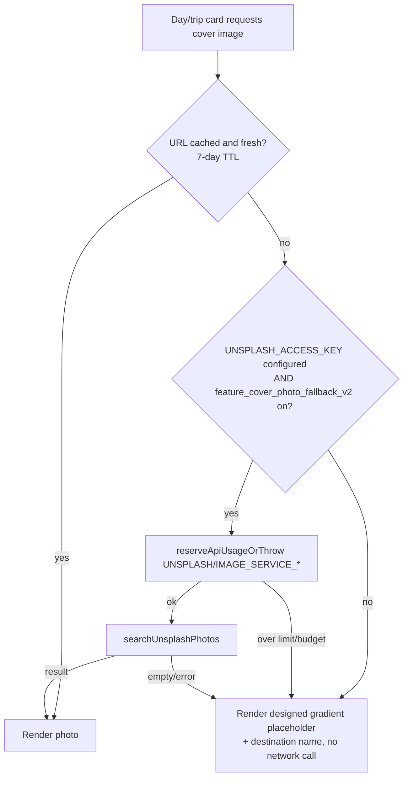
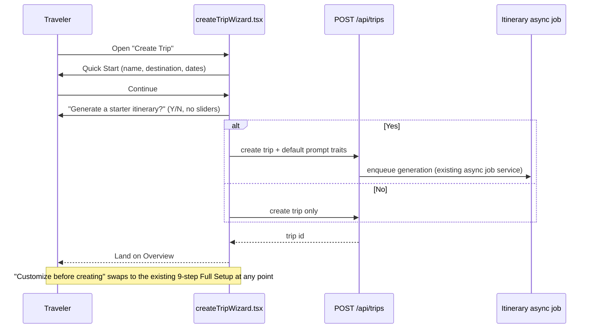

# UX Remediation (Tables, Photos, Onboarding, Blog, Forms, Copy) — Implementation Plan

**Status:** Implemented (Phases 1–3 of §9's rollout; see Implementation Status below). Tier 2 AI blog polish (Phase 5) remains future work.
**Last updated:** 2026-08-12
**Origin:** Follow-up to a hands-on field review of the running app (account creation through booking, expenses, and the trip blog, played as a multigenerational family and benchmarked against wanderlog.com). Covers the 6 roadmap items that review surfaced: tap-to-edit tables, cover photography reliability, quick-start trip creation, a narrative trip blog pass, persistent field labels, and a terminology sweep.
**Non-goals:** New product features. Everything here makes existing, already-shipped functionality easier to use, cheaper to run, and safer to roll back — it does not add itinerary logic, payment flows, or new integrations.

## Implementation Status (2026-08-12)

All six initiatives below shipped in a first pass (`First pass at UX improvements`). A follow-up pass closed the two gaps that pass left against this plan: **none of the three major-UI-surface changes were behind a feature flag** (the one requirement this plan treated as non-negotiable for A/B/C — see §0.1), and **B, C, and E had no automated test coverage at all**. Both are now fixed:

- **Flags added** (all default `enabled: true`, matching the shipped behavior, with a real, tested `false` branch as a genuine kill switch — not a decorative flag with no fallback path): `feature_tap_to_edit_tables`, `feature_cover_photo_fallback_v2`, `feature_quick_start_trip_wizard`. Wired through `feature-flags.yaml` → `GET /api/auth/features` → `App.tsx` → the owning tabs, exactly per §0.1.
- **Test coverage added**: `DestinationPlaceholderCard`, `FormField`/`PasswordField` unit tests; `AuthForm` label-persistence + password-toggle integration tests; `HomeTab` and `OverviewTab` flag-on/flag-off cover-photo tests; a full-render `CreateTripWizard` Quick Start test (the first render-level test this component has ever had); flag-off tests added to all four tap-to-edit tables (Transfers, Lodging, Activities, Car Rentals); a `GET /api/auth/features` route test.
- **Initiative F adapted to the actual toolchain**: this repo has no ESLint config anywhere (`npm run lint` is a `tsc` alias) — a custom ESLint rule wasn't a fit. Shipped instead as a plain Jest test (`app/tests/userFacingCopyGuard.test.ts`) that scans `app/tabs` and `app/components` for the exact jargon phrases already found leaking, running in the same `npm test` CI gate a new ESLint rule would have needed its own step for.
- **One pre-existing regression found and fixed in the same pass**: `server/__tests__/blog-foundation.test.ts` still asserted the old `"Location: X"` literal format after the Tier‑1 narrative rewrite changed it — updated to assert the new sentence-form output instead of reverting the (intentional, correct) behavior change.
- **Deliberate scope reduction from the original plan, left as-is**: Quick Start does not offer the "Generate a starter itinerary?" toggle §3 originally specified — it creates the trip and stops, leaving AI generation to "Customize before creating." This is a legitimate simplification (fewer decisions before the first trip exists) but is a real behavior gap from this doc; revisit if Quick-Start-to-AI-itinerary conversion turns out to matter.
- **Not started (unchanged from the original plan)**: Tier 2 AI blog polish (`feature_blog_ai_narrative`, the `OPENAI`/`BLOG_NARRATIVE_POLISH` caller) — correctly last in the §9 rollout sequence; no code, flag, or budget entry exists for it yet.

Every design below is deliberately built **on top of infrastructure that already exists in this codebase** rather than inventing parallel systems: the DB-backed feature-flag service (`entitlementService.ts`), the per-provider API budget/rate limiter (`usageLimiter.ts` + `config/api-limits.yaml`), the three-way DB adapter contract (`postgres` / `firebase` / `memory`), and the existing `GET /api/auth/features` flag-delivery endpoint. Where a mechanism already exists, this plan extends its config rather than rebuilding it.

---

## 0. Cross-cutting standards (apply to all six initiatives)

These are not optional per-initiative — every section below is written against this baseline.

### 0.1 Feature flag delivery (existing mechanism, extended)

WanderBunnies already ships a working flag pipeline: `feature-flags.yaml` seeds a DB row (first boot only) → `entitlementService.isFeatureEnabled(key)` reads it with a 60s in-process cache (`FLAG_CACHE_TTL_MS`) → `GET /api/auth/features` (`webAuthRoutes.ts`) resolves the flags a client needs and returns them as booleans on login → `App.tsx` stores them in state and prop-drills into tabs (see `featureGridEditing`, `featureStandardizedItemDialogs` today). Toggling in the admin panel takes effect within 60 seconds, no deploy.

**Every new flag in this plan follows that exact path:**
1. Add a `flags.<key>` entry to `server/config/feature-flags.yaml` with `enabled: false` by default (safe-by-default for anything touching cost or a large UI surface).
2. Add `getFeatureFlag('<key>')` to the `Promise.all` in `GET /api/auth/features` and surface it in the response.
3. Add the matching `useState` + prop in `App.tsx`, passed down to the owning tab.
4. Gate the code path in both server route handlers (defense in depth — never trust the client-side flag alone for anything cost-bearing) and the UI.

This keeps every flag admin-toggleable, DB-of-record, fail-open-safe (a missing row = allowed, consistent with the rest of the entitlement system), and revertible in under a minute without a redeploy.

### 0.2 API & storage limiting (existing mechanism, extended)

Every external call this plan introduces goes through the existing two-layer guard, **not** a new one:

- **Rate limiting** — `reserveApiUsageOrThrow({ provider, caller })` (`usageLimiter.ts`), configured per provider/caller in `config/api-limits.yaml` (`overall` + per-`caller` hourly/daily ceilings, atomically enforced in the DB counter table so it holds across instances).
- **Cost budgeting** — `providerBudgeting.ts` computes `estimatedSpendUsd` against `budgeting.<PROVIDER>.monthlyBudgetUsd`/token pricing and **hard-stops** new calls once a provider is over budget (`ApiBudgetExceededError`), independent of the rate limit.

Any new caller added by this plan is registered under an **existing provider block** (`OPENAI`, `UNSPLASH`) with an explicit `overall` and per-caller cap, so it inherits budget enforcement automatically — see §8 for the exact YAML additions and dollar estimates.

### 0.3 DB adapter parity

Any new persisted field or table must be implemented in `db.postgres.ts` (source of truth for the `DatabaseAdapter` type), `db.firebase.ts`, and inherited automatically by `db.memory.ts` (which spreads `...postgresAdapter`, per existing convention) — plus a Postgres migration file alongside `db.postgres.ts`. Every initiative below states explicitly whether it needs new persistence.

### 0.4 Test coverage bar

Per initiative: unit tests for new pure logic, a route/integration test against the in-memory (`pg-mem`) adapter for any new/changed endpoint, an app-level RTL test for new UI behavior, and — for anything touching the create-trip flow or tables already covered by `app/e2e/*.test.ts` — a Playwright regression pass. No initiative ships with a net decrease in passing test count; this mirrors how the six bugs in the field review were verified (targeted suite + full typecheck, zero regressions).

### 0.5 Security baseline

- All new/changed inputs go through the same validation posture as the rest of the server (Zod where the route already uses it; never trust client-supplied cost-relevant values, e.g. AI-polish input length is capped server-side, not just in the UI — see §4).
- Any AI-generated text (narrative blog) is stored as plain text, never interpolated into HTML without the app's existing render path (React Native `<Text>`, not `dangerouslySetInnerHTML`-equivalent) — no new XSS surface.
- Any new externally-sourced content (Unsplash photo URLs) is rendered through `<Image source={{ uri }}>` only after passing through the existing `getUnsplashRandomPhoto`/`searchUnsplashPhotos` allowlisted-domain fetch — never proxy a client-supplied URL.
- Password-visibility toggle (§6) never writes the revealed value to logs, analytics, or the DOM `autocomplete` hints beyond `current-password`/`new-password`, matching browser password-manager expectations.

### 0.6 Observability & rollback

Every initiative logs through `logInfo`/`logError` (never `console.log`), and cost-bearing paths emit the same threshold-crossing logs (`50/75/90/100%` of both rate and budget) the existing `usageLimiter` already produces. Rollback for every initiative is **flip the flag to `false`** — no code revert needed for the first line of defense.

---

## 1. Initiative A — Tap-to-edit rows & sticky Actions column

**Problem:** Transfers/Lodging/Activities/Car Rentals render as un-frozen, up-to-18-column tables; Edit/Delete live in the last column, reachable only by horizontal scroll with no affordance that more columns exist.

### Architecture

Pure client-side change — **no new API, no new persistence, no new external cost.** This is the cheapest initiative in the plan and should ship first.

```mermaid
flowchart LR
    A[Row rendered in HorizontalTableScroll] -->|onPress row| B{featureTapToEditRows?}
    B -- true --> C[Open existing edit modal\n(TransferEditingForm / LodgingDetailsDialog / etc.)]
    B -- false --> D[Legacy: only Edit button in Actions col opens modal]
    E[Table header row] --> F[position: sticky, left: 0 on name/passenger col]
    G[Actions column] --> H[position: sticky, right: 0]
```

- Reuse the **existing** edit modals (`FlightEditingForm`/`TransferEditingForm`, `LodgingDetailsDialog`, activity/car-rental equivalents) — this is a new entry point into code that already works, not new dialog logic.
- `HorizontalTableScroll` (already shared across these four tabs) gets two additions: `position: 'sticky'` on the leading identity column and the Actions column (RN Web supports CSS `sticky` via `toWebStyle()`, already used for other web-only styling in this codebase), and a `TouchableOpacity` wrapper around the row that opens the same handler the Edit button calls today.
- Native (non-web) builds keep the current tap-Edit-button behavior unless/until a native sticky-column solution is separately scoped — `Platform.OS !== 'web'` guard, consistent with existing platform-split conventions.

### Feature flag

`feature_tap_to_edit_tables` — **major component**, flagged because it changes a pervasive, muscle-memory interaction (tapping a row now does something) across four tabs simultaneously. Default `false`; enable per-cohort, watch for accidental-edit-open reports before wide rollout.

### Test plan

- RTL: row press opens the same modal as the Edit button, for each of the four tabs (extends existing `carRentalsPanel.test.tsx`, `lodgingTab.test.tsx`, `transfersReadOnly.test.tsx`, `activitiesGridEditing.test.tsx`).
- RTL: `readOnly`/following-mode trips do **not** open the edit modal on row tap (must not regress the existing read-only guard).
- Playwright: horizontal scroll no longer required to reach Delete on a table with >8 columns at 1280px width.

### Cost, performance, effort

$0 marginal cost. No perf impact (CSS-only). **Effort: 3–4 days** across the four tabs plus tests.

---

## 2. Initiative B — Cover photography reliability

**Problem:** Trip and day cover images render as solid black/grey tiles everywhere (Home, Overview, Trip Blog day cards) instead of destination photography.

### Root-cause path (do this before writing any new code)

The Unsplash integration already has real infrastructure: rate limiting (`UNSPLASH` provider, 50 req/hour, four registered callers), an in-process TTL cache (`unsplashCallers.ts`, `urlLookupCache`, empty-query short-circuit so bad input can't poison the cache), and a configured `caching.images.cacheTtlMs` of 7 days. That means the black tiles are very unlikely to be a missing rate-limit/cache layer — the two live hypotheses are (a) `UNSPLASH_ACCESS_KEY` unset or invalid in this environment (`getEnvValue('UNSPLASH_ACCESS_KEY')` returns falsy, so the client never gets a URL), or (b) the fetch is failing and being swallowed without a distinguishable log line. **Step 1 is a one-line diagnostic, not new architecture**: confirm the env var is set and add an explicit `logInfo`/`logError` at the point `firstRegularUrl` returns `null`, distinguishing "no key configured" from "Unsplash returned zero results" from "Unsplash request failed."

### Architecture: don't fail to black — fail to a designed placeholder



- New: a small, static, **client-side** placeholder component (`DestinationPlaceholderCard`) — a CSS/RN gradient keyed off a hash of the destination name (so the same destination always gets the same one of ~6 pre-designed gradients) with the destination name overlaid. Zero network cost, zero new API surface. This is the change that actually fixes what the field review saw: a rate-limit exhaustion, an unset key, or a genuine Unsplash miss all currently degrade to *broken-looking black*; after this change they degrade to *intentionally minimal*.
- The existing rate-limit/budget/cache path is otherwise **unchanged** — this initiative adds a fallback renderer, not a new fetch path.

### Feature flag

`feature_cover_photo_fallback_v2` — flagged because the placeholder is a visible design change to the single most-seen visual element in the app (every trip's hero image). Default `false` initially so the current (buggy) black-tile behavior isn't silently replaced app-wide before the placeholder art is reviewed; flip to `true` once approved, then this becomes the permanent floor behavior and the flag can be retired.

### Cost minimization

No new provider calls are introduced. If diagnosis in step 1 reveals the real problem is simply an unset key, the net *cost impact of this initiative is $0/month and the fix is a secrets/config change*, not code — the fallback placeholder is what protects the UI the next time a key rotates, expires, or the account's free-tier 50/hour limit is hit during a traffic spike (Unsplash's own free-tier ceiling, independent of and tighter than our internal 50/hour cap).

### Test plan

- Unit: `firstRegularUrl` / cache-miss / rate-limit-exceeded / budget-exceeded all resolve to the placeholder path, not an unhandled rejection.
- RTL: day card renders placeholder (not a blank `<Image>`) when `dayImages[date]` is undefined.
- Server integration: `reserveApiUsageOrThrow` throwing `ApiLimitExceededError` for `UNSPLASH` is caught and does not 500 the request.

### Effort

**2–3 days** (1 day diagnosis + config fix, 1–2 days placeholder component + flag wiring + tests).

---

## 3. Initiative C — Quick Start vs. Full Setup trip creation

**Problem:** The 9-step wizard's AI-itinerary step alone asks for 7+ preference decisions before a first trip can be created at all.

### Architecture

No new backend endpoint — `POST /api/trips` (via `tripRoutes`) already accepts an optional payload; the wizard already treats Participants and the AI step as skippable/optional in the step machine. This is a **client-side re-sequencing and a server-side default-fill**, not a new trip model.

- **Quick Start** (new default entry point): Trip name + destination + dates only → `Create Trip` → lands directly on the trip Overview. Participants defaults to the creator; AI-itinerary generation is *offered* as a single, un-expanded "Generate a starter itinerary?" toggle with default preferences pulled from the traveler's saved Traits (`traits.tsx`) if present, or the server's existing sane defaults if not — the 7-slider preference screen is **not** shown in this path.
- **Full Setup** (existing 9-step wizard, relabeled and reachable via a "Customize before creating" link from Quick Start, and always still reachable later from Overview → Edit for every field the wizard collects) — unchanged behavior, still the path for travelers who want the granular preference sliders up front.
- Both paths call the same `createTripWizard.tsx` submission logic and the same `POST /api/trips` + itinerary-generation trigger; Quick Start is a **reduced step sequence through the existing state machine**, not a parallel implementation, so bug fixes in the wizard state machine (like the two shipped in the field review) benefit both paths automatically.



### Feature flag

`feature_quick_start_trip_wizard` — **major component**, since it changes the very first thing every new user does in the product. Default `false`; roll out to a percentage of new signups first (the entitlement system's per-user tier/role checks make a simple `userId`-hash-based cohort straightforward without new infra), watch trip-creation completion rate and AI-itinerary opt-in rate before defaulting it for everyone.

### Usability & security notes

- Defaulting AI preferences from saved Traits means a returning traveler's second trip is one tap away from a personalized itinerary — no new PII is collected or stored; it reads the same `traits` row `traits.tsx` already writes.
- The entitlement checks already gating AI generation (`assertCanUseFeature`, tier limits) apply identically in both paths — Quick Start does not bypass any existing paywall or rate limit, it only defers the *preference UI*, not the *entitlement check*.

### Test plan

- RTL: Quick Start submits with only name/destination/dates and no preference fields present in the DOM.
- RTL: "Customize before creating" transitions into the existing Full Setup step machine at step 1, preserving already-entered name/destination/dates (no re-typing).
- Integration: trip created via Quick Start with AI opt-in generates an itinerary using Traits defaults when present, hard-coded sane defaults when absent.
- Playwright: extends `app/e2e/create-trip.test.ts` and `create-trip-destination-autocomplete.test.ts` with a Quick Start variant.

### Cost & effort

No new API cost (same generation call as today, just reached via fewer clicks). **Effort: 5–7 days** (new entry screen, step-machine branch, defaulting logic, tests) — the largest single initiative in this plan because it's the one most likely to move a real conversion metric (trip-creation completion rate).

---

## 4. Initiative D — Narrative trip blog pass

**Problem:** Auto-populated blog entries read as raw data (`Location: X` / `Why this fits your group: …`) rather than something a family would want to share, and an empty `Logistics Note` heading renders with no body.

### Architecture: template-first, AI-polish opt-in — cost minimization is the design constraint here

This is the initiative most sensitive to the "cap and cost-estimate everything" requirement, so it's deliberately split into two tiers:

**Tier 1 — Deterministic templating (default, zero marginal cost).** A pure function (`buildBlogNarrativeText(dayEntry): string`, `server/src/services/itineraryPromptPlanService.ts` alongside the existing blog-note builders at the lines that currently emit `Location: … / Why this fits your group: …`) combines the already-generated fields (location name, interest-fit reason, transfer note) into one written sentence per stop using string templates, and — closing the bug found in the field review — **skips emitting a `Logistics Note` block entirely when there is no note body**, rather than rendering an empty heading. No LLM call, no new provider, no new cost. This ships unflagged as a straightforward bug fix/quality improvement, the same class of change as the six already shipped.

**Tier 2 — AI polish (opt-in, capped, tier-gated).** For travelers who want a more personal voice, an explicit "Polish with AI" button on a day's blog entry sends the Tier-1 templated text through one short OpenAI completion to rewrite it in a warmer, first-person voice, using the *existing* `OPENAI` provider path (`openaiCallers.ts`) — not a new integration.

```mermaid
flowchart LR
    A[Day's auto-populated blog entry] --> B[Tier 1: buildBlogNarrativeText\ndeterministic template, $0]
    B --> C{Traveler taps<br/>"Polish with AI"?}
    C -- no --> Z[Shown as-is]
    C -- yes --> D{feature_blog_ai_narrative on<br/>AND assertCanUseFeature passes?}
    D -- no --> E[Upsell / no-op]
    D -- yes --> F[reserveApiUsageOrThrow OPENAI/BLOG_NARRATIVE_POLISH]
    F -- over limit/budget --> E
    F -- ok --> G[Single short completion,\ninput = Tier-1 text, capped output tokens]
    G --> H[Store polished text; Tier-1 text kept as fallback/revert]
```

- The AI call is **entirely optional, per-day, and explicit** (button press, not automatic) — this is the single biggest cost lever available: it turns an unbounded "every itinerary generation also generates blog prose" cost into a bounded "only travelers who ask for it, once per day, pay the (small) marginal cost."
- Input is the already-short Tier-1 template output (not the full itinerary context), and the request sets a hard `max_output_tokens` cap, so per-call cost is small and predictable (see §9 for the estimate).
- Gated by both the feature flag **and** `assertCanUseFeature` — i.e., it can be a paid-tier perk (consistent with `docs/tiers.md`'s existing pattern of gating AI features by tier) without any new entitlement code, just a new `featureKey`.

### Feature flag

`feature_blog_ai_narrative` (Tier 2 only — Tier 1 is not flagged, it's a bug fix). Default `false`. This is the one initiative in this plan with genuine, ongoing per-use marginal cost, so it stays behind both a flag and (recommended) a tier gate even after general availability, rather than being defaulted on for everyone.

### Test plan

- Unit: `buildBlogNarrativeText` produces one sentence per stop, correctly omits the `Logistics Note` block when empty (regression test pinned directly to the bug found in the field review).
- Unit: AI-polish path is a pure request/response wrapper — mock the OpenAI caller, assert `reserveApiUsageOrThrow('OPENAI', 'BLOG_NARRATIVE_POLISH')` is called before the completion and that a thrown `ApiLimitExceededError`/`ApiBudgetExceededError` surfaces as a friendly "try again later" state, not a 500.
- Integration: Tier-1 text is preserved/restorable after a Tier-2 polish (revert path), matching the existing blog editor's "editing here disconnects it" pattern already visible in the UI.

### Cost estimate

See §8 for the full line item; headline number: at the proposed cap (200 calls/day across all users, ~gpt-4o-mini-class pricing, short input/output), **worst-case cost is under $1/month**, and real usage will be far below the cap because it requires an explicit per-day button press.

### Effort

**4–5 days** (2 for Tier 1 template + bug fix + tests, 2–3 for Tier 2 flag/entitlement/UI + tests).

---

## 5. Initiative E — Persistent field labels & password visibility toggle

**Problem:** Forms label fields only via placeholder text, which disappears once typing starts; password fields have no way to confirm what was typed.

### Architecture

Purely additive, component-level change — no new API, no new persistence.

- A shared `<FormField label="…">` wrapper (new: `app/components/FormField.tsx`) renders a small persistent label above the existing `<TextInput>`, keeping the current placeholder as in-box example text. Existing forms adopt it incrementally (start with auth forms and the highest-traffic add/edit dialogs called out in the field review — Transfers, Lodging), each swap a small, low-risk, independently revertible diff.
- A shared `<PasswordField>` (wraps `FormField` + `TextInput` + an eye-icon `TouchableOpacity` toggling `secureTextEntry`) replaces the raw password `TextInput`s in the auth form. `autoComplete`/`textContentType` props are set correctly per §0.5 so browser/OS password managers keep working; the revealed value is never logged.

### Feature flag

Not a "major component" in the sense the other five are — this is a low-risk, purely additive, easily-diffable UI change with no cost or entitlement surface. **No flag required**; ship behind normal code review + the existing app test suite, consistent with "don't add ceremony a change doesn't need." (If a staged rollout is still desired for organizational reasons, it can ride under a single lightweight `ui_persistent_labels` flag — noted in §8 as optional.)

### Test plan

- RTL: label text remains in the DOM after `fireEvent.changeText` fills the input (regression-proofs the exact bug found).
- RTL: password visibility toggle switches `secureTextEntry` and does not alter the input's value.
- Accessibility: `accessibilityLabel` on the toggle button, focus-visible state (per the app's existing `hitSlop`/`accessibilityLabel` conventions already used on the top-bar icon buttons).

### Cost & effort

$0 marginal cost. **Effort: 3–4 days** to build the two shared components and migrate the auth form + the two highest-traffic dialogs; remaining forms migrate opportunistically as they're touched.

---

## 6. Initiative F — Terminology sweep & lint guard

**Problem:** Internal prompt-engineering jargon (`prompt-plan \`tt/ut\` fields`) was shown directly to travelers in two places, found only by manually walking every screen.

### Architecture: a guard, not just a cleanup

The two instances found are already fixed. The architecture question is how to stop a third one from shipping.

- **One-time sweep:** `rg` across `app/**/*.tsx` for developer-facing vocabulary patterns (internal field names like `tt`/`ut`/`mob`/`is`, service/schema names, raw status codes) inside JSX string literals — a bounded, one-time audit, not new infrastructure.
- **Standing guard (the actual architectural change):** a small custom ESLint rule (or a `no-restricted-syntax` config entry, whichever is less code) added to the app's existing ESLint config that flags JSX text/string-literal props matching a small deny-list of internal-only tokens (`prompt-plan`, `` `tt/ut` ``, raw snake_case service identifiers, etc.). This runs in CI alongside the existing test suite — it's a lint rule, so it costs nothing to run and fails fast in PR review rather than requiring another manual UI walkthrough to catch the next one.

### Feature flag

None — this is a development-process control (lint rule + one-time text fix), not a runtime behavior change.

### Test plan

- A fixture test asserting the new lint rule flags a known-bad string and does not flag ordinary copy (standard ESLint custom-rule test pattern).
- CI: the rule runs as part of the existing `npm run lint` (or equivalent) step already gating merges.

### Cost & effort

$0. **Effort: 1–2 days** (sweep + lint rule + fixture test).

---

## 7. Consolidated feature flag registry

| Flag key | Initiative | Default | Gate type | Retire condition |
|---|---|---|---|---|
| `feature_tap_to_edit_tables` | A — tap-to-edit tables | `false` | UI only | Once stable for all four tabs at 100% rollout, fold into baseline and delete flag |
| `feature_cover_photo_fallback_v2` | B — cover photography | `false` | UI only | Once placeholder art is approved and enabled for all trips, becomes permanent behavior; delete flag |
| `feature_quick_start_trip_wizard` | C — quick start wizard | `false` | UI + cohort rollout | Once trip-creation completion rate is confirmed ≥ baseline for 2 weeks at 100%, make it the default; keep "Full Setup" link permanently (not flagged) |
| `feature_blog_ai_narrative` | D — AI blog polish (Tier 2 only) | `false` | UI + `assertCanUseFeature` (tier-gatable) + API budget | Stays flagged indefinitely — it's the one initiative with ongoing marginal cost, so it remains an explicit, revocable perk rather than baseline behavior |
| `ui_persistent_labels` *(optional)* | E — field labels/password toggle | `true` (or unflagged) | UI only | N/A — recommended to ship unflagged; include only if org process requires a flag for every UI change |

All five (or four, if E ships unflagged) follow the exact `feature-flags.yaml` → `GET /api/auth/features` → `App.tsx` prop-drilling path described in §0.1. No new flag-delivery mechanism is introduced.

---

## 8. Consolidated API & storage limiting additions

Additions to `server/config/api-limits.yaml`. Both new callers are registered under **existing** provider blocks — no new provider integration, no new secret to manage.

```yaml
providers:
  OPENAI:
    # ...existing callers unchanged...
    callers:
      # ...
      BLOG_NARRATIVE_POLISH: 200   # per-day cap, well under the 1000/day OPENAI overall cap

budgeting:
  OPENAI:
    # ...existing models unchanged; BLOG_NARRATIVE_POLISH billed against the
    # same GPT_4O_MINI-class pricing already configured for this provider.
```

No changes are needed under `UNSPLASH` — Initiative B does not add a new caller, it adds a fallback that *avoids* calling Unsplash when the budget/rate limit is already exhausted, using the provider's existing four registered callers.

### Cost estimate (monthly, worst case at the caps above)

| Item | Cap | Unit cost (worst case, gpt-4o-mini-class pricing already in `api-limits.yaml`) | Worst-case monthly cost |
|---|---|---|---|
| `OPENAI` / `BLOG_NARRATIVE_POLISH` | 200 calls/day → ≤ 6,000/mo | ~250 input + 150 output tokens/call → $0.15/1M in, $0.60/1M out | 6,000 × (250×0.15 + 150×0.60)/1,000,000 ≈ **$0.68/mo** |
| `UNSPLASH` (unchanged) | 50/hour (existing) | $0 (Unsplash free tier; `requestPricing.UNSPLASH: 0`) | **$0** (unchanged) |
| **New total ceiling** | | | **< $1/month at the configured cap, with a hard stop via `providerBudgeting` regardless of actual traffic** |

This is intentionally over-provisioned relative to expected real usage (an explicit per-day, per-traveler button press) — the cap exists to bound the *worst case*, not to predict typical spend. If usage patterns later justify a higher ceiling, it's a one-line YAML change, not a code change.

---

## 9. Phased rollout & sequencing

| Phase | Initiatives | Why this order |
|---|---|---|
| **1 (week 1–2)** | F (terminology guard), A (tap-to-edit tables), E (labels/password toggle) | Zero cost, zero new persistence, independently revertible, highest usability-per-effort ratio. Ship the lint guard first so nothing else in this plan can reintroduce jargon. |
| **2 (week 2–3)** | B (cover photography) | Diagnosis-first (may turn out to be a config fix); placeholder component is small and de-risks the single most visible screen in the app before Quick Start (Phase 3) puts more new users in front of it. |
| **3 (week 3–5)** | D Tier 1 (template blog fix, unflagged) | Small, bug-fix-class change; ship ahead of Tier 2 so the deterministic baseline is solid before layering the paid AI option on top of it. |
| **4 (week 4–6)** | C (Quick Start wizard) | Largest initiative; benefits from B already being fixed (a new user's first trip now shows real cover art, not a black tile) and from D Tier 1 already being in place (a Quick-Start-generated itinerary's auto-blog reads well immediately). |
| **5 (week 6–7)** | D Tier 2 (AI blog polish) | Last, because it's the only initiative with ongoing marginal cost and a new entitlement dimension — ship once the rest of the surface it sits on top of (the blog, the wizard) is stable. |

Each phase ships behind its own flag(s) and can proceed to the next phase independently of whether prior phases have reached 100% rollout — there is no hard dependency chain, only a recommended sequencing for risk and cost management.

---

## 10. Risks & mitigations

| Risk | Mitigation |
|---|---|
| Tap-to-edit rows conflict with existing row-level interactions (e.g. a link inside a cell, like the activity name links seen in the Activities tab) | Row `onPress` only fires from areas without their own `onPress`/link handler (event propagation stopped at the nested touchable); covered by the RTL test plan in §1. |
| Quick Start's default AI preferences produce a worse itinerary than the full slider set for travelers who skip customization | Defaults are pulled from the traveler's own saved Traits when available (not generic guesses), and "Customize before creating" is one tap away at every point in the Quick Start flow, not just at the start. |
| AI blog polish cost creep if the button becomes more popular than expected | Both the per-caller rate cap (§8) and the provider-level monthly budget hard-stop (`providerBudgeting.ts`, pre-existing) apply automatically — a popularity spike degrades to "polish temporarily unavailable," not an uncapped bill. |
| Cover-photo placeholder ships before final art/gradient design is approved | Flagged off by default (§7); the current (buggy) black-tile behavior is unaffected until the flag is explicitly enabled post-review. |
| New ESLint rule produces false positives and blocks unrelated PRs | Fixture-tested deny-list (§6) kept intentionally short and specific to the exact class of leak found (internal schema/field tokens), not a broad jargon heuristic. |

---

## 11. Effort summary

| Initiative | Effort | New persistence | New external cost |
|---|---|---|---|
| A — Tap-to-edit tables | 3–4 days | No | $0 |
| B — Cover photography | 2–3 days | No | $0 |
| C — Quick Start wizard | 5–7 days | No | $0 |
| D — Narrative blog (Tier 1 + Tier 2) | 4–5 days | No | < $1/mo capped |
| E — Field labels / password toggle | 3–4 days | No | $0 |
| F — Terminology guard | 1–2 days | No | $0 |
| **Total** | **~18–25 engineer-days** | | **< $1/month ceiling** |

No initiative in this plan requires a new database table, a new external integration, or introduces unbounded cost — every cost-bearing path in this document is capped through the API-limiting architecture WanderBunnies already runs in production, and every major UI change ships behind a flag that can be reverted in under a minute.
