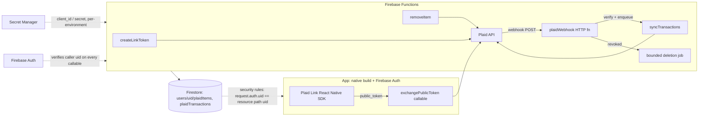

# Credit Card Transaction Import via Plaid — Module Plan

## Status

Proposal. Nothing in this document is implemented yet. This is a design and implementation plan;
it does not by itself enable Plaid, change the public privacy policy, or create a production
Firebase project. The feature remains optional and off by default. This plan covers two layers
deliberately kept separate:

1. **A standalone, reusable module** (`packages/plaid-transactions/`) that connects a user's bank/
   card accounts via Plaid, syncs transactions, and stores them per-user in Firestore. It has no
   WanderBunnies-specific code in it and is designed to be dropped into a different Firebase
   project with only configuration changes.
2. **A WanderBunnies-specific integration** — an optional, Premium-gated "Import expenses" feature
   on top of the module, mapping imported transactions onto the existing `Expense` model
   (`server/src/types.ts`).

Building the module first and the integration second is intentional: it forces a clean adapter
boundary instead of a feature that only works because it's tangled into this app's Postgres schema.

### Decisions that are part of this plan

- **Connection surface:** iOS and Android use Plaid Link's React Native SDK. The SDK requires a
  native build and is not supported by Expo Go. WanderBunnies' web build does not expose a
  connect-account action in v1; adding Plaid's web SDK later is a separate adapter and feature
  flag, not a silent fallback to a WebView.
- **Identity:** Firebase Authentication is the identity accepted by the module's callable
  Functions. WanderBunnies' existing JWT remains authoritative for existing Express APIs. The
  host integration must maintain a server-side Firebase UID ↔ WanderBunnies user mapping and must
  verify both identities before creating an `Expense`; a client-supplied UID is never trusted.
- **Tiers:** the feature is entitled to Premium and Pro, matching `docs/tiers.md`; Free users
  cannot connect or import. Admins bypass numeric tier limits but never bypass feature flags,
  authentication, ownership, or deletion safeguards.
- **Deletion:** deletion and revocation handling is a safety path, never disabled by a feature
  flag. A flag may pause new connections, sync, webhook-driven processing, or the review UI, but
  it may not prevent `/item/remove` or required local data deletion.
- **Cost model:** every expected and maximum usage number below must be represented in
  `server/config/cost-model.yaml`; Plaid's per-Item price is a finance-entered assumption from the
  signed Plaid agreement, not a hard-coded public-price claim.

---

## 1. Goals and non-goals

**Goals**

- Let a user securely connect a bank or credit card account and import transactions, without the
  app ever seeing or storing raw bank credentials.
- Keep the module portable: a second application should be able to adopt it by supplying its own
  Firebase project, Plaid credentials, and a thin adapter — not by forking the code.
- Cap every external API call and every Firestore read/write against an explicit budget, the same
  way this repo already caps OpenAI/Google Places/GCS calls (`server/config/api-limits.yaml`,
  `server/src/apis/usageLimiter.ts`) — mirrored for a Firebase Functions runtime rather than
  duplicated ad hoc.
- Feature-flag every major component independently so any one piece (Link, sync, webhooks,
  auto-categorization) can be killed in production without a redeploy.
- Ship a narrowly-scoped financial-data privacy disclosure before any real (non-Sandbox) Plaid
  environment is enabled.

**Non-goals (v1)**

- Plaid Investments, Liabilities, Identity, Income, or Assets products — Transactions only.
- Any money movement (Plaid Transfer/Payments, ACH). This is read-only transaction import.
- Automatic expense creation without user confirmation — see §7. A synced transaction is always a
  *candidate* the user assigns to a trip; it never silently becomes an `Expense` row.
- Multi-country institution coverage tuning, receipt/line-item detail, or investment-grade
  categorization accuracy. Plaid's own `personal_finance_category` is used as-is.

---

## 2. Module boundary (why this isn't just another `server/src/apis/*.ts` file)

Everything else in this codebase that talks to a third-party API (`googlePlaces.ts`,
`openaiApi.ts`, `unsplashApi.ts`) is a thin wrapper called directly from the Express server on
Cloud Run, using this app's Postgres/Firebase adapter pattern (`db.providers.ts`). That's the
right shape for those integrations because they're stateless per-call.

Plaid is different: it's stateful (an `Item` — a bank connection — persists and needs recurring
sync, webhook handling, and revocation cleanup), and the user explicitly asked for a Firebase
Functions + Firestore + Firebase Auth stack, not the existing Express/Postgres server. That stack
is also *inherently* more portable than this app's server, since "Firebase project + Firebase
Functions + Firestore" is a self-contained unit another app can stand up independently of
WanderBunnies' Postgres schema, entitlement service, or Express routing.

So the module is a **separate Firebase Functions codebase and Firestore schema**, with a narrow,
explicit contract at the boundary:

```text
packages/plaid-transactions/
  package.json                      -- @wanderbunnies/plaid-transactions, mirrors packages/domain's scaffold
  README.md                         -- setup instructions for a *new* consuming app, not just this one
  src/
    functions/
      createLinkToken.ts            -- callable
      exchangePublicToken.ts        -- callable
      syncTransactions.ts           -- callable (manual "sync now") + invoked internally by the webhook handler
      removeItem.ts                 -- callable (user-initiated disconnect)
      plaidWebhook.ts               -- HTTP function, Plaid's webhook target
    lib/
      plaidClient.ts                 -- Plaid SDK client construction, reads credentials via the SecretProvider port
      usageLimiter.ts                -- Firestore-transaction-based version of the atomic increment-if-under-limit
                                         primitive already used server-side (see §8) — ported, not shared, because
                                         this module must not depend on server/src/db.postgres.ts
      firestoreSchema.ts             -- typed collection/doc-path helpers (see §5)
      categoryMapping.ts             -- pure function: Plaid personal_finance_category -> a small neutral taxonomy
      webhookVerification.ts         -- Plaid webhook JWT signature verification
      deletionService.ts             -- idempotent Item/account revocation and user-offboarding deletion jobs
      syncCoordinator.ts             -- per-Item lease, cursor progression, bounded continuation jobs
    ports/
      SecretProvider.ts               -- interface: getSecret(name): Promise<string> — GCP Secret Manager in
                                         production, an in-memory fake in tests
      AuditSink.ts                    -- interface: record(event) — optional, no-op by default
      IdentityPolicy.ts               -- interface for resolving/authorizing the Firebase subject in a host app;
                                         the module never infers a WanderBunnies user from request data
    index.ts                          -- public exports: the callable/HTTP function factories, plus the pure
                                         helpers, so a consumer only imports from here
  test/
    ...                                -- see §11
```

**Contract rule:** nothing under `src/functions` or `src/lib` imports anything from this
repository's `server/` or `app/` packages. The WanderBunnies-specific pieces (mapping a stored
Plaid transaction onto an `Expense` row, gating behind the Premium tier, rendering the "Import
expenses" UI) live entirely in `server/` and `app/`, consuming this module only through
`index.ts` and Firestore documents it writes. A second application wires its own Firebase project
config and its own UI on top of the same module.

`packages/plaid-transactions` is added to the root `package.json` workspaces array alongside
`packages/domain` and `packages/messaging`, with its own Firebase Functions build/deploy manifest.
The package exposes a neutral transaction contract and host hooks; it does not export or import
WanderBunnies `Expense`, tier, route, or UI types.

---

## 3. Architecture



- **Firebase Auth** is the module identity boundary. Every callable function requires
  `context.auth.uid`; there is no service-account-only path that skips it. The webhook is the
  deliberate exception because Plaid cannot send a Firebase token; it uses signature verification,
  strict payload validation, and an Item-to-user lookup before dispatch.
- **Firebase Functions is the only thing that ever calls the Plaid API.** The client never sees a
  Plaid `client_id`/`secret`, and never sees another user's `access_token`.
- **Firestore, not the client, is the source of truth** for what's been imported. The client reads
  its own `users/{uid}/plaidTransactions/*` via security rules; it never re-derives state from
  Plaid directly.
- **Secret Manager** holds Plaid credentials (`PLAID_CLIENT_ID`, environment-specific secrets,
  and the webhook verification-key configuration), resolved once per cold start and cached with a
  bounded TTL for the life of the function instance — not fetched per invocation. Key rotation
  invalidates the cache and is tested as a failure-safe path (cost and latency; see §8/§9).
- **App Check** is required before production enablement. The current WanderBunnies code explicitly
  skips native App Check, so this plan includes adding the RNFirebase App Check provider to the
  custom native build; the existing web reCAPTCHA path is not a substitute for native attestation.

---

## 4. Plaid product flow (Transactions only)

1. **Link token creation** (`createLinkToken`, callable): server-side call to
   `/link/token/create` scoped to `products: ["transactions"]`, `country_codes`, account filters
   for checking/savings/credit-card accounts, and Plaid's `transactions.days_requested` set to a
   conservative default (90 days). A fresh Link token is created for every Link launch; it is
   short-lived and one-time-use, so it is never cached across users or sessions.
2. **Plaid Link (React Native SDK)** runs the client-side connection flow (institution login,
   MFA) inside Plaid's native Link flow. The app never receives institution credentials. This
   intentionally avoids raw-bank-credential handling; legal/security review must still classify
   the transaction data itself as sensitive financial information, and no PCI-scope conclusion is
   made by this plan.
3. **Public token exchange** (`exchangePublicToken`, callable): exchanges Link's `public_token`
   for a persistent `access_token` server-side, and creates the Firestore `plaidItems` doc. The
   `access_token` is written to Firestore *encrypted* (Cloud KMS envelope encryption, not plain
   text — see §10) — Firestore's own encryption-at-rest is not treated as sufficient given the
   sensitivity of a bank-linked bearer token.
4. **Initial + incremental sync** (`syncTransactions`): uses Plaid's `/transactions/sync`
   endpoint (cursor-based), not the older `/transactions/get` date-range endpoint. `/sync` returns
   `added`/`modified`/`removed` deltas after the first cursor call. Initial and historical data may
   arrive through multiple updates, so the Item remains `sync_pending` until `has_more` is false
   and the relevant completion webhook state is observed. Each continuation is bounded by a page,
   transaction-count, wall-clock, and usage budget ceiling.
5. **Disconnect** (`removeItem`): first marks the Item non-syncable, calls `/item/remove`, then
   runs an idempotent Firestore deletion job. A retryable deletion job is used for large histories;
   the UI reports deletion pending until the job has verified that no connection token or
   unconfirmed transaction remains. This is also the user-initiated version of revocation cleanup.

The v1 "sync now" action calls `/transactions/sync` only. `/transactions/refresh` is intentionally
out of v1 because it can initiate an on-demand provider extraction and adds cost/latency; adding it
later requires its own flag, caller limit, and cost-model line.

---

## 5. Firestore schema and per-user isolation

```text
users/{uid}/plaidItems/{itemId}
  institutionName: string
  institutionId: string
  status: 'active' | 'sync_pending' | 'error' | 'pending_disconnect' | 'pending_expiration' | 'revoked' | 'deleting'
  accessTokenEncrypted: string        -- Cloud KMS ciphertext, never plaintext
  accessTokenKeyVersion: string       -- which KMS key version encrypted it, for rotation
  cursor: string | null               -- /transactions/sync cursor
  syncLeaseUntil: Timestamp | null    -- prevents concurrent syncs for the same Item
  syncContinuationCount: number       -- bounded and reset after a completed sync
  lastSyncedAt: Timestamp | null
  lastSyncError: string | null
  createdAt: Timestamp
  consentGrantedAt: Timestamp
  webhookUrl: string                  -- recorded for audit; not secret

users/{uid}/plaidTransactions/{transactionId}
  itemId: string
  accountId: string
  amount: number                      -- Plaid convention: positive = money out
  isoCurrencyCode: string
  date: string                        -- YYYY-MM-DD, transaction date (not authorized date)
  merchantName: string | null
  personalFinanceCategory: string | null -- stored only when supplied by Plaid
  pending: boolean
  removed: boolean                    -- soft-deleted when Plaid reports it in `removed[]`
  consumerLink: {                     -- neutral host-app link; module does not interpret its contents
    consumerType: string
    consumerRecordId: string
    linkedAt: Timestamp
  } | null
  createdAt: Timestamp
  updatedAt: Timestamp

users/{uid}/plaidUsageCounters/{windowKey}
  -- the Firestore-native equivalent of this repo's atomic-increment-if-under-limit primitive,
  -- see §8. windowKey e.g. "SYNC:2026-08-09".
  count: number
  limit: number

plaidItemDirectory/{itemLookupHash}
  uid: string
  itemId: string
  updatedAt: Timestamp
  -- opaque routing metadata only; never credentials, amounts, merchants, or categories.

users/{uid}/plaidSyncJobs/{jobId}
  itemId: string
  kind: 'initial_sync' | 'webhook_sync' | 'manual_sync' | 'deletion'
  status: 'queued' | 'running' | 'completed' | 'failed'
  cursor: string | null
  attempts: number
  nextAttemptAt: Timestamp
  createdAt: Timestamp

users/{uid}/plaidWebhookEvents/{eventKey}
  itemId: string
  webhookType: string
  webhookCode: string
  status: 'claimed' | 'processed' | 'failed'
  receivedAt: Timestamp
  expiresAt: Timestamp
```

The module deliberately does **not** store `tripId`, `expenseId`, or other WanderBunnies fields.
The host integration sets the opaque `consumerLink` only after its own authenticated, idempotent
assignment succeeds. A reusable consumer can use the same field for an invoice, accounting entry,
or another domain record. Merchant address, logo URL, website, account mask, and raw Plaid response
blobs are not stored in v1; data minimization is part of the schema contract.

**Per-user isolation is structural, not just rule-enforced:** all financial documents live under
`users/{uid}/...`, so a Firestore security rule as simple as
`allow read: if request.auth.uid == uid;` is sufficient and provably correct. The only exception
is the server-only `plaidItemDirectory`, which contains opaque routing metadata and no financial
data; client reads and writes to it are denied. Client writes to all module collections are denied
by rule entirely; every mutation goes through a callable or durable Functions job, matching this
repo's existing "server is the source of truth for mutations" principle.

The review queue uses a composite index for `removed == false`, `consumerLink == null`, and
`date desc`, with a maximum page size of 50 and Firestore cursor pagination. It never uses offset
pagination or an unbounded collection read. A sync writes only the normalized fields above, uses
BulkWriter/batches, and records the exact read/write/delete counts for the usage meter.

The webhook handler resolves `item_id` through the hashed `plaidItemDirectory` document rather
than scanning a collection group. That keeps webhook latency and read cost bounded while leaving
financial data under the per-user path. The directory is server-only, contains no financial data,
and is deleted with the Item. A queue document is the durable hand-off from webhook receipt to
sync/deletion processing; a detached Promise is not an acceptable queue.

```text
match /users/{uid}/plaidItems/{itemId} {
  allow read: if request.auth != null && request.auth.uid == uid;
  allow write: if false; // Functions use the Admin SDK, which bypasses rules by design.
}
match /users/{uid}/plaidTransactions/{transactionId} {
  allow read: if request.auth != null && request.auth.uid == uid;
  allow write: if false;
}
match /plaidItemDirectory/{itemLookupHash} {
  allow read, write: if false;
}
match /users/{uid}/plaidSyncJobs/{jobId} {
  allow read, write: if false;
}
match /users/{uid}/plaidWebhookEvents/{eventKey} {
  allow read, write: if false;
}
```

---

## 6. Webhooks: transaction-sync and deletion

Plaid sends one webhook shape (`webhook_type` + `webhook_code`) to a single HTTP function,
`plaidWebhook`, which verifies the signature (§10), claims a short-retention event document, uses
the bounded Item directory lookup, and durably enqueues work before returning `200`:

| `webhook_type` | `webhook_code` | Action |
|---|---|---|
| `TRANSACTIONS` | `SYNC_UPDATES_AVAILABLE` | Verify, validate, and enqueue one idempotent sync job for that Item. Return `200` quickly after durable enqueue; do not perform an unbounded Plaid call in the webhook request. The `/transactions/sync` response's `removed[]` array is applied as `removed: true`, not a physical delete, so an already-imported Expense is not silently orphaned. |
| `ITEM` | `PENDING_DISCONNECT` / `PENDING_EXPIRATION` | Mark `pending_disconnect` for US/Canada or `pending_expiration` for UK/EU; notify the user to reconnect. Do not delete data until revocation/disconnect occurs. |
| `ITEM` | `USER_PERMISSION_REVOKED` | **Deletion webhook.** Stop sync, mark the Item `revoked`, call `/item/remove` when still valid, and enqueue deletion of the Item token and all unconfirmed transaction documents. Confirmed host records remain ordinary WanderBunnies expenses and are not silently orphaned. |
| `ITEM` | `USER_ACCOUNT_REVOKED` | Stop sync and delete Plaid-derived data for the affected `account_id` only. Do not delete unrelated accounts under the same Item. |
| `ITEM` | `ERROR` | Mark `status = 'error'`, store `lastSyncError`; no deletion. |

Webhook idempotency mirrors the existing Stripe webhook pattern in this repo
(`claimStripeWebhookEvent` / `markStripeWebhookEventProcessed` /
`markStripeWebhookEventFailed` in `stripeWebhookRoutes.ts`): because Plaid webhook payloads do not
provide the same canonical event-id contract as Stripe, store a short-retention claim keyed by
`environment + item_id + webhook_type + webhook_code + hash(raw_body)`, and use a per-Item sync
lease/idempotent cursor as the actual correctness mechanism. A failed handler remains retryable;
duplicate deliveries can safely coalesce onto the same queued sync job. Do not persist raw webhook
bodies or transaction values in the audit record.

---

## 7. WanderBunnies-specific integration (optional expense-import feature)

This is the only section that touches `server/` and `app/`.

- **Entitlement:** Premium and Pro tiers, admin bypasses numeric tier limits but not the feature flag —
  the same bypass rule already documented in `CLAUDE.md`'s Entitlement System section
  (`assertCanUseFeature` checks the flag with no admin bypass, then the tier with an admin
  bypass).
- **Surface:** a new "Import expenses" entry point from the existing expense tab
  (`app/tabs/dailyExpenses.tsx` / `app/tabs/ledger.tsx`), opening a review queue of that user's
  unlinked `plaidTransactions` (`consumerLink == null`), most recent first, filtered to a
  configurable lookback window (default 90 days, matching the Link token's
  `days_requested`). The connect action is native-only in v1; on web it is hidden with an
  explanation rather than opening an unsupported RN SDK path.
- **Assignment, not auto-import:** the user picks a trip + confirms/edits category and split
  (payer/for-ids) for each transaction they want to keep — mirrors the existing
  receipt-ingestion review flow (`app/tabs/ingestion.tsx`) rather than inventing a new pattern.
  Confirming creates a normal `Expense` row (`server/src/types.ts`) with
  `sourceType: 'plaid_transaction'`, `sourceId: <plaidTransactionId>` — the `Expense` type
  already has these fields (added for the receipt-ingestion feature), so no schema change is
  needed on the WanderBunnies side.
- **Identity bridge:** the app obtains a Firebase ID token from Firebase Authentication for module
  callables and continues using the existing WanderBunnies JWT for the Expense assignment endpoint.
  The server verifies the Firebase token with Firebase Admin, maps its UID to the authenticated
  WanderBunnies user, verifies trip membership, and only then writes the Expense and the neutral
  module `consumerLink`. Assignment is transactionally idempotent: retrying the same Plaid
  transaction cannot create a second Expense.
- **Currency:** Plaid's `isoCurrencyCode` feeds the existing `amountInTripCurrency` /
  `exchangeRateToTripCurrency` conversion already used elsewhere (`app/utils/exchangeRates.ts`) —
  reused, not reimplemented.
- **Category mapping:** `categoryMapping.ts` (module-side, pure function) maps Plaid's
  `personal_finance_category.primary` to this app's existing expense category taxonomy as a
  *suggestion* the user can override at assignment time — never written silently.
  `docs/merchant-category-lookup-guardrails.md`'s existing guardrails apply to any
  merchant/category inference here too.
- **Dedupe:** before creating an `Expense`, check for an existing `Expense` with the same
  `sourceType`/`sourceId` (idempotency) and, as a soft warning, near-duplicate amount+date+trip
  combinations already entered manually — surfaced as a non-blocking "this might already be
  entered" hint, not an automatic merge.

### Use case

> Priya is on a week-long group trip to Lisbon with three friends. Historically she's had to dig
> through her card's app after the trip and manually retype a dozen restaurant and taxi charges
> into WanderBunnies to settle up. With expense import enabled, she connects her card once via
> Plaid Link before the trip. Each evening she opens "Import expenses," sees the day's card
> activity already pulled in (merchant name, amount, suggested category), picks which charges
> were trip-related, assigns who they're split between, and confirms — turning a post-trip
> reconciliation chore into a two-minute daily check-in. If she disconnects the card afterward (or
> revokes access from her bank's own app), WanderBunnies deletes the connection and any
> not-yet-imported transaction data automatically; anything she already confirmed into an actual
> trip expense stays, exactly like a manually-entered expense would.

---

## 8. API and storage usage capping (extends the existing standard architecture)

This repo's standard pattern is: a YAML-declared per-provider, per-caller limit
(`server/config/api-limits.yaml`), enforced by an atomic increment-if-under-limit primitive
(`atomicIncrementApiUsageIfUnderLimit` in `db.ts`, wrapped by `reserveApiUsageOrThrow` in
`server/src/apis/usageLimiter.ts`). The limit is a deployment-wide safety ceiling, not a
per-user entitlement. The module therefore uses the same provider/caller vocabulary and ports the
same atomic reservation semantics into Firestore; the standalone package does not import this
repository's `db.ts`.

Every reservation is made before the billable side effect. For Firestore, reads/writes/deletes are
reserved at the operation level; for a sync response, the worker stops at the remaining write
budget and persists a bounded continuation rather than exceeding the cap. A sync can therefore be
partially applied but never overrun its storage ceiling. Per-user and per-Item sublimits are
additional counters, not replacements for the aggregate limit.

```yaml
# server/config/api-limits.yaml under `providers:`; mirrored in the package defaults.
  PLAID:
    window: day
    windowHours: 24
    overall: 4000
    callers:
      PLAID_LINK_TOKEN_CREATE: 400
      PLAID_PUBLIC_TOKEN_EXCHANGE: 200
      PLAID_TRANSACTIONS_SYNC: 2500
      PLAID_ITEM_REMOVE: 200
      PLAID_WEBHOOK_DISPATCH: 1000

  FIRESTORE_PLAID:
    window: hour
    windowHours: 1
    overall: 25000
    callers:
      PLAID_ITEM_READ: 2000
      PLAID_TRANSACTION_READ: 10000
      PLAID_TRANSACTION_WRITE: 10000
      PLAID_TRANSACTION_DELETE: 3000
      PLAID_USAGE_COUNTER_WRITE: 3000
      PLAID_ITEM_DIRECTORY_READ: 2000
      PLAID_WEBHOOK_EVENT_WRITE: 2000
      PLAID_SYNC_JOB_WRITE: 2000
      PLAID_REVIEW_QUEUE_READ: 10000
      PLAID_EXPENSE_ASSIGNMENT_READ: 5000
      PLAID_EXPENSE_ASSIGNMENT_WRITE: 3000

  GCP_PLAID:
    window: day
    windowHours: 24
    overall: 10000
    callers:
      PLAID_SECRET_MANAGER_ACCESS: 1000
      PLAID_KMS_ENCRYPT: 300
      PLAID_KMS_DECRYPT: 3000
```

The module's config validator must reject missing/zero limits for safety-sensitive calls and fail
closed if a caller key is absent. Functions must load these values from the versioned standard
configuration (or a generated, checksum-verified artifact); hard-coded numeric arguments in a
handler are prohibited. The WanderBunnies adapter reserves the same operation names via the
normal limiter before its Express-side assignment/read path; it does not create a parallel
unmetered Plaid route. Directory lookup, webhook-event claim, queue write, review query, and
assignment read/write all reserve storage operations before the Firestore side effect.

**Caps that matter operationally, not just as a config exercise:**

- **Sync frequency is caller-capped, not just webhook-driven.** A user mashing "sync now" is the
  realistic abuse/cost case. Add a per-UID/per-Item ceiling of one manual sync per 15 minutes and
  31 manual/webhook sync reservations per Item per UTC month. Webhooks coalesce onto an existing
  lease and do not create an unbounded retry storm.
- **Storage reads are bounded by query shape.** Review pages are limited to 50 documents, use a
  cursor, and are capped per UID/day. Item lookup, usage-counter, deletion-job, and audit reads
  have separate caller keys so a review screen cannot consume the deletion or sync budget.
- **Storage writes/deletes are counted per document operation.** BulkWriter/batches reduce
  round-trips but do not make Firestore billing-free; each document write/delete still consumes a
  reservation and appears in metering. Deletion jobs are capped per run and continue from a cursor.
- **Function execution has hard ceilings.** `syncTransactions` uses a 60-second timeout, 256 MB
  memory, one active lease per Item, a maximum of 500 normalized transaction changes per job, and
  a maximum of three continuations. `plaidWebhook` only validates/enqueues and has a small body,
  timeout, and concurrency budget.
- **Caching reduces calls without weakening freshness.** Cache Secret Manager values per warm
  instance with a bounded TTL, cache Plaid verification keys by key id with rotation/failure
  handling, reuse the `/transactions/sync` cursor, and never cache Link tokens or transaction
  review results across users. Firestore query cursors, not offset scans, provide pagination.

---

## 9. Cost estimation

Extends `server/config/cost-model.yaml`'s existing per-tier, per-user usage-estimate pattern
(Basic vs. Premium, 99%/1% mix, `maxUsers: 10000`) with `plaidTransactions` and
`plaidGoogleCloud` metrics. Basic's estimate is zero; the enabled-tier estimate applies to both
Premium and Pro once the cost model adds a Pro row or documents that Pro inherits the Premium
assumption. The estimator must show both expected usage and a hard-cap scenario derived from §8.

| Cost driver | Unit price (approx.; confirm at implementation time) | Enabled-user/month planning value | Notes |
|---|---:|---:|---|
| Plaid Transactions product | Plaid agreement price per connected Item/month; finance enters the actual value | 1 connected Item | Dominant external cost; caching does not reduce this per-Item charge. Do not ship a fabricated public price. |
| Plaid API calls | Usually included in the product agreement; confirm contract | 1 Link token, 1 exchange, 10 syncs, 10 webhook deliveries | A hard cap is still required for abuse and provider-quota protection. |
| Firebase Functions | Invocation plus compute pricing | 15 invocations, 60 seconds max per sync job | Estimate invocation, vCPU/GiB-seconds, and egress separately; request count alone understates worst-case sync cost. |
| Firestore reads | Use the repo's current `googleCloudHosting` read price ($0.06/100k placeholder) | 100 transaction/item review reads | Include index-entry reads where applicable; bounded cursors prevent unbounded query cost. |
| Firestore writes/deletes | Use the repo's current write price ($0.18/100k placeholder) | 60 writes and 40 deletes | Batching lowers latency, not billed document operations. |
| Secret Manager | Current Google Cloud price for the billing region | 1 cached access per warm instance | Count and meter access even though caching should keep expected usage low. |
| Cloud KMS | Current Google Cloud price plus key-version monthly cost | 1 encrypt and 10 decrypts | Count cryptographic operations and key storage separately; do not decrypt per transaction. |
| Firestore retained storage | Current regional storage price | 250 normalized transaction docs for 90-day lookback | Apply a per-Item retention ceiling and exclude raw provider payloads. |

At 10,000 total users / approximately 100 enabled paid users under the current 99%/1% planning
mix, the estimator must display `100 × connected-item price` as a separate line. It must multiply
expected and cap-derived Firestore/Functions/KMS/Secret Manager usage by enabled-user count and
compare the result with §8's aggregate ceilings. The output must warn when expected blended usage
would exhaust a provider/caller limit; that is a capacity warning, not a request to silently raise
the limit.

Planned `cost-model.yaml` shape (values are illustrative and remain editable assumptions):

```yaml
usagePerUser:
  Basic:
    plaidTransactions: { connected_item_months: 0, link_token_creates: 0, public_token_exchanges: 0, sync_calls: 0, webhook_deliveries: 0 }
    plaidGoogleCloud: { function_invocations: 0, firestore_reads: 0, firestore_writes: 0, firestore_deletes: 0, secret_manager_accesses: 0, kms_encryptions: 0, kms_decryptions: 0, retained_transaction_docs: 0, directory_reads: 0, webhook_event_writes: 0, sync_job_writes: 0, review_queue_reads: 0, assignment_reads: 0, assignment_writes: 0 }
  Premium:
    plaidTransactions: { connected_item_months: 1, link_token_creates: 1, public_token_exchanges: 1, sync_calls: 10, webhook_deliveries: 10 }
    plaidGoogleCloud: { function_invocations: 15, firestore_reads: 100, firestore_writes: 60, firestore_deletes: 40, secret_manager_accesses: 1, kms_encryptions: 1, kms_decryptions: 10, retained_transaction_docs: 250, directory_reads: 10, webhook_event_writes: 10, sync_job_writes: 10, review_queue_reads: 10, assignment_reads: 10, assignment_writes: 10 }

costSources:
  - id: plaid_transactions_subscription
    type: variable
    api: plaidTransactions
    usageLevels:
      - metric: connected_item_months
        unitCostUsd: 0.00 # replace from signed Plaid agreement before launch
  - id: plaid_google_cloud_usage
    type: variable
    api: plaidGoogleCloud
    usageLevels:
      - { metric: function_invocations, unitCostUsd: 0.40, perUnits: 1000000 }
      - { metric: firestore_reads, unitCostUsd: 0.06, perUnits: 100000 }
      - { metric: firestore_writes, unitCostUsd: 0.18, perUnits: 100000 }
      - { metric: firestore_deletes, unitCostUsd: 0.18, perUnits: 100000 }
      - { metric: retained_transaction_docs, unitCostUsd: 0.026 }
      - { metric: secret_manager_accesses, unitCostUsd: 0.00 } # replace with current regional price
      - { metric: kms_encryptions, unitCostUsd: 0.00 } # replace with current KMS operation price
      - { metric: kms_decryptions, unitCostUsd: 0.00 } # replace with current KMS operation price
```

The zero subscription, Secret Manager, and KMS placeholders are launch-review assumptions, not
evidence that those services are free. They must be replaced with finance/security-reviewed prices
before the master flag can be enabled. The metrics remain separate so pricing changes or a
key-rotation/decryption regression are visible without changing application code.

---

## 10. Security

- **No institution credentials ever reach this app.** Plaid Link handles the login/MFA flow in
  its native SDK; the app receives only Plaid's `public_token` callback, and the Functions backend
  exchanges it for an `access_token`. The client never receives the access token.
- **`access_token` is encrypted at rest** via Cloud KMS envelope encryption before being written
  to Firestore (§5) — Firestore's platform-level encryption at rest is not treated as sufficient
  on its own for a persistent bank-linked bearer credential, matching this repo's existing
  practice of not trusting infrastructure-level encryption alone for its most sensitive secrets
  (`docs/security/key-management.md`).
- **Least-privilege Secret Manager access:** the Functions service account gets
  `secretmanager.secretAccessor` scoped to exactly the Plaid secret names it needs, not project-
  wide access — same principle as this repo's existing `_FILE`-suffix Secret Manager convention
  in `server/src/env.ts`, ported to Firebase Functions' own secret-binding mechanism
  (`functions.config()`/`defineSecret`).
- **Webhook signature verification** (`webhookVerification.ts`) validates Plaid's JWT signature
  on every webhook delivery before any handler logic runs, using Plaid's published verification
  key endpoint (cached, not fetched per-request) — mirrors the existing requirement (per
  `docs/travel-blog-architecture.md`'s Stripe section and this repo's general convention) that
  webhook signatures are verified, never trusted on payload shape alone.
- **Firebase App Check** is required on all callable functions in production. The existing
  `app/utils/firebaseAppCheck.ts` web path can use reCAPTCHA, but its native path currently skips
  App Check; production enablement is blocked until the custom native build adds RNFirebase App
  Check and the enforcement path is tested.
- **No secrets, access tokens, or raw transaction data in logs.** Structured logging on this
  module logs `itemId`/`uid`/counts only, never amounts tied to merchant names at INFO level (an
  ERROR-level log for a failed sync may need transaction-adjacent detail for debugging, which is
  the one deliberate exception, gated to a short retention window).
- **No legal scope conclusion is implied.** The module avoids primary account numbers and
  institution credentials, but transaction-level data is sensitive personal financial information.
  Legal, privacy, and security review must determine applicable contractual, consumer-data, and
  PCI/GLBA-adjacent obligations before production enablement.

---

## 11. Testing strategy

| Layer | Approach |
|---|---|
| Pure logic (`categoryMapping.ts`, dedupe matching, currency conversion glue) | Plain unit tests, no network/emulator — the module's core value is testable without Firebase at all. |
| Firestore security rules (§5) | `@firebase/rules-unit-testing` against the Firestore emulator — assert a user can read only their own `plaidItems`/`plaidTransactions`, and that client-side writes are always denied regardless of auth state. |
| Callable/HTTP functions | Firebase Functions test SDK + Firestore emulator; Plaid API calls mocked via a fake `PlaidClient` (never real network calls in CI). |
| Webhook signature verification | Fixture-based: known-good and known-bad signed payloads (Plaid publishes test vectors); never generate "valid" signatures by disabling verification in tests. |
| End-to-end sync flow | Plaid **Sandbox** environment only, using Plaid's documented test institutions/credentials and its `/sandbox/item/fire_webhook` endpoint to simulate `SYNC_UPDATES_AVAILABLE` and the revocation webhooks — no real bank ever touched in CI or local dev. |
| Usage limiter (§8) | Unit tests against a Firestore emulator transaction, asserting the same "concurrent requests must not both succeed past the limit" race-condition coverage this repo already requires of `atomicIncrementApiUsageIfUnderLimit`. |
| WanderBunnies integration (§7) | Standard `supertest` + pg-mem pattern for the `Expense`-creation endpoint; RTL component tests for the review-queue UI, following this repo's existing `app/tests/` conventions. |
| Identity and platform | Test Firebase ID-token-to-WanderBunnies-user mapping, rejected mismatched JWT/UID pairs, web/native platform gating, Expo custom-dev-build behavior, and App Check enforcement. |
| Deletion and retention | Test user disconnect, Item permission revocation, account-level revocation, account deletion, retry after partial failure, and the invariant that no access token or unconfirmed transaction remains after a completed deletion job. |
| Cost and limits | Parse the new `api-limits.yaml` and `cost-model.yaml` entries, test aggregate and per-user contention, and assert the hard-cap scenario is visible in estimator output. |

No test — unit, integration, or manual QA — ever runs against a real financial institution or a
production Plaid environment. Sandbox/emulator only, enforced by keeping the production Plaid
secret out of every non-production environment's Secret Manager binding entirely (not just
unconfigured — absent).

---

## 12. Feature flags

Every major component gets its own flag, following this repo's existing `trip_blog_*` pattern
(`server/config/feature-flags.yaml`) — but with one deliberate divergence: **this feature family
is fail-closed, not fail-open.** The rest of this app's feature flags intentionally fail open
(§ Entitlement System in `CLAUDE.md`) so a missing config row doesn't lock users out of low-risk
features; financial-account connection is the one place in this app where "a missing flag row
silently enables bank-linking" is the wrong default. `assertCanUseFeature`'s existing fail-open
behavior is a platform-wide primitive, so this is implemented as an explicit allowlist check at
the call site (`if (!flags.expense_import_plaid) throw`) rather than relying on the shared
helper's default, and is called out in code comments precisely because it's an intentional
exception to the platform convention, not an oversight.

```yaml
  expense_import_plaid:               # master switch; every sub-flag below requires this too
    enabled: false
  expense_import_plaid_link:          # can the user launch Link / connect a new Item at all
    enabled: false
  expense_import_plaid_sync:          # can sync run (manual or webhook-triggered)
    enabled: false
  expense_import_plaid_review_queue:  # can the user view/select transaction candidates
    enabled: false
  expense_import_plaid_assignment:    # can a candidate become a WanderBunnies Expense
    enabled: false
  expense_import_plaid_webhooks:      # can the webhook HTTP function process deliveries
    enabled: false                    # false = ack-and-defer sync, not "500 and retry forever"
  expense_import_plaid_auto_category: # suggest a category from personal_finance_category
    enabled: false                    # off = user must always pick a category manually
```

Every flag is seeded `false`, is documented in `docs/feature-flags.md`, and is checked server-side.
The financial-feature wrapper treats a missing row as disabled even though the general feature flag
service is fail-open. Turning `expense_import_plaid_webhooks` off returns Plaid a `200` only after
the payload is signature-verified and a bounded deferred-delivery record is recorded; the handler
must still process `USER_PERMISSION_REVOKED` and `USER_ACCOUNT_REVOKED` deletion events regardless
of sync/review flags. The flag controls normal sync behavior, not acknowledgement or safety
deletion.

---

## 13. Financial-data privacy disclosure (draft)

Narrowly scoped to this feature only — does not restate the rest of `app/public/privacy.html`.
Intended as a new numbered section appended after the existing §14 ("Related documents"), and as
a corresponding update to `docs/legal/privacy-policy.md`. Legal review required before any
non-Sandbox Plaid environment is enabled; the text below is a starting draft, not final copy.

> ### 15. Financial account connections (optional)
>
> **This feature is off by default and only available if you turn it on.** If you choose to
> connect a bank or credit card account to import transactions as trip expenses:
>
> - **What we collect.** Through our service provider Plaid, we receive transaction-level data
>   from your connected account: dates, amounts, merchant names, and Plaid's own category
>   labels. We may also receive the connected institution and account identifiers needed to keep
>   one connection's updates separate from another. We do not receive, and never ask you for, your bank username, password, or
>   multi-factor authentication codes — those are entered only within Plaid's own secure
>   connection flow, which we do not have access to.
> - **Why we collect it.** Solely so you can review recent transactions and, if you choose,
>   import individual ones as expenses on a specific trip. We do not use this data for credit
>   scoring, marketing, advertising, or any purpose other than the expense-import feature you
>   activated. We do not sell this data or share it for advertising or profiling. Plaid and
>   Firebase/Google Cloud process it as service providers required to operate this feature.
> - **What we don't automatically do.** Connecting an account does not automatically create
>   expenses. Every transaction requires your explicit confirmation before it becomes part of a
>   trip's records.
> - **Retention and deletion.** Imported transaction data you have not confirmed into an expense
>   is retained only while your account connection stays active. If you disconnect an account, or
>   if Plaid sends us a permission/account-revocation webhook, we stop syncing and delete that
>   connection and the affected unconfirmed transaction data automatically. Transactions you've
>   already confirmed into a trip expense are retained like any other expense you entered manually,
>   and are covered by this policy's general retention/deletion terms — not deleted just because
>   the underlying connection is later removed. Account deletion also queues deletion of the Plaid
>   connection and its remaining derived data.
> - **Your control.** You can disconnect a linked account at any time from [Account Settings].
>   Doing so immediately revokes our access at Plaid and triggers the deletion described above.
> - **Security.** Your account access token is encrypted before storage and is never exposed to
>   the app's client, to other users, or to anyone but the automated systems that need it to sync
>   transactions on your behalf.
> - **No sale or advertising.** We do not use connected-account data for credit decisions,
>   advertising, marketing profiles, or data-broker activity. Legal review must confirm the final
>   provider terms, retention periods, and links before production launch.

---

## 14. Rollout and maintainability

The current worktree scaffolding is not itself a production approval. Before any production flag
is enabled, the implementation must close these explicit gates:

- replace hard-coded limiter values and direct Firestore reads with the standard, config-backed
  reservation path;
- enforce the master flag plus the relevant sub-flag inside every callable, HTTP webhook, review,
  and assignment handler; missing financial flags must fail closed;
- replace fire-and-forget initial/webhook sync calls with the durable bounded queue described in
  §§5–6, and use the Item directory instead of a collection-group scan;
- use Cloud KMS envelope encryption and rotation procedures rather than a Secret Manager value
  acting as an application-managed encryption key;
- make Expense assignment idempotent across the Express database and Firestore link update, with
  a compensating retry state for a partial failure; and
- add the emulator, Sandbox, concurrency, deletion, and cost/limit tests listed in §11 before
  exposing the native Link button to an internal cohort.

1. **Module scaffold** (`packages/plaid-transactions/`) with the pure/testable pieces first
   (categoryMapping, usageLimiter, webhookVerification, syncCoordinator, deletionService) — no
   live Plaid calls yet.
2. **Identity and native-build prerequisite:** configure Firebase Authentication, the UID mapping,
   RNFirebase App Check, Plaid's native build configuration, and a custom Expo development build.
   Expo Go is not a supported test target for this feature.
3. **Sandbox-only end-to-end** wiring (Link → exchange → sync → Firestore) behind all flags
   `false` in every real environment; only exercised via the Plaid Sandbox test harness and this
   repo's own dev environment.
4. **Limit/cost/config wiring:** add the `PLAID`, `FIRESTORE_PLAID`, and `GCP_PLAID` provider
   callers to `server/config/api-limits.yaml`, add cost metrics and the signed Plaid price
   assumption to `server/config/cost-model.yaml`, and add the flags to
   `server/config/feature-flags.yaml` and `docs/feature-flags.md`.
5. **WanderBunnies integration** (§7) behind `expense_import_plaid` still `false` — reviewable in
   a staging environment before any real user sees it.
6. **Legal sign-off on §13**, completion of the public policy update, data-retention runbook, and
   deletion drill, then a narrow production flag flip for an internal/admin cohort only before
   general Premium/Pro availability.
7. **Ongoing maintainability:** the module's `README.md` is written for a reader who has never
   seen WanderBunnies — that's the real test of whether the boundary in §2 held. Any change that
   can't be described without referencing this app's `Expense` type or entitlement service
   belongs in `server/`/`app/`, not in the module.

### Critical files/paths this plan introduces

- `packages/plaid-transactions/` (new package)
- `server/config/api-limits.yaml` (new `PLAID`/`FIRESTORE_PLAID`/`GCP_PLAID` provider blocks)
- `server/config/cost-model.yaml` (new Plaid API, Firebase usage, storage, and signed-price assumptions)
- `server/config/feature-flags.yaml` and `docs/feature-flags.md` (new `expense_import_plaid*` flags)
- `app/public/privacy.html` + `docs/legal/privacy-policy.md` (feature-specific financial-account disclosure)
- `app/utils/firebaseAppCheck.ts` and native app configuration (production App Check prerequisite)
- `server/src/types.ts` — no change needed; `Expense.sourceType`/`sourceId` already support this
- `app/tabs/dailyExpenses.tsx` / `app/tabs/ledger.tsx` — new "Import expenses" entry point
- `docs/plaid-transaction-import-plan.md` — this document

### Official implementation references

- [Plaid Link React Native SDK](https://plaid.com/docs/link/react-native/)
- [Plaid Link flow and public-token exchange](https://plaid.com/docs/link/)
- [Plaid Transactions `/transactions/sync` and webhooks](https://plaid.com/docs/api/products/transactions/)
- [Plaid Item revocation webhooks and `/item/remove`](https://plaid.com/docs/api/items/)
- [Plaid webhook verification](https://plaid.com/docs/api/webhooks/webhook-verification/)
- [Firebase Firestore pricing and document-operation billing](https://firebase.google.com/docs/firestore/pricing)
- [Firebase pricing plans and Cloud Functions availability](https://firebase.google.com/docs/projects/billing/firebase-pricing-plans)
