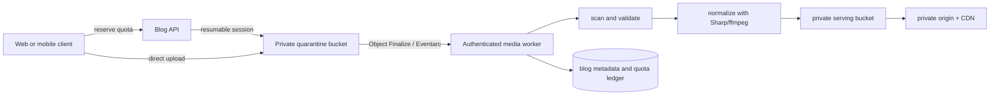

# Joint Trip Blog Architecture

## Status

Proposal for product, legal, security, and engineering review. No blog component is implemented yet.
The product-decision round in section 19 is now answered for essentially every P0/P1 item; those
answers are folded into the relevant sections below rather than left as a separate list to
cross-reference. A handful of concrete numbers (exact tier sizes, add-on price points, legal ToS
wording, abuse-response SLA) now have specific engineering recommendations in this document but
still need finance/legal ratification before launch — that is a sign-off step, not an open design
question. Remaining genuinely open follow-up questions are in section 19.

This design adds a collaborative, day-organized trip blog containing text, photos, and Premium-only
video. It is private to travelers and authenticated trip followers by default. Initial publication,
and republication after a revocation, require consent from every account-holding traveler on the
trip — practically speaking, every *adult* traveler, since minors are not permitted to hold their own
account (see the confirmed decision below); a minor traveler is represented, as today, through the
existing family/dependent mechanism rather than their own login and is excluded from the vote.

## Confirmed product decisions

- Every photo and video is attributed to its uploading account. Storage consumption and any required
  purchased capacity are charged to that uploader, not the trip owner or a shared trip pool — **this
  is the authoritative model** (confirmed after a documentation inconsistency: an earlier draft of
  this section briefly described a trip-owner-funded pool, which conflicted with the per-uploader
  ledger, admin-ceiling design, and acceptance criteria in sections 7, 8, and 14; those sections were
  already correct and this bullet, section 2's storage meter, and section 7's quota-check flow have
  been brought back in line with them).
- Premium video eligibility is evaluated against the uploading account, the same account that funds
  its storage — not the trip owner's tier.
- Unilateral Revocation: While initial publication requires a unanimous vote, **any single
  consent-eligible traveler** may unilaterally revoke public access at any time, making the blog
  private immediately to protect their privacy.
- Automated SafeSearch flags and the abuse-report mailbox are two distinct pipelines, not one: a
  **trip owner gets first-look review** of content flagged by automated SafeSearch scanning within
  their own trip, before it can be published — a proactive, per-trip gate. Separately, on-call
  engineering staffs `media_reports@wander-bunnies.com` for reactively reported abuse (see section
  15) and any CSAM detection is escalated immediately regardless of either queue, per the legal
  reporting obligation. A trip owner's review is not a substitute for, and cannot override, the
  mandatory CSAM-reporting path.
- **No automated face blurring** is implemented. As defined in `privacy.html`, the legal responsibility
  for obtaining likeness consent and complying with local photo requirements remains with the
  uploader and travelers.
- Minors do not have their own account, so they do not participate in the consent decision — this
  matches, and is not a new rule invented for this feature: `app/public/privacy.html` §11 already
  states "There are no minors as account holders... a person under 16 may not create or hold an
  account," and `app/public/terms.html` §3 requires a user to be "at least 16." A minor traveler is
  represented the same way it already is elsewhere in the app: an adult creates a placeholder
  `family_relationships` entry for them (`provider='family'`, no real login) rather than the minor
  holding a genuine account — that placeholder-account traveler is the "guest/dependent without their
  own account" row in section 3, not a special "minor" case requiring its own logic.
- **Registration age gate (resolved, design specified in section 3a below):** registration will
  collect date of birth and reject signups below the stated 16-year minimum, closing the gap between
  the existing ToS/Privacy Policy's 16+ claim and what registration actually enforces today. This is
  an app-wide identity/registration change, outside the blog feature's own code, but the blog's
  consent model depends on it, so it is specified here rather than left as a dangling assumption. The
  family/dependent mechanism (`family_relationships`, `provider='family'` placeholder accounts)
  remains the *only* path for a minor traveler to appear on a trip — the age gate applies solely to
  real, login-capable account creation and never touches that placeholder-account flow.
- Deleting a trip permanently deletes that trip's blog content and each affected uploader's media for
  that trip, after an explicit, itemized confirmation naming every affected uploader and their byte
  count; each affected storage ledger is reconciled immediately as part of the deletion, not on a
  later sweep.
- Deleting an *account* deletes that user's uploaded media everywhere, including media that appears
  in trips the deleted user no longer has any relationship to. This is a stronger rule than trip
  deletion (which only affects one trip): once an account is gone, none of its media survives in any
  other traveler's shared trip either. Co-travelers should be warned in-app before a departing
  member's account deletion takes effect wherever practical — the exact warning UX is an
  implementation detail for the build phase, not an open architecture question.
- Admin accounts are subject to the same hard storage ceiling as any account — they do not get
  unlimited storage. An admin may instead set their own account's effective storage tier directly,
  skipping Stripe checkout, via an audited admin action, up to a defined hard ceiling of **500 GB**
  (distinct from, and above, the Pro tier's 100 GB, sized for internal testing/content creation, not
  "unlimited"). Purchased add-on capacity is sold in tiered blocks with improving per-GB rates at
  higher tiers (mirroring Google One's tiering), not flat per-GB metering. All of the tier sizes,
  the admin ceiling, and add-on block pricing are now defined as concrete defaults in
  `server/config/blog-storage-tiers.json`, mirroring this repo's existing `feature-flags.yaml`/
  `api-limits.yaml`/`cost-model.yaml` config convention — still placeholders pending finance/legal
  ratification, but no longer undefined.
- WanderBunnies' terms require a broad, non-exclusive, worldwide, royalty-free, sublicensable license
  to host, display, distribute, and (for public content) redistribute/promote a contributor's
  uploaded media — mirroring how Instagram, Google, and comparable platforms actually operate.
  Copyright itself remains with the original creator; the platform does not take ownership, only the
  operating license just described. This is stated precisely because "we own the copyright like
  Instagram" is a common but inaccurate reading of those platforms' real terms — an outright
  copyright assignment is unusual, would require a separately signed agreement per contributor, and
  is not needed to get the operational rights this feature actually requires.
- The public "no costs" guarantee applies only to structured application data (expense amounts,
  budgets, currency, payment coverage) — it does not require detecting or blocking prices that
  happen to appear in free-text captions or photographed receipts; that content is explicitly
  allowed in a public blog.
- Flagged media/abuse reports route to `media_reports@wander-bunnies.com`. Content that plausibly
  depicts child sexual abuse material is removed immediately on detection and reported to NCMEC,
  independent of the standard review queue, per the mandatory-reporting obligation that applies to
  any US-based platform (18 U.S.C. § 2258A). Standard, non-exigent reports are acknowledged within 24
  hours with an actioned decision within 5 business days — a placeholder SLA pending legal counsel
  sign-off, not a final commitment.
- When an uploader's purchased capacity lapses or otherwise falls below usage, that account's oldest
  photos/videos are hidden until its visible media is within the active limit.
- Hidden over-limit media enters a 30-day recoverable grace period. Restoring enough capacity within
  that period restores eligible media; otherwise the affected objects are permanently deleted after
  the grace period.
- The 30-day media grace clock begins only after the existing billing/dunning period finishes and
  billing reconciliation declares the storage entitlement inactive. A failed payment, cancellation
  request, or past-due event does not start this clock while the entitlement remains active.

## 1. Goals and product principles

- Give every trip day an integrated, ordered story containing text and media.
- Let any active, account-bearing traveler create, edit, reorder, or remove blog content.
- Let authenticated followers read the private blog, but never edit it or vote on publication.
- Preserve Chinese, emoji, right-to-left text, and other Unicode content end to end.
- Make initial publication and post-revocation republication explicit, unanimous, reversible, and
  auditable without interrupting ordinary public editing.
- Exclude costs and other private trip data from the public contract by construction.
- Keep storage, processing, provider API, and public-delivery costs bounded.
- Reuse the repository's database adapters, entitlement service, provider limiter, cost model,
  feature flags, Socket.IO trip rooms, Stripe billing, and deployment platform.

### Non-goals for the first release

- Character-by-character collaborative editing (CRDT/OT).
- Public comments or anonymous uploads.
- Unattended synchronization of an entire cloud photo library.
- A custom video streaming platform. Progressive MP4 is sufficient for MVP; add HLS only if
  playback telemetry justifies it.
- AI-generated writing or highlights **at launch**. This is not an indefinite non-goal: AI-assisted
  highlight curation (Cloud Vision aesthetic score for photos, LLM sentiment analysis for text — see
  section 4) is a **confirmed, real Phase 8+ Pro feature**, gated behind `trip_blog_ai_highlights`
  with its own budget, cost estimation, and moderation review — not launch scope, but not a vague
  someday-idea either. Free-form AI-generated writing (the app writing a traveler's story for them)
  remains out of scope with no current design.

## 2. Recommended experience

Each valid trip day renders one initial empty text editor without writing an empty database row.
The row is materialized on first save. A traveler may add more text blocks or media and drag them
into a single interleaved order. Text and media should not have separate ordering columns because
that cannot represent “paragraph, photo, paragraph, video.”

Recommended launch authoring fields:

- Trip cover image, public title, subtitle, and introduction.
- Day headline, optional summary, and coarse location.
- Text block with language tag and optional translation relationship.
- Media caption, alt text, contributor credit, captured-at time, and highlight/cover selection.
- Autosave, visible upload/processing progress, retry, edit attribution, and version history.
- Publication preview showing exactly what anonymous visitors will see.
- Personal storage meter showing the current uploader's used, reserved, grace-hidden, and available
  capacity plus usage by trip/day (per-uploader, per section 8 — not a trip-level pool).
- **Weather Badge**: Daily high/low temperatures and a condition icon (e.g. ⛅) automatically
  injected into the day's header based on the trip location.
- **Highlight Reel**: A curated "Greatest Hits" view of the trip, populated by manual "Star" curation
  at launch (see section 4) — the separate **AI-Proposed Highlights (Pro)** auto-curation mode is a
  Phase 8+ feature behind `trip_blog_ai_highlights`, not part of this launch field.

### Connected itinerary notes and locations

Notes and location/place entries created for a trip day in the itinerary are projected into that
day's private blog feed as linked text items. The projection stores the source type, source ID, and
the last synchronized source snapshot in `blog_item_source_links`; it is not a second authoritative
copy of the itinerary.

- A trip-page edit updates the linked blog item while the link is still attached, including a day
  move when the source day changes.
- Editing the linked item in the blog, or deleting it from the blog, marks only the blog link as
  detached. The itinerary note/location remains unchanged and future trip-page edits no longer
  overwrite the blog copy.
- Deleting the source itinerary item detaches the blog copy rather than silently deleting authored
  blog content. The blog copy can then be edited or removed independently.
- Synchronization is idempotent, source-snapshot based, account-member only, and must not run for
  read-only followers or anonymous/public readers. Linked items retain normal versioning, audit,
  audience, caching, export, and deletion behavior.

Do not block the MVP on maps, reactions, or photo-book export.

### Modality extension contract

The launch UI supports text, photos, and video, but the core model must allow later modalities such
as audio/voice notes, galleries, structured place/activity cards, translations, panoramas/360 media,
exports, reactions, and AI-assisted metadata without weakening existing controls.

Every modality is registered through one server-owned descriptor rather than scattered `kind ===`
branches:

```text
BlogItemTypeDescriptor
  kindKey                          -- stable namespaced key, for example core.text or media.gallery
  schemaVersion
  create/update/read schemas
  requiredFeatureFlag
  requiredEntitlement nullable
  audiencePolicy
  storage/processing/API meters
  private serializer
  public allowlist serializer
  cache dependencies/invalidation events
  deletion/export handler
  accessibility requirements
  moderation policy
```

The following rules are architectural requirements:

1. **Extensible item kinds:** `blog_items.kind_key` is a validated registry key, not a database enum.
   Unknown, disabled, or unsupported kinds fail closed on writes. Reads return an unavailable-item
   placeholder only when needed for forward compatibility; they never expose an unregistered payload.
2. **Rendition-based media:** one logical asset may have image, video, audio, poster, thumbnail,
   transcript, caption, panorama, or future renditions. Every physical rendition is independently
   metered and lifecycle-managed.
3. **Item-level audience:** items may target `travelers`, `followers`, or `public`. A public item is
   anonymous only while the blog itself is public. Changing an item to `public` while the blog is
   already public takes effect immediately under the confirmed consent policy and therefore requires
   a prominent warning and audit event.
4. **Gallery parent items:** a gallery is one ordered blog item containing ordered child assets; it
   participates in the day feed, versioning, audience, publication, and deletion rules as a unit.
5. **Per-modality governance:** each modality declares its own flag, entitlement, input limits,
   storage units, processing units, provider callers, concurrency cap, cost coefficients, and
   degraded behavior. No modality inherits “unlimited” behavior from the master blog flag.
6. **Provider adapters:** external embeds, imports, social destinations, translation, transcription,
   and export backends use narrow provider interfaces. Provider IDs/URLs are provenance, never an
   authorization bypass or durable-display assumption.
7. **Complete lifecycle contract:** a modality cannot ship until it implements authorization,
   public serialization, deletion/restoration, export, accessibility, moderation, caching,
   observability, quota accounting, cost estimation, and adapter-parity tests.

`GET /api/trips/:tripId/blog/capabilities` returns the current user's server-evaluated kinds, limits,
entitlements, and audience choices so web/mobile clients do not duplicate flag or tier logic.

## 3. Roles and authorization

The existing trip access model already distinguishes owner/member/follower. Every server route and
storage operation must derive authorization from current server-side membership; client controls
are only presentation.

| Actor | Private read | Add/edit/reorder/delete | Upload | Consent/revoke | Public read | Social post |
|---|---:|---:|---:|---:|---:|---:|
| Trip owner | Yes | Yes | Yes | Yes | Yes | Own connected account |
| Active account member | Yes | Yes | Yes | Yes | Yes | Own connected account |
| Authenticated follower | Yes | No | No | No | Yes | No |
| Dependent/guest without account (includes minors, via `family_relationships`) | No direct access | No | No | Exempt | If public | No |
| Removed member | No | No | No | No new decisions | If public | No |
| Anonymous visitor | No | No | No | No | Current content while blog is public | No |

Followers are read-only and do not consent. Guests/dependents without their own account — which is
how every minor traveler is represented, per the confirmed decision above — are exempt from
publication consent. `requires_publication_consent` is derived server-side as "is a current, active
trip member with a real (non-`family`-provider) account"; no separate age lookup is needed because
the existing `provider='family'` placeholder-account flag already distinguishes a real account from a
dependent one. This does not by itself resolve broader child-privacy or likeness obligations, which
remain a largely account-level (not blog-specific) compliance question — but the specific
registration-time age-verification gap is now resolved with a concrete design, below.

### Registration age gate (app-wide dependency, specified here for completeness)

Not part of the blog feature's own code — this is an existing-app registration change the blog's
consent model depends on, so it is specified rather than left as a dangling assumption.

**Data model:** add `date_of_birth DATE` to the `users` table (a durable fact, unlike `age`, which
drifts) with migrations and adapter parity across `db.postgres.ts`/`db.firebase.ts`/the in-memory
test adapter, per this repo's convention. `User`/`WebUser` (`server/src/types.ts`) gain an optional
`dateOfBirth?: string | null`. It stays `null` for `provider='family'` placeholder accounts, which
never go through this gate. The existing `web_users.age` demographic trait (`traitRoutes.ts`,
trip-personalization) is untouched and stays a separate, self-reported, non-authoritative field —
it is not the eligibility gate.

**Email/password registration:** `POST /register` (`authRoutes.ts`, `webAuthRoutes.ts`) accepts a new
required `dateOfBirth` alongside name/email/password, validated with a Zod schema per this repo's
existing convention for external-input validation. The server computes age from `dateOfBirth` against
the current UTC date and rejects with `400 { error: 'MINIMUM_AGE_NOT_MET', code }` if under 16 —
matching the existing ToS §3 "at least 16" language — and rejects malformed, future, or implausible
(for example, >120 years) dates the same way. The registration form gets a date-of-birth input with
client-side pre-validation for UX; the server remains the authoritative check regardless.

**OAuth registration (Google, Apple):** neither provider reliably supplies date of birth in the
profile scopes this app already requests, so the gate cannot be enforced at the OAuth callback
itself. Add a mandatory "complete your profile" interstitial immediately after a user's *first* OAuth
login that collects `dateOfBirth` before the account becomes usable, applying the same age check and
rejection path as the email/password flow — so all three signup paths (email, Google, Apple) are
subject to the same gate rather than leaving OAuth as an unenforced bypass.

**Family/dependent path stays explicitly unaffected:** `family_relationships`-created placeholder
accounts (`provider='family'`, synthetic email, unusable password) never collect or require a
`dateOfBirth` and never hit this gate — they are not login-capable accounts, so the minimum-age rule
(which exists to keep minors from *operating* a real account) does not apply to them. This remains
the only path for a minor traveler to appear on a trip.

**Existing accounts:** grandfathered, not retroactively enforced — no forced backfill or deactivation
for accounts created before this change, unless legal counsel says otherwise.

**Testing:** registration-endpoint tests (both `authRoutes.ts` and `webAuthRoutes.ts`) covering
under-16 rejected, exactly-16 accepted, malformed/future DOB rejected, and the `family` placeholder
creation path unaffected — using this repo's existing `supertest` + `pg-mem` integration-test
convention.

Followers reuse this app's existing follow/following model (`trip_following` feature, the
`follow.tsx`/`following.tsx` tabs) rather than a parallel blog-specific follower concept. A trip
owner or member can remove a specific follower or disable the trip's shareable follow-link at any
time: removing a follower immediately revokes that follower's private-blog read access, while
disabling the follow-link only stops *new* followers from joining and does not retroactively remove
existing followers.

All content mutations write an audit event. A delete is soft for a short, configurable recovery
window, followed by deletion from storage, CDN, and both database adapters.

## 4. Content and Highlight Model

Use a parent ordered-item model so text and media can be interleaved.

### Highlight Reel Generation
The blog supports a "Highlights" mode for public and private viewing:
- **Manual Curation (launch):** Travelers can "Star" any text block or media item. Starred items are
  automatically included in the Highlight Reel. No AI, no separate flag beyond `trip_blog` itself.
- **AI-Proposed Highlights (Pro, Phase 8+, confirmed but not launch scope):** an "Auto-Curate" button
  uses the Cloud Vision API's "Aesthetic Score" for photos and LLM analysis of text-block sentiment
  to suggest a 5-item daily summary for the reel. Gated behind `trip_blog_ai_highlights`, requires its
  own entitlement, cost estimation (Cloud Vision calls + LLM tokens per suggestion run, both routed
  through the standard provider-limiter/cost-model architecture in section 15), and moderation review
  of its suggestions before they're shown — it is a real, designed feature, just not one that ships
  with the rest of the launch.
- **Presentation:** the public URL defaults to the Highlight Reel view, with an optional toggle
  to "See Full Trip Story."

```text
trip_blogs
  trip_id PK
  title, subtitle, introduction
  cover_asset_id nullable
  canonical_alias_id nullable
  content_revision bigint
  visibility_state ('private' | 'pending_consent' | 'public')
  visibility_epoch bigint
  created_at, updated_at

blog_days
  id, trip_id, local_date
  headline, summary, coarse_location
  version, created_at, updated_at
  UNIQUE(trip_id, local_date)

blog_items
  id, trip_id, blog_day_id nullable
  kind_key                            -- registry key; core.text, media.photo, media.audio, etc.
  schema_version
  audience ('travelers' | 'followers' | 'public')
  sort_key
  author_user_id, last_editor_user_id
  planned_activity_ref nullable         -- links blog item to a planned itinerary entry for scaffolding
  version
  deleted_at nullable
  created_at, updated_at

blog_text_contents
  item_id PK/FK
  body
  language_tag nullable                 -- BCP 47, for example en, zh-Hans, ar
  translation_group_id nullable
  content_format ('plain_text')         -- Markdown/rich text is a later security decision

blog_media_assets
  id, trip_id, uploader_user_id
  storage_account_user_id              -- always the uploader for user uploads/imports
  media_kind_key                         -- photo, video, or audio
  is_immersive (bool, default false)    -- true for 360/panoramic media
  source ('upload' | 'google_photos' | 'apple_photos' | 'mobile_share' | 'voice_memo')
  source_ref nullable                    -- provenance/deduplication; never an OAuth token
  state ('reserved' | 'uploading' | 'quarantined' | 'processing' |
         'ready' | 'grace_hidden' | 'rejected' | 'failed' | 'deleted')
  pipeline_version, object_generation nullable
  primary_rendition_id nullable, poster_rendition_id nullable
  physical_bytes, billable_bytes
  source_checksum, source_mime_type
  captured_at nullable, capture_timezone nullable
  caption, alt_text, credit
  moderation_state
  hidden_at nullable, delete_after nullable
  failure_code nullable
  created_at, updated_at, deleted_at nullable

blog_media_renditions
  id, asset_id
  rendition_kind_key                    -- primary/thumbnail/poster/etc.; registry key
  object_key nullable                    -- null for text-only transcript/caption payloads
  mime_type, width nullable, height nullable
  frame_rate nullable, duration_ms nullable, byte_size
  checksum, pipeline_version, state
  language_tag nullable, text_payload nullable
  created_at, deleted_at nullable

blog_item_assets
  item_id, asset_id, position, role ('primary'|'gallery_child'|'attachment')
  PRIMARY KEY(item_id, asset_id)
  UNIQUE(asset_id)                       -- an asset belongs to one parent item in MVP

blog_gallery_contents
  item_id PK/FK
  layout ('carousel'|'grid')
  title nullable, description nullable

blog_structured_cards
  item_id PK/FK
  card_kind_key                         -- place/activity/lodging/route/etc.; registry key
  source_entity_type, source_entity_id
  public_snapshot                       -- allowlisted display facts; no costs/booking secrets

blog_item_versions
  id, item_id, version, editor_user_id
  change_kind, content_snapshot, created_at
```

Audience is hierarchical: `travelers` means active account-bearing trip members only; `followers`
means travelers plus authenticated followers; `public` means both of those groups and, only while
the blog is public, anonymous visitors. `public` is the default and the only allowed value while
`trip_blog_item_audiences` is off, preserving the confirmed existing behavior. Audience filters are
part of repository queries and cache keys, not a client-side hide.

Database changes require migrations plus parity in `db.postgres.ts`, `db.firebase.ts`, and the
in-memory/test adapter convention. Firestore collections must be denormalized for the same query
boundaries and protected by rules; server authorization remains authoritative.

**Firestore risk, not just a parity checkbox:** the section 8 reconciliation query ("select this
uploader's visible assets across all trips, oldest first, hide until under limit") is a
cross-collection, ordered, potentially large-fan-out read-then-write. In Postgres this is a single
indexed query inside a transaction; in Firestore it must respect the ~500-document/10 MiB
transaction limit and needs a composite index on `(storage_account_user_id, created_at)`. A
heavy-uploading account with thousands of assets could exceed a single Firestore transaction, which
Postgres would not hit. Design the reconciliation worker to page through in bounded batches with a
resumable cursor on both adapters from day one, rather than assuming a single atomic pass — do not
defer this to "whichever adapter is live in production," since `memory`/pg-mem is also used for
tests and cannot silently diverge from Firestore's batching behavior either.

**Test-adapter gotcha:** this repo's pg-mem in-memory adapter does not support `NOT EXISTS`
subqueries or `ANY($1::uuid[])`; the oldest-first hide/restore queries and the reservation
under-limit check must be written as `LEFT JOIN`/`IN`-subselect patterns that work on pg-mem, real
Postgres, and Firestore identically, or test coverage for the lapse/restore state machine will
quietly only run against one adapter.

### Unicode and language behavior

Postgres UTF-8 and JavaScript strings can store Chinese and other Unicode, but storage alone is not
the acceptance criterion:

- Accept and return UTF-8 explicitly.
- Count limits in Unicode code points or grapheme clusters, not UTF-16 code units.
- Preserve combining characters and emoji through save/version/conflict flows.
- Use BCP 47 language tags, appropriate fonts, locale-aware line breaking, and RTL direction.
- Treat translations as linked variants rather than overwriting the original.
- Add captions/transcripts for video accessibility in a later, separately flagged phase if not
  feasible at launch.

## 5. Collaboration and conflict handling

Use optimistic locking, recommended for this product's expected edit frequency:

```http
PATCH /api/trips/:tripId/blog/items/:itemId
If-Match: "<version>"
Idempotency-Key: "<uuid>"
```

A version match saves and increments the version. A mismatch returns `409` with the current version
and enough data to present “mine vs. current” without discarding either edit. Use the existing
Socket.IO trip room for block-level presence and invalidation events, not as the database of record.

Recommended additions:

- Autosave a local draft while offline.
- Show “another traveler is editing” presence.
- Preserve item versions for recovery and publication diffs.
- Limit body length, items/day, reorder frequency, and request rate in server configuration.

## 6. Media constraints

Product asked for "typical website practice" defaults rather than a blocking numeric decision, so
the table below is now a concrete engineering recommendation to build and cost-test against — still
subject to a final product/legal numbers pass, but not an open design question:

| Constraint | Photo | Video |
|---|---|---|
| Allowed input | Decoded JPEG or PNG; reject animated PNG | MP4, MOV, or WebM with allowlisted codecs (H.264, H.265/HEVC, VP9) |
| Hard safety envelope (reject outright beyond this) | 20 MB, 8K/33 MP | 1 GB, 5 minutes, 4K/60 fps |
| Normalized output (typical web-hero-image practice) | JPEG, max 2048 px long edge, ~85% quality (roughly 200 KB-1.5 MB) | MP4 H.264/AAC, max 1080p and 30 fps |
| Entitlement | Free and above | Premium and above |

2048 px matches how most photo-sharing sites size a full-bleed hero/detail image (crisp at up to 2x
pixel density on a ~1000 px display column); 4096 px (the earlier draft's figure) is display
resolution most viewers will never benefit from and simply costs more to store and serve. The 5
minute / 4K / 60 fps envelope is deliberately generous — an "envelope," not the launch target — so
normal phone-camera output is never outright rejected, while the *output* cap (1080p/30 fps) is what
actually controls transcode cost and storage.

Validate decoded type/magic bytes, not filename extension or client MIME. Check file bytes, decoded
pixel count, dimensions, container, codec, duration, frame rate, checksum, and object generation.
Reject decompression bombs, malformed files, animated PNG, and values beyond the hard safety envelope
above. Within that envelope, normalize resolution/orientation/frame rate rather than storing
uncontrolled variants.

**Suggestion — client-side pre-compression before upload.** A traveler's phone camera routinely
produces 12+ MP photos and multi-hundred-Mbps video that will be normalized down server-side anyway.
Resizing/re-encoding on-device before the resumable upload starts (native `expo-image-manipulator`
equivalent for web/mobile) cuts upload time and cellular data for the traveler, reduces quarantine
storage churn, and lowers Cloud Run normalization compute — a cost and performance win on both ends
of the pipe, not just a UX nicety. The server-side validation/normalization step remains mandatory
regardless (never trust the client's claim that it already resized), so this is additive, not a
replacement for section 7's pipeline.

HEIC/HEIF and Live Photos are common on iPhone but conflict with the JPEG/PNG-only requirement.
Recommendation: allow the native client to convert a user-selected HEIC still to JPEG before upload,
while the server continues accepting only JPEG/PNG. Confirm whether the motion portion of a Live
Photo is rejected or treated as Premium video.

## 7. Upload, processing, and storage architecture



1. `upload-init` authenticates a writable traveler, checks that uploader's flags, media entitlement,
   and **own** personal storage account (per-uploader, not the trip owner's — see section 8),
   validates declared metadata, rate-limits the endpoint, and atomically reserves worst-case bytes
   against the uploader. If that uploader is at or near their own capacity, return `QUOTA_EXCEEDED`
   with a **Just-in-Time (JIT) purchase** prompt — the uploader's own app instance opens a Stripe
   bottom sheet to add capacity (for example, "Add 20 GB for $1.99") rather than a dead end. Because
   storage is per-uploader, there is no owner-notification path here: a guest hitting their own limit
   manages their own capacity directly, and the trip owner's capacity is never what blocks someone
   else's upload.
2. The server returns a short-lived GCS resumable upload session targeting a server-generated opaque
   quarantine key. The client never chooses a bucket key.
3. Object Finalize triggers an authenticated Cloud Run service through Eventarc/Pub/Sub. Cloud Tasks
   may dispatch HTTP work, but it does not directly execute a Cloud Run Job without an executions-API
   wrapper.
4. The worker is idempotent on `(asset_id, object_generation, pipeline_version)`, verifies the actual
   object, scans it, strips precise EXIF GPS by default, normalizes it, creates responsive image
   derivatives or a video poster, and records the physical byte ledger.
5. On success, commit billable usage and release the reservation. On reject/failure/timeout/delete,
   release it transactionally and delete quarantine objects.
6. An outbox records processing, quota, notification, and cache-purge events so a database commit
   cannot be separated from its side effects.

Do not move every original to Coldline after 24 hours. Coldline still consumes bytes and introduces
minimum-duration/retrieval tradeoffs. Delete the quarantine original after successful normalization
and a short recovery window. “Keep original” can be a future paid option only if its bytes count
toward both customer quota and platform cost.

Use GCS Public Access Prevention. Do not copy assets into a world-readable prefix. Serve private and
public derivatives from a private origin through authorization-aware signed CDN URLs or another
private-origin CDN pattern. URLs are versioned; unpublish/delete issues a purge. Set and test a
revocation cache SLA, recognizing already downloaded media cannot be recalled.

Lifecycle rules remove abandoned uploads, failed quarantine objects, superseded derivatives, and
expired soft deletes. A reconciliation job compares object inventory with the quota ledger.

## 8. Per-uploader quotas, recurring storage, and lapse recovery

Storage is account-scoped, not trip-scoped. Every asset permanently records `uploader_user_id` and
`storage_account_user_id`; for traveler uploads and imports both values are the uploading account.
That account's included and purchased capacity pays for the asset even when it appears in a joint
trip. Moving an item between trip days or editing its caption does not transfer storage ownership.
Any future ownership-transfer feature must be explicit, accepted by the receiving account, and
transactionally move both asset attribution and ledger bytes.

The upload UI shows the current uploader's used, reserved, grace-hidden, and available bytes. Other
travelers' uploads never consume that account's allowance.

Available bytes are:

```text
included tier bytes + active purchased add-on bytes - visible committed bytes - reserved bytes
```

Use an append-only `blog_storage_ledger` plus a transactional aggregate:

```text
blog_storage_accounts
  storage_user_id PK
  included_bytes, purchased_bytes
  visible_committed_bytes, grace_hidden_bytes, reserved_bytes
  entitlement_inactive_at nullable
  version, reconciled_at

blog_storage_reservations
  id, storage_user_id, trip_id, asset_id
  reserved_bytes, state, expires_at, idempotency_key

blog_storage_ledger
  id, storage_user_id, trip_id, asset_id
  byte_delta, rendition_kind_key         -- primary/thumbnail/audio/staging/etc.; registry key
  usage_state ('visible'|'grace_hidden'|'deleted')
  reason, idempotency_key, created_at

blog_media_retention_actions
  id, storage_user_id, asset_id
  action ('hide_over_limit'|'restore_capacity'|'delete_grace_expired')
  effective_at, idempotency_key, metadata
```

All physical objects count in platform cost estimation. Product quota may bill only normalized
media plus retained derivatives, but temporary/staging bytes must have a short TTL and separate
platform cap.

Reuse, don't reinvent: the repo already has an atomic "increment-if-under-limit" primitive
(`atomicIncrementApiUsageIfUnderLimit` in `db.ts`, used by `usageLimiter.ts`'s
`reserveApiUsageOrThrow`) that handles the exact race condition a storage reservation needs —
concurrent requests must not both succeed past the same limit. Model `blog_storage_reservations`
inserts through the same style of atomic conditional-increment call rather than a bespoke
lock/version scheme; it is already implemented, already tested, and already has adapter parity
across postgres/firebase/memory.

**Trip deletion (confirmed):** deleting a trip permanently deletes that trip's blog content and every
affected uploader's media for that trip — media is trip-scoped for deletion purposes even though
storage quota is account-scoped for billing purposes. Because the person deleting the trip (typically
the owner) is not necessarily the uploader whose media gets destroyed, the deletion flow must show an
explicit, itemized confirmation naming every affected uploader and how many bytes/items of theirs will
be removed, not a generic "delete this trip?" prompt. Immediately after deletion, release the
corresponding `reserved_bytes`/`visible_committed_bytes` for every affected `storage_user_id`
transactionally in the same operation — a deleted trip must never leave a permanent quota leak against
a still-active uploader account. **Account deletion (confirmed, distinct from trip deletion):** it
deletes that account's media everywhere, including in a still-existing shared trip other travelers
can see (see the top-of-document decisions) — a stricter rule than trip deletion, since here the
account, not the trip, is the unit of deletion.

Purchased storage is a fixed recurring capacity add-on, not metered pay-as-you-go usage. Model it as
a recurring Stripe Price and subscription item quantity (for example, N blocks of capacity) using
Billing APIs and hosted Checkout for the initial purchase. Stripe webhooks, with verified signatures
and idempotent event handling, are the entitlement source of truth. Reuse the existing billing
reconciliation path and Customer Portal where it can represent add-on changes. Do not grant space
from the synchronous Checkout redirect.

The current billing launch is web-first. Native apps should show storage state and a policy-compliant
“manage on web” path unless mobile storefront billing is separately designed and approved.

### Capacity-lapse algorithm

Only the authoritative post-dunning entitlement transition to inactive removes purchased bytes and
starts media grace. Intermediate billing states continue to follow the existing billing/dunning
policy and do not set `hidden_at` or `delete_after`. When reconciliation then reduces an account's
active capacity below its visible committed usage:

1. Lock/version the uploader's storage aggregate so upload completion and concurrent reconciliation
   cannot race.
2. Select that uploader's visible photos and videos across all trips in ascending `created_at`,
   breaking ties by immutable asset ID. **Confirmed: implement this selection as a bounded-batch,
   resumable-cursor scan from day one** (see the Firestore risk note in section 4), not a single
   unbounded pass — required for every adapter, not only whichever one production happens to run on.
3. Move the oldest assets to `grace_hidden` until `visible_committed_bytes <= included_bytes +
   purchased_bytes`. Record `hidden_at` and `delete_after = hidden_at + 30 days`.
4. Invalidate private/public media URLs and purge CDN entries. Blog layouts show an unavailable-media
   placeholder to other travelers rather than silently changing item order.
5. Notify the uploader with affected item count/bytes, deletion dates, and a storage-management link.

`grace_hidden` media is unavailable to all viewers but remains physically stored and recoverable. Its
bytes are excluded from the uploader's visible quota calculation, recorded separately as
`grace_hidden_bytes`, and included in platform cost estimation. Subsequent uploads use current
available capacity and may cause the next-oldest visible assets to enter grace; the UI must warn
before this occurs.

Whenever included or purchased capacity becomes active again, an idempotent reconciliation restores
eligible grace-hidden assets whose `delete_after` has not passed, newest hidden assets first, until
the account reaches its active limit. If the account returns to its former capacity within 30 days,
all media hidden by that lapse is restored automatically, URLs are regenerated, CDN/public metadata
is invalidated, and collaborators are notified through normal blog updates.

A scheduled retention worker permanently deletes each still-hidden asset at or after `delete_after`,
including normalized media, posters/thumbnails, source objects, and stale CDN entries, then records
the final negative ledger entry. Deletion is idempotent and auditable. Media cannot be restored after
physical deletion. Legal holds pause physical deletion without making the media visible.

Stripe webhook state and the existing subscription reconciliation service determine when purchased
capacity is active or lapsed. The 30-day clock begins at the reconciled `entitlement_inactive_at`
timestamp after dunning, never at the first payment failure or cancellation request. A synchronous
Checkout redirect never restores media. Duplicate or out-of-order webhooks must converge on the same
capacity, `entitlement_inactive_at`, and restoration result. Send warnings during dunning and before
scheduled add-on cancellation where provider state allows it.

Stripe keys remain server-side in Secret Manager; use a least-privilege restricted key where
supported. Continue the repository's existing raw-body signature verification and environment
separation. Storage prices and quantities require tax/finance review.

## 9. Google Photos and Apple Photos

### Google Photos

Current Google Photos capabilities materially constrain the requirement:

- Since March 2025, Library API access to a user's general library is restricted; use the Google
  Photos Picker API for user-selected items.
- Picker is a selection-session flow. Do not promise unattended synchronization of an arbitrary
  existing album unless a provider spike proves the exact UX and terms.
- Picker `baseUrl` values expire in about 60 minutes and require a bearer token. They are not durable
  public image URLs.
- `productUrl` opens an item in Google Photos for the authorized user; it is not an inline,
  shareable embed for all blog viewers.

Therefore, supported MVP behavior is: select items in Google Photos, download them through a
server-side provider adapter, process/store them like uploads, and count retained bytes toward quota.
An outbound “open in Google Photos” provenance link may be stored when policy permits.

The requested inline no-import display does not have a safe, durable implementation with the current
Picker contract. Track it as an experimental feature flag and discovery spike, default off. A
refreshing proxy would still consume API calls and egress, fail after authorization revocation, and
would not be zero-cost storage/delivery.

**Confirmed:** product has accepted Picker-based item selection without durable inline hotlinking as
sufficient — arbitrary album auto-sync and a zero-cost embed are not required. `trip_blog_google_photos_links`
is accordingly deprioritized to a possible future experiment rather than launch scope; Phase 4 only
needs the import path.

### Apple Photos

Apple does not provide a server-side cloud Photos API for this use case, but iOS PhotoKit can access
user-authorized assets and albums, including iCloud-backed assets, on device. Support:

- System multi-select picker for one-time import.
- Optional native album browser/batch import after explicit Photo Library authorization.
- iOS Share Extension from Photos to WanderBunnies.

Do not promise background server album synchronization. PhotoKit, the iOS Share Extension, and the
Android `SEND` intent require native targets/config plugins and development/store builds in this
Expo application; they do not work in Expo Go. Preserve URI permissions, copy share-extension files
into an app group/owned location, support resumable background upload, and re-check auth, flags,
video entitlement, and quota on the server.

**Confirmed:** one-time, user-initiated album import is sufficient — no ongoing server sync. A
traveler may re-run the import at any time; already-imported media is skipped via the checksum/
provider-ID dedup described below rather than being imported a second time.

### Day matching and deduplication

**Confirmed timezone precedence** for mapping `captured_at` to a trip-local calendar date: (1) the
timezone of the trip's lodging active on that date, if known, else (2) the timezone embedded in the
photo/video's own metadata, else (3) the device's local time at the moment of upload. If none resolve
to a date inside the trip range, or metadata is missing/contradictory, place the item in an
import-review "Unassigned" queue and require a traveler to select a valid day — do not silently guess
or discard.

**Confirmed approach — a trip-independent lodging catalog.** `Lodging` (`server/src/types.ts`)
currently stores an `address`/`place_id` but no IANA timezone, and it is a trip-scoped row (cost,
dates, travelers), so resolving a timezone per trip-lodging would mean re-resolving it every time the
same physical hotel is booked on a different trip. Introduce a new `lodging_locations` catalog,
independent of any single trip, keyed on a stable identifier (`place_id`) and storing exactly the
facts about a physical location that do not vary by traveler or trip: address, phone number, and IANA
timezone. When a trip's `Lodging` row is created, look up (or create) its `lodging_locations` entry —
resolving and caching the timezone via a Google Time Zone API lookup keyed off `place_id`/coordinates
at that point, not on every blog-day render — and have the trip-scoped `Lodging` row reference it. This
mirrors the existing `attractionsCatalogService.ts`/location-catalog pattern already in this codebase
(a shared, trip-independent catalog of place-level facts feeding trip-specific records) rather than
inventing a new one, and the Time Zone API lookup itself routes through the same
`usageLimiter`/`providerBudgeting` governance as the existing `googlePlaces.ts` integration.

Deduplicate using provider ID when available and a checksum after byte retrieval. Imports show
progress, support cancel/retry, and survive an app restart.

## 10. Publication consent, revocation, and public URLs

Consent applies to a public-visibility epoch, not to each content revision. The first transition
from private to public requires unanimous approval from all consent-eligible travelers. Once public,
text/media additions, edits, reordering, and removals become public without renewed consent. The
authoring UI must clearly indicate this live-public behavior.

A consent-eligible traveler may revoke public access, making the entire blog private immediately.
Re-enabling public access after any revocation starts a new visibility epoch and again requires
unanimous approval. Guests/dependents without their own account — including minor travelers,
represented via the existing `family_relationships` placeholder-account mechanism — are excluded
from both approval and revocation voting.

```text
blog_publication_epochs
  id, trip_id, visibility_epoch
  eligible_traveler_snapshot_hash
  state ('pending'|'approved'|'declined'|'expired'|'revoked'|'superseded')
  requested_by, requested_at, approved_at, revoked_at
  revoked_by nullable

blog_publication_consents
  publication_epoch_id, traveler_user_id
  decision ('pending'|'approved'|'declined'|'revoked')
  decided_at
  PRIMARY KEY(publication_epoch_id, traveler_user_id)

blog_public_aliases
  id, trip_id, user_id, username_snapshot, trip_slug
  is_canonical, redirect_to_alias_id nullable
  active_from, retired_at
  UNIQUE(username_snapshot, trip_slug)
```

State flow:

```text
private
  -> request initial publication(visibility epoch + eligible traveler snapshot)
  -> pending consent
      -> public, only when all consent-eligible travelers approve
      -> declined, when any consent-eligible traveler declines
      -> expired, after a configurable period
  -> public content continues changing without re-consent
  -> revoked/private immediately when an eligible traveler revokes
  -> request republication(new visibility epoch and fresh unanimous consent)
```

- Record the requester as approved for audit but send no dialog to that person.
- Send an in-app prompt to every other consent-eligible traveler. Email/push reminders are optional,
  rate-limited, and stop after a decision.
- Rate-limit publication-request *creation* itself (per trip, per requester), not just reminders —
  otherwise a careless or malicious traveler can re-request repeatedly and spam every other
  traveler's inbox each time a prior request expires or is declined.
- One decline blocks that visibility epoch. **Confirmed:** the requester sees which traveler(s)
  declined. A pending publication/republication request expires after **14 days** without full
  consent.
- While public, later edits are public as soon as committed and do not create consent requests.
- During a pending initial/republication request, adding or removing a consent-eligible traveler
  invalidates and rebuilds the pending snapshot. Membership changes after approval do not themselves
  require re-consent or unpublish the blog.
- Revocation increments the visibility generation used by authorization/cache keys, makes anonymous
  routes unavailable, and triggers CDN purge. Republishing always uses a new epoch; old approvals
  cannot be reused.
- Guests/dependents without an account — including minors — never receive publication dialogs and
  are omitted from the denominator used to determine unanimity.

Public aliases use the existing normalized username/reserved-name system; do not add a redundant
`public_username`. Create the required route for each traveler:

```text
https://wanderbunnies.com/{username}/{trip-slug}
```

All aliases resolve to the same current public content revision. Pick one canonical alias for
`<link rel="canonical">`, Open Graph metadata, sitemap entries, and analytics; other aliases may
redirect to it while still satisfying inbound links. **Confirmed:** rename redirects (username or
trip-slug changes) are retained for **30 days**, after which the old alias may be released/reused;
prevent reserved/profane/impersonating slugs and define deleted-account behavior. **Confirmed:**
public pages remain `noindex` until the travelers explicitly enable indexing as a second, separate
choice.

**Suggestion — auto-generated share-card image.** The main way a public trip blog actually gets
traffic is a link pasted into iMessage/WhatsApp/Instagram bio/Slack, and every one of those surfaces
renders an Open Graph card. Auto-select (or let travelers pin) a per-trip hero image for
`og:image`/`twitter:image` rather than defaulting to a generic site logo — this is a near-zero-cost
addition (one derivative already produced by the normalization pipeline in section 7) with an
outsized effect on click-through for the influencer use case this feature targets. Regenerate the
card if the pinned hero image is later hidden/deleted (grace-hide, revoke, etc.).

## 11. Public privacy contract

Implement a dedicated public repository method and allowlisted DTO. It reads current blog-safe
fields only while `visibility_state='public'`. It must never join or serialize:

- Expenses, prices, budgets, currency amounts, or payment coverage.
- Booking references, confirmation numbers, receipts, or private itinerary notes.
- Traveler email, phone, account IDs, follower data, or precise location.
- Grace-hidden/deleted media, original media metadata, or private moderation/audit data.

Contract tests search recursively for forbidden keys and canary values. Do not fetch a broad trip
object and remove fields afterward.

The public repository first applies `audience='public'`, then dispatches each item through its
registered public serializer. Galleries recursively apply the same asset/rendition allowlists;
structured cards return their stored public snapshot rather than joining live private itinerary
records; transcript/caption renditions respect their own language and moderation state. A modality
without a public serializer is omitted from anonymous output even if its flag is accidentally on.

**Confirmed scope:** the public "no costs" guarantee applies only to structured application data
(expense amounts, budgets, currency, payment coverage) — free text, captions, and photographs
(including a photographed receipt) are explicitly allowed to contain prices and are out of scope for
this guarantee. The publication preview may still show a one-time, non-blocking courtesy reminder,
but no DLP/OCR price-detection scan is required or currently planned; only a future policy change
would reintroduce one.

Sanitize all rendered content to prevent stored XSS. Strip EXIF GPS by default and display only
deliberately entered coarse locations. Copyright/license terms are confirmed (see the top-of-document
decisions): a broad operating license, not an ownership transfer, mirroring Instagram/Google-style
terms. Still define likeness consent, minors policy specifics beyond the consent vote itself,
report/takedown workflow (routed to `media_reports@wander-bunnies.com`, see section 15), retention,
account export/deletion, and an incident response path before public indexing.

## 12. Social posting

Use a provider adapter and a per-user OAuth connection. Each traveler connects and posts to that
traveler's own eligible Instagram/Facebook destination. Never auto-post.

```text
social_connections
  user_id, provider, provider_account_id
  encrypted_token_ref, expires_at, scopes, state

social_post_jobs
  id, trip_id, visibility_epoch, content_revision, local_date
  user_id, provider, idempotency_key
  payload_snapshot, state, attempt_count
  provider_post_id, next_attempt_at, failure_code
```

Per-day flow:

1. Traveler chooses a currently public day and provider.
2. App renders an exact provider preview and validates account capability, media limits, rights,
   caption, and current revision.
3. Explicit confirmation enqueues one idempotent job.
4. Worker reserves the provider call, publishes, polls/receives status as supported, and applies
   bounded retry with dead-letter/manual retry.
5. Disconnect revokes or deletes the token and prevents new jobs.

Use OAuth state and PKCE where supported, minimal scopes, encrypted refresh tokens with a Secret
Manager-backed envelope key, token redaction from logs, and provider-domain allowlists for fetched
media. Meta account eligibility, destinations, formats, app review, permissions, carousel/video
limits, and rate-limit headers must be verified against current provider documentation during the
Phase 0 spike. Provide native share/download as a graceful fallback.

**Confirmed:** the source content must already be public before direct API posting is allowed, and
social syndication is included in the same consent preview/scope as public-web approval — a single
"make public" consent covers both; no distinct consent scope is required for social posting.

**Revocation cannot recall a social post.** Section 10's revoke path purges the blog's own CDN/public
routes, but a photo a traveler already pushed to Instagram/Facebook stays live on that platform
regardless of what the trip blog does afterward — this product has no ability to delete another
platform's post. The per-post confirmation dialog in step 2 above must say this explicitly before
the traveler confirms, not just imply it via the general publication preview.

## 13. API surface

Representative routes:

```text
GET    /api/trips/:tripId/blog?date=&cursor=
GET    /api/trips/:tripId/blog/capabilities
PATCH  /api/trips/:tripId/blog
POST   /api/trips/:tripId/blog/days/:date/items
PATCH  /api/trips/:tripId/blog/items/:itemId
DELETE /api/trips/:tripId/blog/items/:itemId
POST   /api/trips/:tripId/blog/items/reorder

POST   /api/trips/:tripId/blog/media/upload-init
POST   /api/trips/:tripId/blog/media/:assetId/upload-status
POST   /api/trips/:tripId/blog/imports/google-photos/session
POST   /api/trips/:tripId/blog/imports/google-photos/complete

POST   /api/trips/:tripId/blog/publication-requests
POST   /api/trips/:tripId/blog/publication-requests/:id/decision
POST   /api/trips/:tripId/blog/publication-requests/:id/revoke
GET    /:username/:tripSlug

GET    /api/account/blog-storage
GET    /api/account/blog-storage/grace-media

POST   /api/trips/:tripId/blog/social/connections/:provider
DELETE /api/trips/:tripId/blog/social/connections/:provider
POST   /api/trips/:tripId/blog/days/:date/social-posts
GET    /api/trips/:tripId/blog/social-posts/:jobId
```

Mutating routes require schema validation, authorization, CSRF protection where cookie-authenticated,
idempotency keys, request-size limits, audit logging, and per-user/IP limits. Object and item IDs are
opaque and always scoped to the route trip to prevent IDOR.

Generic item create/update envelopes contain `kindKey`, `schemaVersion`, and a kind-specific
`payload`; the registry validates and dispatches them. Controllers must not switch directly on every
kind or accept arbitrary JSON that bypasses its descriptor.

## 14. Feature flags and entitlements

All flags default off, are enforced server-side, support environment/account/percentage rollout where
the flag service permits it, emit evaluation metrics, and declare dependencies.

| Flag | Purpose |
|---|---|
| `trip_blog` | Master and private text authoring |
| `trip_blog_photo_uploads` | Photo pipeline and its cost kill switch |
| `trip_blog_video_uploads` | Premium video processing/playback |
| `trip_blog_audio` | Voice notes/audio renditions, playback, and optional transcripts |
| `trip_blog_galleries` | Multi-asset gallery/carousel items |
| `trip_blog_structured_cards` | Allowlisted place/activity/lodging/route cards |
| `trip_blog_item_audiences` | Traveler/follower/public item-level audience choices |
| `trip_blog_panorama_media` | Panorama/360 ingestion, normalization, and viewer |
| `trip_blog_translation` | On-demand machine translation of text blocks for public/follower viewers (named as a target modality in sections 2/4/15 but previously missing its own flag/entitlement — added here for consistency with the "every registered kind names its flag explicitly" rule) |
| `trip_blog_google_photos_import` | Picker import |
| `trip_blog_google_photos_links` | Experimental outbound/deep-link behavior — deprioritized, not required for launch |
| `trip_blog_apple_photos_import` | Native PhotoKit batch import |
| `trip_blog_mobile_share_ios` | iOS Share Extension |
| `trip_blog_mobile_share_android` | Android SEND intent |
| `trip_blog_public_sharing` | Visibility-epoch consent, revocation, and anonymous serving |
| `trip_blog_public_indexing` | Search indexing, separate from publication |
| `trip_blog_social_posting_meta` | Instagram/Facebook adapter |
| `trip_blog_media_moderation` | Paid automated moderation |
| `trip_blog_storage_grace_deletion` | Physical deletion after 30 days; disabling pauses deletion but never bypasses quota/hiding |
| `trip_blog_exports` | Portable archive and later PDF/photo-book exports |
| `trip_blog_ai_highlights` | Later AI suggestions with separate budget |

`trip_blog_video_uploads` depends on the master/media pipeline and the `trip_blog_video` entitlement.
Public indexing depends on public sharing. Provider-specific kill switches must stop new work without
making existing private content unreadable.

Suggested entitlement keys:

- `trip_blog`, `trip_blog_photo_upload`, `trip_blog_video`, `trip_blog_audio`,
  `trip_blog_structured_cards`, `trip_blog_exports`, `trip_blog_translation`, `trip_blog_social_posting`.
- `blog_storage_bytes_included`, `blog_upload_bytes_per_day`,
  `blog_video_processing_seconds_per_month`, `blog_audio_processing_seconds_per_month`,
  `blog_transcription_minutes_per_month`, `blog_export_jobs_per_month`,
  `blog_translation_characters_per_month`, `blog_items_per_day`.

Every new registered kind must name its flag and entitlement explicitly. A missing entitlement means
“no additional tier restriction,” not “unmetered”; its descriptor still requires finite abuse,
storage, processing, and provider limits. Gallery child bytes remain charged to their uploaders,
not to the traveler who creates or rearranges the gallery.

**`blog_storage_bytes_included` — typical-practice recommendation** (engineering figure to build
and cost-test against; still needs a finance ratification pass, not a design decision): Free 2 GB,
Premium 25 GB, Pro 100 GB. Purchased add-on capacity is sold in tiered blocks with improving per-GB
rates at higher tiers, mirroring Google One rather than flat metering — for example +20 GB ≈
$1.99/mo, +100 GB ≈ $2.99/mo, +200 GB ≈ $4.99/mo, +2 TB ≈ $9.99/mo, stacking additively on top of
the account's tier-included bytes. `blog_upload_bytes_per_day`, `blog_video_processing_seconds_per_month`,
and `blog_items_per_day` remain soft abuse-prevention limits.

**Admin bypass consistency (resolved):** admins do not get unlimited storage — every account,
including admins, is subject to a hard platform storage ceiling. Instead, an admin may set their
own account's effective storage tier directly (skipping Stripe checkout entirely) via an audited
admin action that writes to `audit_log` like other admin mutations, per this repo's existing
convention — this is a tier *selection*, not a bypass of the ceiling itself. `blog_items_per_day`-style
soft limits remain admin-bypassable as usual, consistent with the existing numeric-limit bypass rule,
and admins still never bypass moderation blocks, consent requirements, or feature flags. **Confirmed:**
the admin-selectable ceiling is a distinct, defined 500 GB internal-testing constant (see
`server/config/blog-storage-tiers.json`), above the Pro tier's 100 GB rather than reusing it.

## 15. Standard limits, cost controls, and estimation

Use two existing control planes:

1. Customer/tier quotas through `canUseFeature`, `getLimit`, atomic reservations, and
   idempotent `recordUsage`.
2. Aggregate external-provider limits through `api-limits.yaml`,
   `reserveApiUsageOrThrow`, `recordProviderRequestCost`, and provider budget circuit breakers.

Add or correct provider callers to reflect actual operations:

| Provider/workload | Caller/counter examples | Hard-cap behavior |
|---|---|---|
| Google Photos | session create/status, selected-item list/fetch, token refresh | Pause imports; uploads/text remain available |
| Meta Graph | capability check, media create/status, publish | Queue/retry bounded; native share fallback |
| Cloud Vision/DLP if enabled | photo/text moderation | Stop scans or fail publication according to policy |
| SMTP/push | consent request/reminder/status | Suppress reminders; in-app state remains |
| GCS | upload init/finalize, stored GB-month, operations, egress | Reject new upload; never break text |
| Cloud Run media | image jobs, video input minutes, CPU/GiB seconds | Queue cap and Premium monthly limit |
| Eventarc/Pub/Sub/Tasks | events/attempts | Bounded retry and dead letter |
| CDN/public serving | requests, cache-fill bytes, egress bytes | Per-IP abuse limits, hotlink policy, alert/kill switch |
| Translation/transcription adapter | characters, audio minutes, jobs, retries | Per-account/tier and provider budget; original remains usable |
| Export renderer/storage | jobs, rendered pages, CPU seconds, temporary/output bytes | Queue admission and account/month cap |

The existing draft configuration includes `PHOTOS_ALBUM_LIST`; replace that conceptual caller with
Picker session/item operations unless the Phase 0 spike proves a supported album operation. OAuth
token exchange is also rate-limited at the application edge even when it has no provider charge.

**Confirmed abuse/report handling:** flagged media and abuse reports route to
`media_reports@wander-bunnies.com`. Standard, non-exigent reports are acknowledged within 24 hours
with an actioned decision within 5 business days. Content that plausibly depicts child sexual abuse
material is removed immediately on detection — independent of the standard review queue — and
reported to NCMEC, per the mandatory-reporting obligation on any US-based platform (18 U.S.C.
§ 2258A); this is a legal requirement, not a policy choice, and it is not subject to admin/owner
override (see section 17). The 24h/5-business-day figures are placeholders pending legal counsel
sign-off, not a final SLA commitment.

Every async job carries `user_id`, `trip_id`, `storage_user_id` when media is involved, `caller`,
`idempotency_key`, and estimated units. Reserve before dispatch, finalize actual units once, and
release on terminal failure. Apply global, per-account, per-trip, per-IP, and concurrency caps where
relevant. Provider cost exhaustion degrades only that component.

The modality registry is the admission point for all usage. Before work starts, its descriptor must:

1. Reserve customer/tier units through the entitlement usage architecture.
2. Reserve each external call under the provider/caller in `api-limits.yaml`.
3. Reserve worst-case physical rendition bytes against the uploader when storage is involved.
4. Apply endpoint/IP/concurrency limits for non-provider work.
5. Supply cost-model dimensions and an idempotent finalize/release operation.

A descriptor that lacks any applicable meter is invalid at startup and its feature flag remains
effectively off. This prevents a new modality from shipping with API, storage, transcription,
rendering, or egress outside the standard caps.

Extend `server/config/cost-model.yaml` rather than burying prices in code. Store the price source and
effective date. At minimum model:

```text
monthly platform cost =
  normalized GB-month * storage price
  + temporary/original GB-month * storage price
  + GCS operation counts * operation prices
  + origin/CDN egress GB * tiered egress price
  + image processing jobs * measured average compute
  + video input minutes * measured average compute
  + audio/transcription minutes * configured provider and compute prices
  + translation characters * configured provider price
  + export jobs/pages * measured compute and temporary-storage prices
  + sum(all modality rendition GB-month and delivery egress)
  + database row/document storage, reads, writes, and index overhead
  + moderation calls * configured request price
  + Google/Meta/provider calls * configured request price
  + queue/event requests * configured request price
  + logging/monitoring allowance
  + Stripe transaction fees on add-on revenue
```

Run low/base/high scenarios for active blogs, uploads/blog, photo size, video minutes, public views,
cache-hit ratio, and egress. Report cost per active blog, per paying account, and gross margin on
storage blocks. Alert at configurable percentages and hard-stop optional spend at its budget. Storage
quota alone does not cap viral egress, moderation, abandoned uploads, or transcode compute.

## 16. Performance, caching, and reliability

- Fetch one day plus bounded adjacent metadata; cursor-paginate media and never load a whole large
  trip by default.
- Serve responsive AVIF/WebP derivatives where supported while retaining JPEG/PNG canonical output;
  use `srcset`, lazy loading, video posters, and reduced-motion behavior.
- Cache public JSON by `(trip_id, visibility_epoch, content_revision)`. Invalidate it on every public
  edit, visibility transition, and media hide/restore/delete event; an in-process TTL cache alone is
  insufficient across multiple Cloud Run instances.
- Include `audience`, `kind_key`, `schema_version`, and the relevant capability/flag generation in
  metadata cache keys. Never reuse traveler/follower payloads for anonymous responses.
- Cache `/blog/capabilities` briefly by account tier/entitlement and flag generation; invalidate it
  on tier, add-on, admin override, or flag changes so clients cannot act on stale modality access.
- Use versioned asset URLs and high CDN TTL for immutable asset bytes, with tested purge on
  revoke/grace-hide/delete. Public HTML/JSON has a shorter privacy-aware TTL because public content
  may change without a new consent cycle.
- Fetch gallery child metadata in a bounded page and lazy-load renditions. Public responses select
  only the requested rendition sizes instead of returning every derivative/transcript in one payload.
- Avoid cache keys containing raw OAuth/signed tokens and prevent authenticated responses from being
  stored in shared caches.
- Define measurable budgets before build: day payload bytes/item count, API p95, upload success,
  photo/video processing p95, publication cache-purge SLA, and storage-ledger drift.
- Bound worker concurrency, retry with jitter only for retryable failures, dead-letter poison jobs,
  and expose manual replay with idempotency.
- Trace upload reservation through object generation, processing, ledger finalization, publication,
  CDN purge, and social job without logging content or tokens.

## 17. Security, privacy, and compliance checklist

- Private buckets with Public Access Prevention, least-privilege service accounts, and environment
  separation.
- Server-side ACL on every read/write; Firestore/Storage rules deny unmediated cross-trip access.
- Signed sessions target opaque keys; completion performs full verification.
- Malware scanning plus file/parser sandboxing and ffmpeg/Sharp resource limits.
- Stored-XSS sanitization; plaintext MVP or a strictly allowlisted renderer.
- Registry schemas reject arbitrary item kinds/payloads; each public serializer is an explicit
  allowlist. Structured cards snapshot only public-safe fields and never dereference arbitrary URLs.
- Audience enforcement occurs in repository queries, signed-URL authorization, exports, search
  indexing, notifications, and caches—not only in the UI or top-level blog response.
- CSRF, OAuth state/PKCE, SSRF allowlists, IDOR tests, upload abuse limits, and secret redaction.
- Encrypted OAuth refresh tokens and documented revoke/disconnect/deletion.
- Default EXIF GPS removal and coarse public locations.
- Immutable consent/audit history and immediate unpublish path.
- Moderation is defense in depth, not a substitute for policy. Define automated block/admin review
  behavior; a trip owner must not be able to override illegal or disallowed content.
- Copyright/license terms are confirmed as a broad operating license (not an ownership transfer),
  mirroring Instagram/Google-style ToS. Contributor-license wording, likeness/child-privacy rules,
  report/takedown (`media_reports@wander-bunnies.com`, section 15), data export, retention, legal
  hold, and account deletion policies still need drafting. Minors are excluded from the publication
  vote by construction, since they do not hold their own account (section 3) — backed by the
  registration age-gate design in section 3, not just a ToS assertion, once that gate is built.
- WCAG-oriented alt text, captions, keyboard focus, contrast, RTL, reduced motion, and screen-reader
  labels.
- Audio requires a transcript/caption policy; galleries require ordered focus/navigation semantics;
  panoramas require a non-motion fallback; every new modality declares its accessible alternative
  before its rollout flag can be enabled.

## 18. Test strategy, rollout, and acceptance gates

### Automated coverage

- Unit: ACL matrix, Unicode/grapheme limits, optimistic conflicts, interleaved ordering, trip-date
  reassignment, file validation, quota reservation/finalization, Stripe entitlement reconciliation,
  visibility-epoch consent state machine, deterministic oldest-first hiding/newest-first restoration,
  30-day deadline calculation, alias rules, modality descriptor validation, audience hierarchy,
  gallery ordering, rendition byte accounting, and every kind's public DTO allowlist.
- Registry contract: parameterized tests run against every registered modality and fail if it lacks
  schemas, a flag, finite applicable meters, serializers, deletion/export behavior, cache events,
  accessibility requirements, moderation policy, or cost dimensions.
- Adapter contract: identical blog behavior across Postgres, Firebase, and test/in-memory adapters.
- Integration: concurrent upload reservations cannot oversubscribe each uploader; one account's
  uploads never consume another account's quota; lapse hides the correct oldest assets; capacity
  restoration within 30 days restores media; expiry permanently deletes; worker processing is
  idempotent; Google/Meta failures obey limits; revocation purges caches.
- Security: IDOR, follower write denial, guests/dependents without a real account (including minors,
  via `family_relationships`) omitted from consent prompts, stored XSS, MIME spoofing, zip/decode
  bombs, oversized video/audio, unknown-kind payloads, audience/cache confusion, structured-card
  field leakage/SSRF, OAuth CSRF, token/log leakage, and anonymous private access.
- E2E web/mobile: Chinese, emoji, combining text, and RTL; member edits; follower read-only; photo
  import; uploader Premium video gate; unanimous eligible-traveler approval excluding the requester
  and any guest/dependent without a real account (including minors); public edits without
  re-consent; logged-out public view; immediate revoke; unanimous republication; cost/privacy fields
  absent; vanity aliases resolve current content.
- Load/chaos: viral public reads, low CDN hit ratio, worker backlog, provider outage, duplicate events,
  database retry, and cache-purge failure.

### Phased rollout

0. Provider/legal/cost spikes: Google Picker/deep-link, Apple native bridge, Meta eligibility/app
   review, minors/likeness, media benchmarks, Stripe add-on lifecycle.
1. Internal private text, audit/versioning, Unicode, and follower read-only.
2. Canary private photos, per-uploader quotas, cleanup, lapse/restoration, and ledger reconciliation.
3. Premium video canary with measured compute and failure rates.
4. Google import, Apple import, and mobile share behind separate flags.
5. Public visibility-epoch consent/revocation with `noindex`; live-public edit warnings, security,
   privacy, load, and purge review.
6. Public indexing allowlist, then percentage rollout.
7. Meta posting provider by provider. AI/highlights remain later experiments.
8. Add future modalities one at a time through the registry contract—recommended order: galleries,
   structured cards, item audiences, audio, exports, then panoramas/AI. Each gets an independent
   canary, cost baseline, accessibility review, and rollback flag.

Each phase has an explicit rollback flag and exit metrics: authoring/save errors, upload success,
processing p95/failure, storage drift, cost per active blog, consent completion/expiry, revoke-to-
private latency, cache leaks, social post success, and abuse/takedown volume.

### Must-pass acceptance points

- Every valid trip day presents one initial editor; multiple interleaved items are supported.
- Any active traveler can edit; followers can read privately but cannot mutate.
- Simplified/Traditional Chinese, emoji, RTL, and combining text survive save/conflict/version flows.
- JPEG/PNG and configured video caps are enforced from decoded content.
- Video is rejected server-side unless the uploading account has the required Premium entitlement.
- Included and active purchased capacity are additive per uploader; concurrent uploads cannot exceed
  that uploader's account limit or charge another traveler's account.
- Initial publication is public only after all consent-eligible travelers approve; the requester and
  any guest/dependent without a real account (including minors) receive no prompt and are not counted
  in the unanimity denominator.
- Public edits appear without renewed consent. A consent-eligible traveler can make the blog private
  immediately; re-enabling it requires a fresh unanimous consent epoch.
- A capacity lapse hides only that uploader's oldest media until within limit. Media restored within
  30 days reappears automatically; media still hidden at the deadline is physically deleted.
- Public payloads never include structured cost or other forbidden trip fields.
- Google/Meta/moderation requests and storage/processing/delivery usage are capped and costed.
- Unknown or disabled modality kinds fail closed; `/blog/capabilities` matches server enforcement.
- Every enabled modality passes the registry lifecycle contract and has finite API, storage,
  processing, concurrency, and cost-estimation dimensions.
- Audience-specific items never leak through list queries, signed URLs, caches, exports, indexing,
  notifications, galleries, structured cards, or social jobs.

## 19. Resolved decisions and remaining open questions

Every original P0 item and nearly every P1 item now has a product answer, folded into the relevant
section above. This section records what was resolved (for traceability) and the smaller set of
genuinely new follow-up questions those answers raised.

### Resolved this round

| # | Question | Resolution | Where it lives now |
|---|---|---|---|
| 1 | Minor-identification data / consent exemption | **Superseded, not just answered**: minors do not hold their own account at all (confirmed to match the app's existing, but currently unenforced, 16+ ToS/Privacy Policy), so there is no separate "minor with an account" case to identify — a minor traveler is always a `family_relationships` placeholder-account dependent, which already sits in the exempt "guest/dependent" row. No age-detection logic is needed for consent. The real remaining gap is that registration does not yet enforce that 16+ policy — see new question 1 below. | Sections 3, 10, top decisions |
| 2 | Final media limits, tier capacity, add-on pricing | Concrete "typical practice" numbers now specified (photo/video caps, Free/Premium/Pro GB, Google-One-style add-on tiers). Still needs a finance/legal ratification pass on the exact numbers, not a design decision. | Sections 6, 14 |
| 3 | Normalize vs. reject over-envelope input | Confirmed: normalize inside a hard safety envelope, reject beyond it. Envelope specified. | Section 6 |
| 4 | Copyright/likeness/redistribution rules | Confirmed as a broad operating license (host/display/distribute/redistribute-if-public), **not** a copyright transfer — copyright stays with the creator, matching how Instagram/Google's terms actually work despite the "we own it like Instagram" framing of the ask. | Top decisions, sections 11, 17 |
| 5 | Scope of "no costs" | Confirmed: structured application data only. Prices in free text/photos are explicitly allowed; no DLP/OCR requirement. | Top decisions, section 11 |
| 6 | Trip deletion vs. orphaned media | Confirmed: deleting a trip deletes that trip's blog content and the affected uploaders' media for it, after an itemized warning; ledger reconciled immediately. Account deletion (a distinct case) is still open — see question 2 below. | Section 8 |
| 7 | Admin storage ceiling | Confirmed: hard ceiling applies to admins too; an admin may self-select their effective tier without Stripe checkout (audited action). Exact ceiling value is new question 7 below. | Sections 14, top decisions |
| 8 | Follower visibility/removal | Confirmed: all named/approved followers see the private blog; reuses the app's existing follower model; owner/members can remove a follower or disable the follow-link. | Section 3 |
| 9 | Editor format | Confirmed: plain text at launch. | Sections 2, 4 |
| 10 | Timezone for day-matching | Confirmed precedence: lodging timezone, then photo/video metadata timezone, then device upload time. Surfaced a new implementation dependency — see question 21 below. | Section 9 |
| 11 | Apple one-time import | Confirmed sufficient; re-import is supported and skips already-imported media via existing dedup. | Section 9 |
| 12 | Google Picker-only acceptable | Confirmed yes; `trip_blog_google_photos_links` deprioritized out of launch scope. | Sections 9, 14 |
| 13 | Public pages noindex until second choice | Confirmed yes. | Section 10 |
| 14 | Canonical URL / redirect retention | Confirmed: 30-day retention for rename redirects. | Section 10 |
| 15 | Decliner visibility / request expiry | Confirmed: requester sees who declined; requests expire after 14 days. | Section 10 |
| 16 | Public-before-Meta-posting | Confirmed yes. | Section 12 |
| 17 | Social syndication consent scope | Confirmed: covered by the same public-web consent, no distinct scope; revoke-can't-recall warning required in the post-confirmation UI. | Section 12 |
| 18 | Abuse report handling / SLA | Confirmed: `media_reports@wander-bunnies.com`; 24h acknowledgement / 5-business-day decision as a placeholder SLA; CSAM reported to NCMEC immediately regardless of queue, per legal obligation. | Section 15, top decisions |
| 19 | Native storage purchases | Confirmed: remain web-managed for now. | Section 8 |
| 20 | Bounded-batch reconciliation | Confirmed: design for bounded-batch/resumable-cursor execution from day one on every adapter. | Sections 4, 8 |

### Resolved in round 3

| # | Question | Resolution | Where it lives now |
|---|---|---|---|
| R3-1 | Guardian/child-privacy compliance / registration enforcement | Superseded and resolved: minors do not get accounts at all (see resolved item 1 above), so there is no minor-specific consent-vote question left to resolve here. The remaining enforcement gap — registration not actually checking the stated 16+ minimum — now has a full design (date-of-birth collection, rejection, OAuth interstitial, family-path exemption, grandfathering) in the new "Registration age gate" subsection of section 3. Broader guardian/COPPA-style obligations beyond age-gating remain a general account-policy question, not blog-specific. | Section 3 |
| R3-2 | Account deletion vs. orphaned media | Confirmed: deleting an account deletes that user's media everywhere, including in other travelers' still-active trips — stricter than trip deletion, which only affects one trip. An in-app warning to co-travelers before a departing member's deletion takes effect is a UX detail to design during implementation, not an open architecture question. | Sections 8, top decisions |
| R3-3 | Admin storage ceiling value | Confirmed: a defined hard ceiling of 500 GB, distinct from and above the Pro tier's 100 GB — sized for internal testing/content creation, never "unlimited." | Sections 14, top decisions, `server/config/blog-storage-tiers.json` |
| R3-4 | Who reviews flagged content | Confirmed: on-call engineering, for now. | Section 15 |
| R3-5 | Lodging timezone data gap | Confirmed approach: add a cached Google Time Zone API lookup for lodging, and — more broadly — introduce a `lodging_locations` catalog independent of any single trip, storing traveler-independent facts (address, phone number, timezone) once per physical location rather than per trip. See the new subsection at the end of section 9. | Section 9 |
| R3-6 | Storage tier/add-on numbers | Confirmed: `server/config/blog-storage-tiers.json` created with typical defaults (Free 2 GB / Premium 25 GB / Pro 100 GB, admin ceiling 500 GB, Google-One-style add-on blocks). Still a placeholder pending finance ratification, but no longer undefined. | `server/config/blog-storage-tiers.json`, section 14 |

### Manual approvals

1. Exact finance-approved numbers in `server/config/blog-storage-tiers.json` and legal-approved ToS
   language for the copyright/license section still need a formal sign-off pass before launch — both
   now have concrete engineering defaults to build and cost-test against, so this is a ratification
   step, not further design work.

## 20. Feature recommendations

### New Modalities & Interaction Layer
- **Audio "Vibe" Snippets**: Support for ambient sound recordings (max 60s) to add atmosphere to
  blog days.
- **Narrative Scaffolding**: Automatically offer writing prompts based on the day's planned 
  itinerary items ("How was your visit to...").
- **360° Media Support**: Immersive "look-around" viewer for panoramic photos.
- **Trip Soundtrack**: Link a Spotify track or Apple Music playlist to a trip or specific day.
  **Implementation note:** this should be a link/oEmbed to the provider's own player (Spotify oEmbed,
  Apple Music embed), never hosting or re-streaming the audio itself — that keeps it a zero-storage,
  zero-licensing-exposure modality (provenance-only, like the Google Photos deep-link pattern in
  section 9), not a new rights-management problem.
- **QR "Live-Trip" Waypoints**: Generate a QR code that deep-links people you meet directly to
  your current public blog day.
- **Follower Reactions**: Lightweight "Hearts" and "Helpful" icons for followers to engage 
  without full comment moderation overhead.
- **"Listen to this day" narration:** on-demand text-to-speech reading of a day's own text blocks
  aloud for a public/follower viewer — distinct from the ambient Audio "Vibe" Snippets above (which
  are the traveler's own recorded sound) and from AI-Proposed Highlights (which curates, not reads).
  A genuine accessibility win (screen-reader alternative for low-vision or eyes-busy/driving
  listening) as well as a nice-to-have, so it is worth designing even before AI highlights.
- **Private co-traveler comment threads:** distinct from both the deferred *public* comments
  (section 1 non-goals) and the public-facing Follower Reactions above — a lightweight,
  travelers-only reply thread on any blog item ("Bob: nice shot!"), reusing the existing Socket.IO
  chat infrastructure (`server/src/socket/`, `ChatPanel.tsx`) rather than building new
  real-time infrastructure. Much lower moderation risk than public comments since the audience is
  already the same trusted group that can already edit the blog.
- **Full-text search** across a trip's own blog entries (and, later, across a user's own trips) —
  simple Postgres full-text search on `blog_text_contents.body` to start; no new infrastructure
  needed at launch scale.
- **Structured data for public pages:** `schema.org` (`BlogPosting`/`TravelAction`) JSON-LD alongside
  the existing Open Graph share-card work (section 10) — richer search-engine and social-preview
  rendering for essentially free, reusing data already on the page.
- **"Currently traveling" live mode:** a status badge on a public trip page ("Bob is in Kyoto right
  now") for trips whose date range includes today, separate from whether any specific day's content
  is fresh — pairs naturally with the QR waypoint idea above (meeting someone mid-trip and pointing
  them at a blog that visibly says you're still there, not archival).
- **Fuller offline-first authoring:** section 5 currently only autosaves a local draft while offline;
  a genuinely offline-capable authoring queue (write and attach photos now, upload/sync automatically
  once connectivity returns) matters more for a *travel* app specifically than for a generic blog —
  travelers are routinely offline (flights, remote areas, expensive roaming) exactly when they'd want
  to capture that day's content.

### Analytics & Creator Tools
- **Per-trip public analytics the travelers can actually see** — not just an internal admin metric:
  view count, top-referrer domain, and most-viewed day.
- **A "best of" auto-suggested highlight day** using existing signals (follower thumbs-up reactions
  once shipped, view counts, uploader's own highlight/cover flags) rather than new AI generation —
  gets most of the value of AI-Proposed Highlights (section 4, Phase 8+) sooner and without its
  Cloud Vision/LLM cost, as a launch-scope stepping stone rather than a replacement for it.
- **Co-traveler credit line on public pages** ("with Alice, Bob, and 2 others") linking to each
  consenting traveler's own public alias — reinforces the multi-URL-per-traveler design in section 10
  and gives every traveler, not just the requester, a reason to want the blog to look good.
- **A trip-blog-to-itinerary cross-link** — a public blog day showing "Day 3: Kyoto" could link back
  to (a redacted, cost-free view of) that day's itinerary entries, turning the blog into a lightweight
  funnel toward trying the itinerary-planning side of the product for readers who are not yet users.
- **Batched, quiet-hours-aware consent notifications** — travelers on a multi-timezone group trip
  should not get a push notification for a publication request at 3 a.m. their time; batch/delay
  consent reminders to a sensible local-time window rather than firing immediately, independent of
  the 14-day expiry clock itself.

Public comments remain an indefinite non-goal until moderation, cost, and consent are proven (section
1). AI-Proposed Highlights is different: it is a confirmed, designed Phase 8+ feature (section 4),
just not launch scope — the private co-traveler comment threads, full-text search, structured data,
and "currently traveling" ideas above are all launch-adjacent, lower-cost additions that don't carry
that same AI cost/quality risk.

## 21. Official capability references

- [Google Photos API changes](https://developers.google.com/photos/support/updates)
- [Google Photos Picker flow](https://developers.google.com/photos/picker/guides/get-started-picker)
- [Google Photos media URL behavior](https://developers.google.com/photos/library/guides/access-media-items)
- [Apple PhotoKit](https://developer.apple.com/documentation/photokit)
- [Apple PhotoKit asset and album access](https://developer.apple.com/documentation/photokit/fetching-assets)
- [Stripe subscription integration design](https://docs.stripe.com/billing/subscriptions/design-an-integration)
- [Stripe webhook security](https://docs.stripe.com/webhooks#verify-events)
